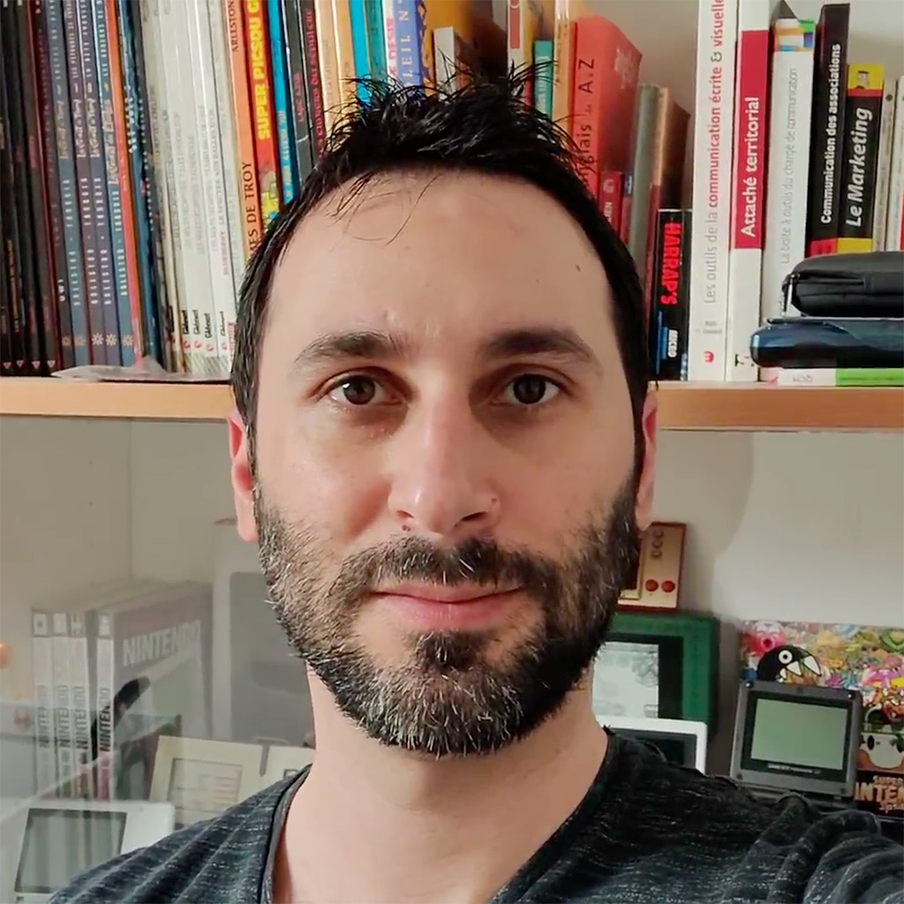

exclude: true
<!--
Le développement augmenté à l'IA: tout ce qui va changer

Les IA chez les devs, c'est comme le sexe chez les ados: tout le monde en parle, mais très peu ont finalement une réelle expérience du sujet. Dans ce talk, nous partagerons notre expérience du développement assisté à l'IA que nous pratiquons depuis les premières versions beta de ces modèles: ce que nous en avons appris, les trucs et astuces, leur limites... Mais ce sera aussi l'occasion de debunker certaines contre-vérités que l'on peut entendre à gauche et à droite.

En poussant un peu plus, on découvrira également que les bénéfices dépassent le simple fait de générer du code. Ces IA peuvent servir d'outil de feedback, améliorer la qualité, la sécurité et l'accessibilité de nos projets, automatiser des tâches et pourraient même changer complètement l'expérience du recrutement. Qu'on l'accepte ou non, l'IA a *déjà* commencé à changer notre métier.

Entrez dans le quotidien d'un dev du futur, et découvrez ce qui ce cache réellement derrière les sirènes du marketing et des histoires miraculeuses entendues au café!
-->
---

title: How to become an IA-enhanced developer
class: animation-fade
layout: true

.twitter-handle[
  @sinedied / @cmaneu
]

---

class: hide-handle, full, more-shadow
background-image: url(images/ai-enhanced-developer.jpg)

<!-- .full-layer.with-margins.left.up[
.w-20.responsive.logo-filter[]
] -->

.title-new.w-55.center[
# .baseline.bit-larger[IA-enhanced development]
## .small[What's going to .grad-text[change]]
]

.full-layer.who.text-right.small.middle.light-text.darkened[
  .ms.responsive[]
  |
  Yohan Lasorsa
  |
  Christopher Maneu
]

<style>
.tmatch { font-size: 1.17em; }
.grad-text { color: #FFB900; }
</style>
???


---

class: center, middle, hide-handle
# Who are we?

.table.row.middle.center[
.col-2[]
.col-4.center[
  .w-70.responsive.avatar.bounceInLeft.animated[]

  **Yohan Lasorsa**<br>
  .fab.fa-x-twitter[] .e[@sinedied]
]
.col-4.center[
  .w-70.responsive.avatar.bounceInUp.animated[]

  **Christopher Maneu**<br>
  .fab.fa-x-twitter[] .e[@cmaneu]
]
]

---

class: big-text, clist, center, middle

# What are we talking about?

???

---

TODO intro

---

class: cover, hide-handle
background-image: url(./images/confused.jpg)

???

---

.col-6.float-left[
  .w-80.responsive[]
]
.col-6.float-left[
  <br><br>

  # A (brief) intro
  - Training data, fine-tuning & RLHF
  - Model types and how you use them
  - Limits: context window, speed, bias
  - Embeddings and vector DBs
  - Agents
]

---

class: center

# LLM Training

.w-80.responsive[]

???
- pre-training: expensive $$$
- fine-tuning: cheap $
- RLHF: long and complicated

---

class: 

# Model types

#### Pure text completion models

.pre[These models specialize in text completion .grey-text[*tasks such as question answering, machine translation and summarization.*]]

#### Intruction-following models (aka chat models)

<span class="pre">&lt;|im_start|>system
You are a professional translator&lt;|im_end|>
&lt;|im_start|>user
How do I translate "hello" in French?&lt;|im_end|&gt;
<span class="grey-text">&lt;|im_start|>assistant
Bonjour&lt;|im_end|></span>
</span>

???

---

# Tokens

LLMs don't work with words, but with tokens.

.w-80.responsive[]

# Limits

#### Context window


---


class: contain, hide-handle, dark
background-image: url(./images/show-code.jpg)

???

- Real world examples
  * timer case
  * synth stand
  * synth case

---

class: small

.row.table.middle[
.col-6[
```openscad
unit = 8;
fudge = 0.001 / unit;
tolerance = 0.15 / unit;

module lego(w, d, h, c = "white") {
  h_hole = (h - 1/6 + tolerance)*2;

  color(c)
  scale(unit) {
    difference() {
      cube([w, d, h]);
      translate([0.25 - tolerance/2, 0.25 - tolerance/2, -h_hole/2])
        cube([w - 0.5 + tolerance, d - 0.5 + tolerance, h_hole]);
    }

    for (i = [0 : w - 1])
      for (j = [0 : d - 1])
        translate([i + 0.5, j + 0.5, h - fudge])
          cylinder(1/6, d = 0.5, $fn = 32);

    if (w > 1 || d > 1) {
      single = w == 1 || d == 1;
      df = single ? 0.55 : 1;

      for (i = [0 : max(w - 2, 0)])
        for (j = [0 : max(d - 2, 0)])
          translate([i + (w == 1 ? 0.5 : 1), j + (d == 1 ? .5 : 1), fudge])
            difference() {
              cylinder(d = 0.915 * df, h_hole/2, $fn = 32);
              cylinder(d = (0.5 + tolerance*2) * df * df, h_hole, $fn = 32, center = true);
            }
    }
  }
}

translate([-5 * unit, 0, 0])
  lego(4, 2, 1, "cyan");

translate([0, 2 * unit, 0])
  lego(1, 1, 2, "yellow");

lego(3, 1, 1/3, "crimson");
```
]
.col-6[
]
]

---

class: all-sketch
# References & going further

.full-layer.with-margins.right.stick-bottom.space-right[
.w-25.responsive.circle[]
]


- OpenSCAD tutorial
  * https://en.wikibooks.org/wiki/OpenSCAD_User_Manual
- VS Code extension
  * https://marketplace.visualstudio.com/items?itemName=Antyos.openscad
- Another OpenSCAD intro
  * https://static.fablab-lannion.org/tutos/openscad/#/intro
- Libraries
  * https://github.com/GillesBouissac/agentscad
  * https://github.com/HopefulLlama/JointSCAD
  * https://github.com/revarbat/BOSL2
- JS fork of OpenSCAD
  * https://github.com/jscad/OpenJSCAD.org
  * https://openjscad.xyz

---

class: middle, center, hide-handle, clist

.w-90.responsive[
<object data="images/thanks.svg"></object>
]

???
Feedback please!