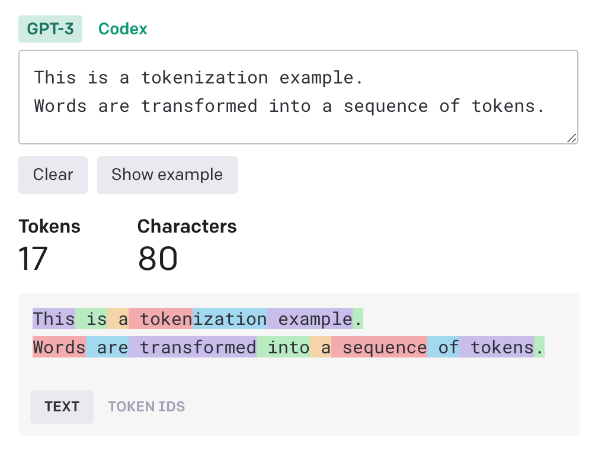

exclude: true
<!--
Le développement augmenté à l'IA: tout ce qui va changer

Les IA chez les devs, c'est comme le sexe chez les ados: tout le monde en parle, mais très peu ont finalement une réelle expérience du sujet. Dans ce talk, nous partagerons notre expérience du développement assisté à l'IA que nous pratiquons depuis les premières versions beta de ces modèles: ce que nous en avons appris, les trucs et astuces, leur limites... Mais ce sera aussi l'occasion de debunker certaines contre-vérités que l'on peut entendre à gauche et à droite.

En poussant un peu plus, on découvrira également que les bénéfices dépassent le simple fait de générer du code. Ces IA peuvent servir d'outil de feedback, améliorer la qualité, la sécurité et l'accessibilité de nos projets, automatiser des tâches et pourraient même changer complètement l'expérience du recrutement. Qu'on l'accepte ou non, l'IA a *déjà* commencé à changer notre métier.

Entrez dans le quotidien d'un dev du futur, et découvrez ce qui ce cache réellement derrière les sirènes du marketing et des histoires miraculeuses entendues au café!


Intro: https://www.lebigdata.fr/ia-creer-logiciel

Conclu: https://www.infoq.com/news/2023/09/copilot-copyright-commitment/


-->
---

title: How to become an IA-enhanced developer
class: animation-fade
layout: true

.twitter-handle[
  @sinedied / @cmaneu
]

---

class: hide-handle, full, more-shadow
background-image: url(images/ai-enhanced-developer.jpg)

<!-- .full-layer.with-margins.left.up[
.w-20.responsive.logo-filter[]
] -->

.title-new.w-55.center[
# .baseline.bit-larger[IA-enhanced development]
## .small[What's going to .grad-text[change]]
]

.full-layer.who.text-right.small.middle.light-text.darkened[
  .ms.responsive[]
  |
  Yohan Lasorsa
  |
  Christopher Maneu
]

???

---

class: center, middle, hide-handle
# Who are we?

.table.row.middle.center[
.col-2[]
.col-4.center[
  .w-70.responsive.avatar.bounceInLeft.animated[]

  **Yohan Lasorsa**<br>
  .fab.fa-x-twitter[] .e[@sinedied]
]
.col-4.center[
  .w-70.responsive.avatar.bounceInUp.animated[]

  **Christopher Maneu**<br>
  .fab.fa-x-twitter[] .e[@cmaneu]
]
]

---

class: big-text, clist, center, middle

# What are we talking about?

???

---

TODO intro

---

class: cover, hide-handle
background-image: url(./images/confused.jpg)

???

---

.col-6.float-left[
  .w-80.responsive[]
]
.col-6.float-left[
  <br><br>

  # LLM crash course
  - Training
  - Model types
  - Tokens
  - Limits
  - Embeddings
  - Prompt engineering
  - Agents
]

---

class: center

# Training

.w-80.responsive[
  <object data="images/llm-training.svg"></object>
]

???
- pre-training: expensive $$$
- fine-tuning: cheap $
- RLHF: long and complicated

---

class: 

# Model types

#### Pure text completion models

.pre[These models specialize in text completion .grey-text[*tasks such as question answering, machine translation and summarization.*]]
???
- LLMs do no think: they *just* complete text
--

#### Instruction-following models (aka chat models)

<span class="pre">&lt;|im_start|>system
You are a professional translator&lt;|im_end|>
&lt;|im_start|>user
How do I translate "hello" in French?&lt;|im_end|&gt;
<span class="grey-text">&lt;|im_start|>assistant
Bonjour&lt;|im_end|></span>
</span>

???
- Chat models are tuned to follow instructions, with the addition of special tokens

---

# Tokens

LLMs don't work with words, but with tokens.

.w-80.responsive[]

---

# Limits

#### Context window
- Common limits: .em-text[**2-4K tokens**] (GPT-4: 8k or 32K)
- Context window limits .em-text[**input + output**]
???
- context training: O(n^2) complexity
- 4K tokens ~ 3K words ~ 6 pages
- 100K context windows => using tricks, with great loss of accuracy (attention)
--


#### Bias
- LLMs may reflect the biases of the training data
???
- Humans do both logical and stereotypical reasoning, LLMs do not have logic
--

- Examples:
  * Optimized code?
  * Accessible code?
  * Best language to learn?

???
- Who can give some code-related biases?

---

class: center
# Embeddings

.w-80.responsive[
  <object data="images/embedding.svg"></object>
]

???
- Embedding: vector representation of a piece of data, that captures the underlying structure and relationships between pieces of data
- Embeddings are used to build vector DBs
- This is how we "memorize" things (ie your data) in LLMs

---

# Prompt engineering

#### Zero-shot

Generate output with no specific training or examples

.small[*Prompt:*]
.up[
```
Translate the following text in French: "Hello, world!"
```
]

.small[*Output:*]
.up[
```
"Bonjour, le monde !"
```
]

---

# Prompt engineering

#### Few-shot

Use in-context examples to condition the output

.small[*Prompt:*]
.up[
```
Bonjour Devoxx: french
Brian is in the kitchen: english
Danke schön: german
Den här koden är hemsk:
```
]

.small[*Output:*]
.up[
```
swedish
```
]

---

# Prompt engineering

#### Chain of thought

Simulate human-like reasoning and decision-making

.small[*Prompt:*
.up[
```
When I was 6 years old, my sister was twice my age. Now I'm 30. How old is my sister?
Let's think step by step.
```
]

*Output:*
.up[
```
Sure, let's break it down step by step.

1. When you were 6 years old, your sister was twice your age. This means your sister was 6 * 2 = 12 years old at that time.
2. The age difference between you and your sister is 12 - 6 = 6 years.
3. Now, you are 30 years old. To find out how old your sister is now, you need to add the age difference to your current age. So, 30 + 6 = 36.

Therefore, your sister is currently 36 years old.
```
]
]

???
- Without "Let's think step by step." => 24
- Allow to break down a problem into smaller, simpler steps

---

# Prompt engineering

#### Retrieval Augmented Generation

Use a vector DB to retrieve relevant information and add it to augment the context

.center[
.w-75.responsive[
<object data="images/rag.svg"></object>
]
]

---

# Agents

A program that perceives its environment, make decisions and takes actions to achieve goals autonomously.

.col-9.float-left.center[
.w-80.responsive[
  <object data="images/agent.svg"></object>
]
]
--
.col-3.float-left[
#### Examples
- [AutoGPT](https://github.com/Significant-Gravitas/AutoGPT)
- [babyAGI](https://github.com/yoheinakajima/babyagi)
- [GPT Engineer](https://github.com/AntonOsika/gpt-engineer)

#### Frameworks
- 🦜️🔗 LangChain
- Semantic Kernel
]

---


---


class: contain, hide-handle, dark
background-image: url(./images/show-code.jpg)

???
---

---

class: all-sketch
# References & going further

.full-layer.with-margins.right.stick-bottom.space-right[
.w-25.responsive.circle[]
]

- https://www.promptingguide.ai
- https://github.com/kyrolabs/awesome-langchain


---

class: middle, center, hide-handle, clist

.w-90.responsive[
<object data="images/thanks.svg"></object>
]

???
Feedback please!