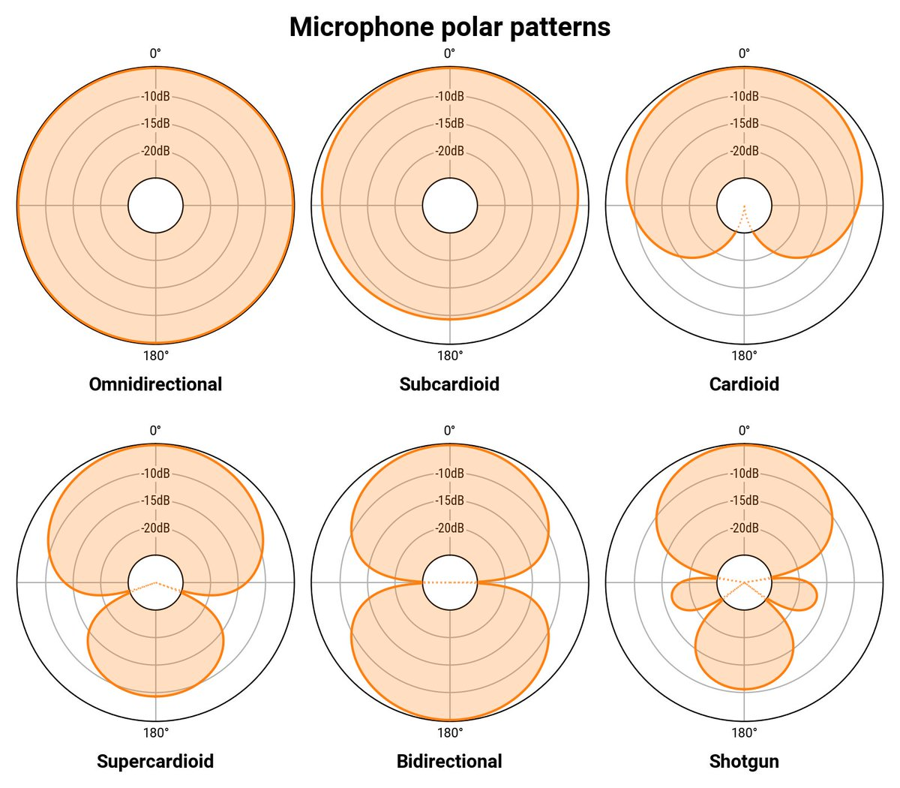
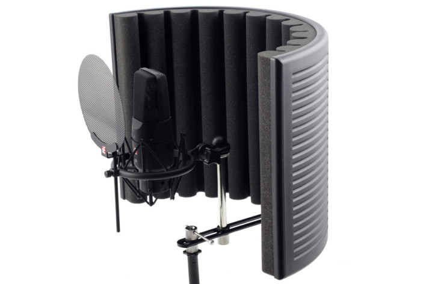
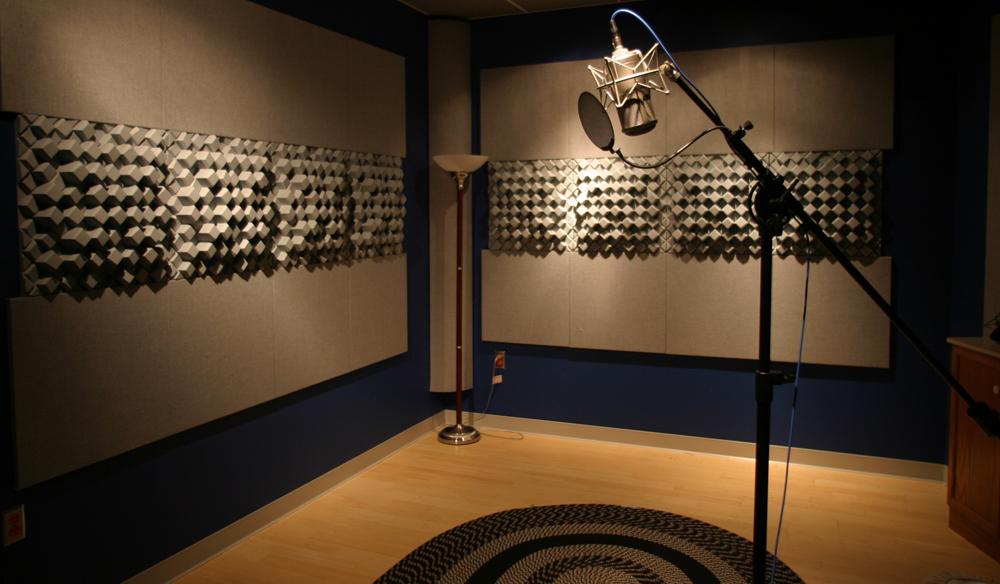
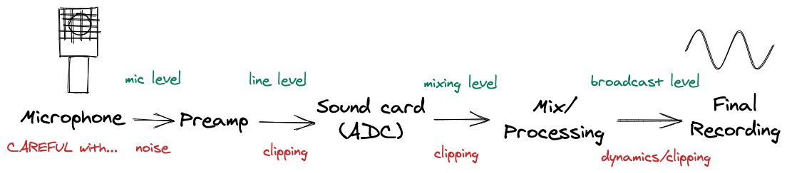
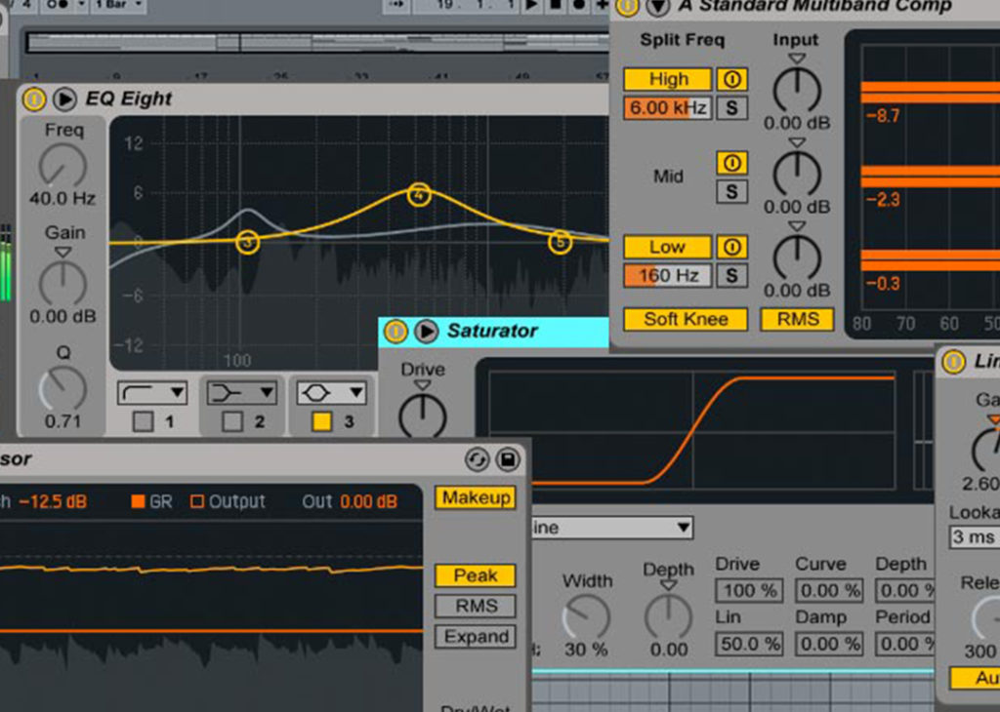

class: alt-code
layout: true

.twitter-handle[
  @sinedied
]

---

class: left, no-bar, primary, middle

.title[
# .light-text.large[Improve your audio recordings]
## Tips and tricks
]

.center.middle[
    .huge[.big[🎙️ 🎚️]]
]

.full-layer.who.text-right.small.middle.light-text[
  <!-- .ms.responsive[]
  | -->
  Yohan Lasorsa
  |
  @sinedied
]

???

- First: who am I to give you audio advices?
* Well...
* I almost became an audio engineer, studied in Cannes, played in million $ studio, with a lot of expensive gear...
* 25 years of music production experience
* I've used a lot of different mics over the year, even though my specialty is more around audio processing

---

background-image: url(./images/studio.jpg)

---

class: big-text

.side-layer.right[
   
  .w-40.responsive.rounded[]
]

# The plan

1. Know your mic
2. Accessories
3. Room acoustics
4. Gain staging
5. Processing

---

# Know your mic

## Main types of microphones

- **Dynamic**: not very sensitive, can handle high SPL, durable, no need for external power
- **Condenser**: very sensitive, high dynamic range, more detailed sound, fragile, require external power
  - **Electret**: no need for external power, usually cheaper

???

- Dynamic: moving coil
- Dynamic: you can use regular wired headphones as a mic
- Condenser doesn't always means better (ie Rode procaster)

--

## Small vs large diaphragm

- **Small**: more consistent and neutral sound
- **Large**: less consistent frequency response, but more "pleasing" for voice

---

class: middle, center

.full-layer.top.left.no-margin[
  .w-50.responsive[]
]

.col-6.float-right.big-text[
**Proximity effect**  
Closer means more bass/low-end
]

---

## Directivity / Pickup pattern

.center.up[
.w-60.responsive[]
]

???
- look at the manual of your mic!
- If you have a switch, use cardiod

---

# Accessories

.side-layer.right[
  .w-30.responsive.rounded[]
]

.large.w-70[
- **Pop filter**: reduce plosives sounds
- **Foam windshield**: reduce pressure from wind
- **Dead cat**: block wind
- **Suspension**: shield against vibrations
- **Arm mount** for your convenience 🙂
]

???

DIY pop filter: tights and metallic coat hanger 

---

# Room acoustics

### ⚠️ 2 importants things to consider

- Hard surfaces reflect sound
- Flat surfaces reflect sound

**Sound reflections creates unwanted reverb/echo and resonance**

.center[
  .w-40.responsive[]
]

???

Isolation are not realy practical for us...

---

# Cheap tips to improve room acoustic

.side-layer.right[
        
  .w-40.responsive.rounded[]
]

.big-text[
- Decorate your room!
- Use a carpet on your floor (not on your walls)
- Heavy curtains and bath towel can help dampening problematic reflections
- Avoid foam panels
]

???

re foam panels:
- you're more likely to do more harm than good
- proper acoustic room treatment needs 3 things:
  * trapping bass resonance
  * diffusing reflections
  * absorbing the remaining unwanted reflections

---

# Gain staging

.quote[
> Gain staging is the process of setting each gain stage to the proper levels to achieve a maximum quality, both in the analog or digital realm.
]

--
.responsive[]

--

✅ USB mic are easier to use because of integrated preamp and converters 
✅ Aim for a ~6dB headroom in analog/digital worlds

???

Always keep a 6db headroom (2x voltage gain factor)
- +10db is double volume (loudness)
- +6db is double sound pressure (voltage)
- +3db is double intensity (energy)

---

# Processing

.bit-larger[1 motto: *less is more*]

.side-layer.right[
   
  .w-30.responsive.rounded[]
]

## Common audio processors

- **EQ**: alter the frequency balance
- **Denoiser**: remove background noise
- **Noise gate**: cut signal below a specific threshold
- **Compressor**: reduce dynamic range
- **Expander**: boost dynamic range
- **De-esser**: reduce sibilance
- **Limiter**: avoid clipping

⚠️ Be wary of Camtasia/Screenflow default voice processing!

---

class: impact

# Demo 🎛️

---
class: middle, center

.center[
# .big[Thanks!]
]

<!-- [aka.ms/audio-tnt](https://aka.ms/audio-tnt) -->
