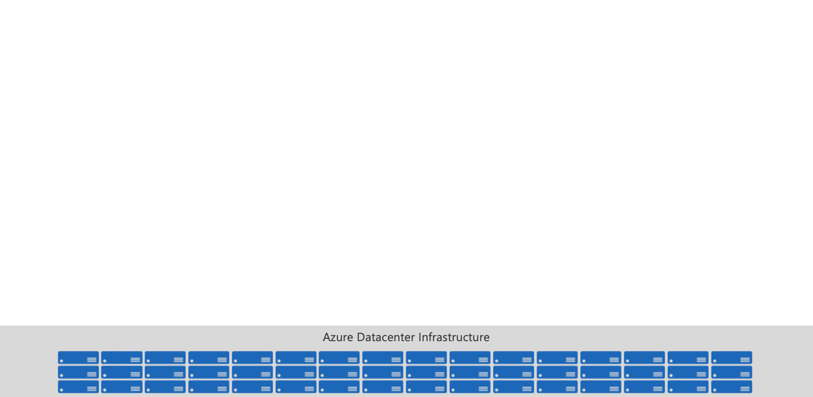
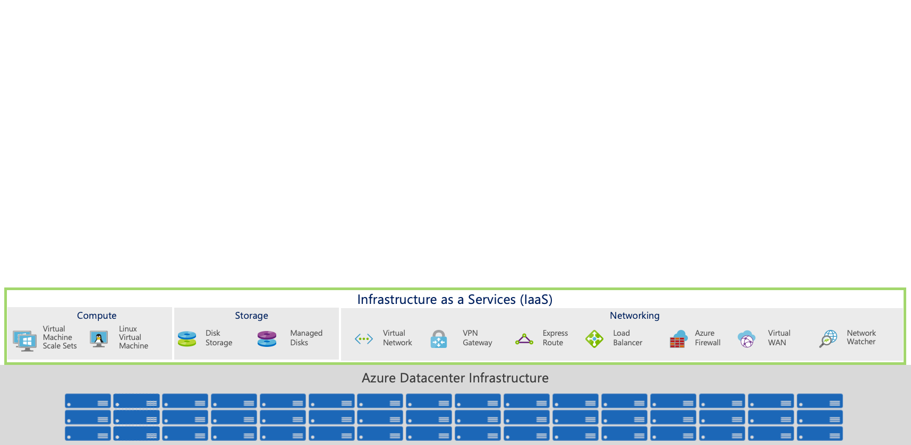
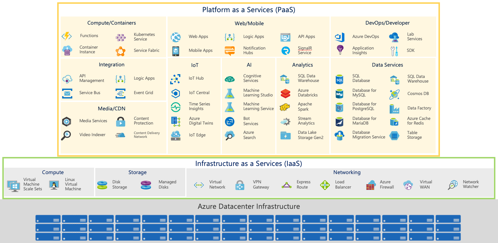
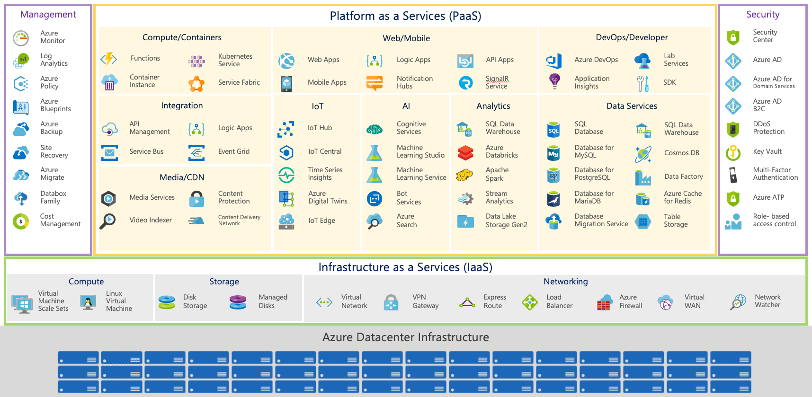
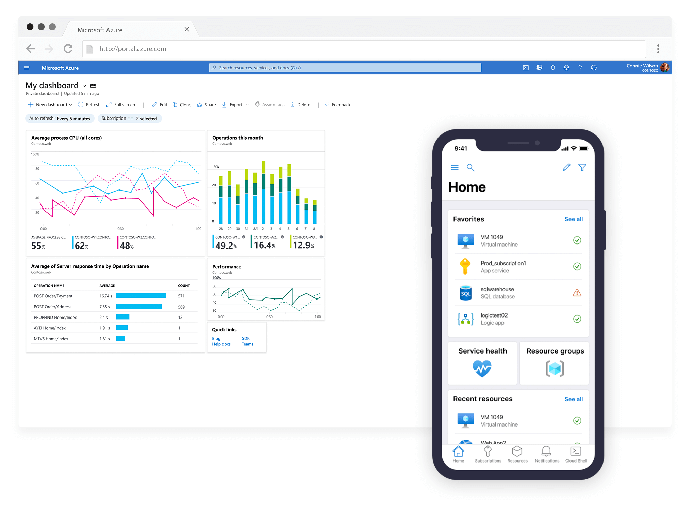
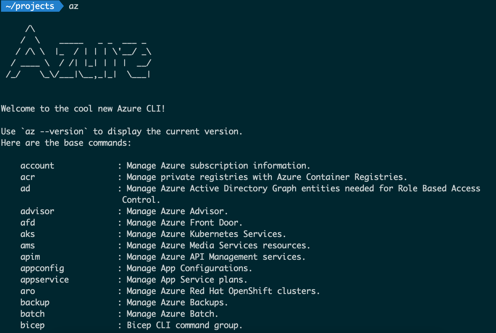
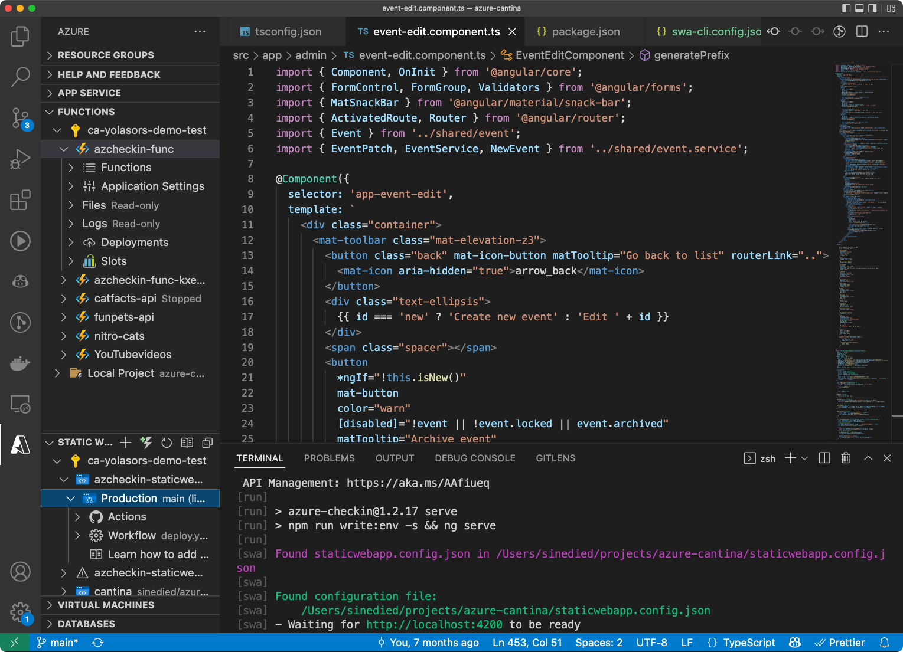

title: The missing introduction to Azure
class: animation-fade
layout: true

.twitter-handle[
  @sinedied
]

<!--
Okay, Azure is Microsoft's cloud platform. What does it means from a developer standpoint, and how do you get started to find what you need in the myriad of services offered?

After a quick tour of the basics, we'll dive into the most important question when working through any cloud platform: what are your options, and how to pick the best one? From developers tools, to getting your apps from zero to up and running at scale with full CI/CD pipelines, we'll explore how you can build your apps while leveraging benefits from the cloud, and avoiding its usage becoming a constraint.
-->

---

class: center, hide-handle, middle
background-image: url(images/azure-clouds.jpg)

# .a[The] .blue-text[*missing*] .a[introduction to Azure]
<br><br><br><br><br><br>

.full-layer.who.text-right.small.middle.light-text[
  .ms.responsive[]
  |
  Yohan Lasorsa
]

---

class: middle, center, hide-handle
# .large[Who am I?]

.table.row.middle[
.col-4.center[
  .w-70.responsive.avatar.tada.animated[]
]
.col-8.bit-larger.left[
  .e[Yohan Lasorsa]<br>
  .bit-larger[\[ Cloud Developer Advocate .mini-img[] \]]<br>
  .small.em-text[Web tech geek, OSS maintainer, DIY lover]<br>
]
]
.center.bit-larger[
.large.em-text[{]
.fab.fa-twitter[] .fab.fa-github[] .fab.fa-dev[]
.large.em-text[}] .e[@sinedied]<br>
]

???
- My main focus is working on web apps
- before joining MS I worked for 5 years at Thales, where I was a software architect.
- That's where I discovered Azure, and to be honest, I wasn't thrilled by my first approach!
- I found it really hard get any info beyond the first "get started" tutorials.

---

class: center, middle, light-text, bg-gradient
# .light-text.large[What's Azure?]

???
- I'll start with a general introduction
- Then we'll talk a bit about cloud strategies
- And finally dive a bit more into the products and workflows

---

exclude: true
class: center, middle, full, big-text
background-image: url(./images/pillars.jpg)

.bit-larger[&nbsp;&nbsp;&nbsp; Compute&nbsp;&nbsp;&nbsp;&nbsp; Storage &nbsp;&nbsp;&nbsp;&nbsp;Networking]

???
- 3 pillars: Compute, storage, network

---

class: hide-handle

.full-layer.space-left.space-right.flex-align[
.responsive[]
]
???
- 3 pillars: Compute, storage, network
- Storage is bit special in Azure:
  * Built on a unified and distributed storage system
  * Durability, encryption at rest, strongly consistent replication, fault tolerance, auto load-balancing
  * 5PiO by default (can be increased to more)


--

.full-layer.space-left.space-right.flex-align[
.responsive[]
]

--

.full-layer.space-left.space-right.flex-align[
.responsive[]
]

--

.full-layer.space-left.space-right.flex-align[
.responsive[]
]

???

Side tracks: security, monitoring, devops/automation

---

class: center
# Cloud service models

.full-layer.full-bottom.no-margin.small-bottom-margin[
.tiny[.box.you.ib[&nbsp;] Managed by you .ib.space-right[] .box.ib[&nbsp;] Managed by cloud provider]
]

.col-3.center.float-left.up[
  .box.you[Application]
  .box.you[Data]
  .box.you[Runtime]
  .box.you[Middleware]
  .box.you[OS]
  .box.you[Virtualization]
  .box.you[Servers]
  .box.you[Storage]
  .box.you[Network]

  ### On-Premise
]
--
.col-3.center.float-left.up[
  .box.you[Application]
  .box.you[Data]
  .box.you[Runtime]
  .box.you[Middleware]
  .box.you[OS]
  .box[Virtualization]
  .box[Servers]
  .box[Storage]
  .box[Network]

  ### IaaS
]
--
.col-3.center.float-left.up[
  .box.you[Application]
  .box.you[Data]
  .box[Runtime]
  .box[Middleware]
  .box[OS]
  .box[Virtualization]
  .box[Servers]
  .box[Storage]
  .box[Network]

  ### PaaS
]
--
.col-3.center.float-left.up[
  .box[Application]
  .box[Data]
  .box[Runtime]
  .box[Middleware]
  .box[OS]
  .box[Virtualization]
  .box[Servers]
  .box[Storage]
  .box[Network]

  ### SaaS
]

???
## IaaS (Infrastructure as a Service)
  * Managed: Hardware
  * You manage: Operating System

## PaaS (Platform as a Service)
  * Managed: Runtime
  * You manage: Application & Data

## SaaS (Software as a Service)
  * Managed: Software
  * You manage: Configuration -->

---

class: center
# .blue-text.animated.jackInTheBox.ib[Special] .a[PaaS service models]

.col-3.center.float-left.up[
  &nbsp;
]
.col-3.center.float-left.up[
  .box.you[Application]
  .box.you[Data]
  .box.you[Runtime]
  .box[**Orchestration**]
  .box[OS]
  .box[Virtualization]
  .box[Servers]
  .box[Storage]
  .box[Network]

  ### CaaS<br>.tiny[(Containers as a Service)]
]
---

class: center
# .blue-text.ib[Special] .a[PaaS service models]

.col-3.center.float-left.up[
  &nbsp;
]
.col-3.center.float-left.up[
  .box.you[Application]
  .box.you[Data]
  .box.you[Runtime]
  .box[**Orchestration**]
  .box[OS]
  .box[Virtualization]
  .box[Servers]
  .box[Storage]
  .box[Network]

  ### CaaS<br>.tiny[(Containers as a Service)]
]
.col-3.center.float-left.up[
  .box.you[**Function**]
  .box[Data]
  .box[Runtime]
  .box[Middleware]
  .box[OS]
  .box[Virtualization]
  .box[Servers]
  .box[Storage]
  .box[Network]

  ### FaaS<br>.tiny[(Function as a Service)]
]

???
## CaaS (Container as a Service)
  * Managed: OS
  * You manage: Runtime

## FaaS
  * Managed: Runtime, Scale-in/scale-out
  * You manage: Application & Data
  * Specifics: Pay-by-use, Autoscale

---

class: dark, full, contain, center
background-image: url(./images/servers.jpg)
background-position: left center

.col-4.float-left.full-height[
]

# Serverless computing

???
## Serverless
  * Managed: Runtime, Scale-in/scale-out
  * You manage: Application & Data
  * Specifics: Pay-by-use, Autoscale
--
.q.float-left.col-8.animated.fadeInUp[
  

  .text.alt-text[
  Serverless doesn't mean there are no servers, it means let's think about servers... less.
  <br>
  .float-right[— [.alt-text[@jeffhollan]](https://twitter.com/jeffhollan)]
  ]
]

---

class: dark, full, contain, center
background-image: url(./images/servers.jpg)
background-position: left center

.col-4.float-left.full-height[
]

# Serverless computing

.q.float-left.col-8[
  

  .text.alt-text[
  Serverless doesn't mean there are no servers, it means let's think about servers... less.
  <br>
  .float-right[— [.alt-text[@jeffhollan]](https://twitter.com/jeffhollan)]
  ]
]

.col-8.float-left.no-margin[
<br>
.col-4.float-left.up.center.animated.pulse.delay-1s[
  .bigmoji[💵]

  **Pay-by-use**
]
.col-4.float-left.up.center.animated.pulse.delay-3s[
  .bigmoji[📈]

  **Autoscaling**
]
.col-4.float-left.up.center.animated.pulse.delay-5s[
  .bigmoji[🪄]

  **Fully managed**
]
]

--
.side-layer.stick-bottom.small.left.no-margin[
  .col-4.float-left[&nbsp;]

  <i><sup>*</sup> But all serverless tiers aren't made equal</i> 😞
]

---

class: full, center, big-text
background-image: url(./images/now-what.jpg)

# Now what?

???

- Now you understand a bit how it works, and what you can find but it won't help you do anything.

---

class: center, middle, light-text, bg-gradient
# .light-text.large[.a[Define your ☁️ strategy].hidden[?]]

---

class: center, middle, light-text, bg-gradient
# .light-text.large[.a[Define your ☁️ strategy?]]
--

.side-layer[
What are you trying to achieve? Focus on what generates business **value** for you.
]

???

- Do you want to reduce your running costs?
- Do you want to accelerate your developments?
- Do you want to scale up your app?

---

class: full, middle, center
background-image: url(./images/lift.jpg)

# .large.animated.backInUp[ .ib.animated.backInUp[Lift] .a[&] .ib.delay-1s.animated.lightSpeedInRight[shift] ]
### .light-text[Migrate first, redesign later.]

---

class: full, middle, center
background-image: url(./images/tools.jpg)

.darktab[
# Picking the right tool is the hardest part
]

???
* Azure is a toolbox | like your hardware store
* When you build a house, you won't go to HW store and read the product labels to find the right parts, right?
* Ex: couler une dalle de béton
  - 200m2 => betonneuse
  - 10m2 => betonniere mobile
  - 1m2 => sceau et huile de coude

---

class: center
background-image: url(./images/cloud.jpg)

# .large.light-text.animated.zoomInUp.ib[Cloud native]
### .bit-larger[Building from the ground up for the cloud.]

???
- Eviter de se lancer tete baissée
- bien garder en tete les bonnes pratiques
  * il va peut etre falloir changer des process!

---

class: center
background-image: url(./images/cloud.jpg)

# .large.light-text[Cloud native]
### .bit-larger[Building from the ground up for the cloud.]

.full-layer.stick-bottom[
### .light-text[[12-factor methodology](https://12factor.net/)]
]

???
- Eviter de se lancer tete baissée
- bien garder en tete les bonnes pratiques
  * il va peut etre falloir changer des process!

---

class: center, middle, light-text, bg-gradient
# .light-text.large[Using Azure]

---

class: center
# Getting started

<br>
.col-4.float-left.center[
  ### Azure Portal

  .w-90.responsive[]
]
.col-4.float-left.center[
  ### Azure CLI

  .w-90.responsive[]
]
.col-4.float-left.center[
  ### VS Code extensions

  .w-90.responsive[]
]

???
* Portal: experimentation, monitoring, billing, etc.
* CLI: development & automation
* VS Code extensions: development, testing, support

---

class: center
# Azure Resource Management

.w-80.responsive[]

???
En pratique il y a plein de facons de créer des resources Azure mais toutes passent par ARM.

---

class: center, clist
# Azure .blue-text[lingo]

- **Subscription:** a billing group for Azure services.

- **Resource group:** a container holding related resources for an application.

- **Region / location:** an area within a country that contains one or more datacenters.

- **Resource:** any item that is part of your Azure solution.

- **Storage account:** a container for storing data objects, needed by many Azure services.

---

class: center
# Repeatable infrastructure
### Infrastructure as code (IaC)

```bicep
param prod bool = true
param appName string = 'myapp'
var suffix = prod ? '' : uniqueString(resourceGroup().id)

resource storageAccount 'Microsoft.Storage/storageAccounts@2021-02-01' = {
  name: '${appName}${suffix}'
  location: location
  kind: 'StorageV2'
  sku: { name: 'Standard_LRS' }
  properties: {
    allowBlobPublicAccess: false
    supportsHttpsTrafficOnly: true
  }
}
```

.ib.up[👉 ARM (JSON), Bicep (DSL), Terraform, Pulumi...]

---

class: center
# Automation

### CI/CD Pipelines

```yml
name: continous_integration
on:
  push:
    branches: [main]
jobs:
  build:
    strategy:
      matrix:
        platform: [ubuntu-latest, macos-latest, windows-latest]
        node-version: ['12', '14', '>=16']
    runs-on: ${{ matrix.platform }}
    steps:
    - uses: actions/checkout@v1
...
```

👉 GitHub Actions

???
- Tools: Portal / CLI / VS Code
  * IaC => CI/CD / DevOps. Bicep or Terraform or (insert fav. tool)
  * GitHub: Source control, Project management, Actions (CI/CD)

---

class: center
# Observability & alerting

<br><br><br>

.quote[
> You want .blue-text[**metrics**] to see how your systems are running, .blue-text[**alerts**] to know when something goes wrong and unified .blue-text[**logs**] to trace back your issues.
]

<br><br><br><br>
👉 Azure App Insights, Azure Monitor

---

class: center, middle, light-text, bg-gradient
# .light-text[An Azure (example) Journey]

---

class: center, clist
# .blue-text[Stage 1:] Bootstrap and experiment 

.large[
- Bootstrap code for a web app and API<br>
  **GitHub, VS Code Extensions**
- Deploy a test version of the app<br>
  **Azure Static Web Apps, VS Code Extensions**
- Add a database and create mock data<br>
  **CosmosDB, VS Code Extensions, Data Explorer**
]

---

class: center, clist
# .blue-text[Stage 2:] Setup infrastructure and CI/CD

.large[
- Define infrastructure as code (IaC)<br>
  **Bicep, Azure CLI**
- Add CI/CD pipelines<br>
  **GitHub Actions**
  * .small[Create infrastructure (staging/prod environments)]
  * .small[Build & test app on every commit/PR]
  * .small[Deploy Azure Static Web Apps and Functions]
]

---

class: center, clist
# .blue-text[Stage 3:] Develop and release

.large[
- Test and debug locally<br>
  **SWA and Func CLIs, VS Code**
- Automatic or manual releases<br>
  **GitHub**
- Set up alarms, monitor traffic and debug issues<br>
  **Azure App Insights, Azure Monitor**
]

---

class: center, middle, light-text, bg-gradient
# .light-text[The (missing) slide]

???
- You won't see a slide like the one I'm going to show, even though I find it the most important one
- probably because of marketing

---

.center[
# Service picks .blue-text[at a Glance]
]

.col-6.float-left.small[
### Gateway
- **Azure Portal, VS Code, Azure CLI**

### DevOps
- **GitHub**: code, project management
- **GitHub Actions**: CI/CD, automation
- **GitHub Packages**: artifacts, containers
- **Bicep**, **ARM**: infrastructure as code
- **Azure App Configuration**: feature flags, A/B testing
- **Azure Key Vault**: secrets
- **Azure Monitor, App Insights**: observability
- **Azure Policy, Azure Sentinel**: governance & security
]
.col-6.float-left.small[
### Apps
- **Azure Kubernetes Service**: containers
- **Static Web Apps, Functions**: web apps & APIs 
- **Azure Active Directory**: identity

### Data
- **Azure Storage**: files, blobs 
- **Cosmos DB**, **Azure SQL DB**: database
- **Azure Synapse**: big data

### AI/ML
- **Azure Cognitive Services, Azure ML**
]

---

class: center, clist
# Learning .blue-text[fundamentals]

### Azure Fundamentals Learn Path / [AZ-900 certification](https://docs.microsoft.com/learn/certifications/exams/az-900?WT.mc_id=javascript-0000-yolasors)

- [1. Describe core Azure concepts](https://docs.microsoft.com/learn/paths/az-900-describe-cloud-concepts/?WT.mc_id=javascript-0000-yolasors)
- [2. Describe core Azure services](https://docs.microsoft.com/learn/paths/az-900-describe-core-azure-services/?WT.mc_id=javascript-0000-yolasors)
- [3. Describe core solutions and management tools on Azure](https://docs.microsoft.com/learn/paths/az-900-describe-core-solutions-management-tools-azure/?WT.mc_id=javascript-0000-yolasors)
- [4. Describe general security and network security features](https://docs.microsoft.com/learn/paths/az-900-describe-general-security-network-security-features/?WT.mc_id=javascript-0000-yolasors)
- [5. Describe identity, governance, privacy, and compliance features](https://docs.microsoft.com/learn/paths/az-900-describe-identity-governance-privacy-compliance-features/?WT.mc_id=javascript-0000-yolasors)
- [6. Describe Azure cost management and service level agreements](https://docs.microsoft.com/learn/paths/az-900-describe-azure-cost-management-service-level-agreements/?WT.mc_id=javascript-0000-yolasors)

???
- Learn modules
- AZ-900


---

class: middle, hide-handle

.big-text.no-bg.baseline[
```js
const end = {
  message : 'Thank you!',
  slides  : 'bit.ly/azure-intro'
};

sendToAll('room', end);
sendToAll('room', 'Any questions?');
```
]

<hr class="hr-right more-space">
.right.large[
.large.em-text[{]
.fab.fa-twitter[] .fab.fa-github[] .fab.fa-dev[]
.large.em-text[}] .e[@sinedied]
]

<!-- 
- Azure?
  * CNCF Cloud lanscape
  * Azure = Cloud Platform
  * Basics: compute, storage, networking, everything else is built from that.
  * Side: security, reliability, monitoring, disaster recovery...
  * PAAS: Serverless, AI, DB...

- Cloud Strategies
  * On-premise: no cloud/private cloud
  * Hybrid: private+public cloud
  * Cloud-native: built for the cloud
  * Multi-cloud: portable and host independant cloud apps

- Developping App for the cloud
  * VMs: Lift & Shift, temp migration
  * Containers: Managed or through K8s
  * PAAS: Managed Service, incl. Serverless
  * Serverless: Pay as you go, auto-scale, no runtime management

1 question: which cloud service can make your app developement faster and cheaper?

- What do you need?
  * Gateways
    - Portal, VS Code, CLI
  * Dev Tools
    * GitHub: code hosting, CI/CD & online dev env
    * App Configuration
    * Key Vault
    * Bicep/ARM IAC
  * Compute/hosting
    - VM, AKS, App Services, Functions, SWA
  * Data
    - Azure Storage, CosmosDB, SQL Server, Synapse
  * AI
    - Cognitive Services
  * Monitoring
    - App Insights, Azure Monitor
  * Governance, Security
    - Sentinel, Policies
  
- Learn modules
- AZ-900

*******************************************

- Azure AFUN10
  * Cloud? Compute, storage, network
  * Side tracks: security, monitoring, devops/automation
  * And more....

- IaaS / PaaS / SaaS
           \-> Caas, Serverless

- Now you understand a bit how it works, and what you can find but it won't help you do anything.

- What are you trying to achieve? Which part of your app generates VALUE for you?
  * Azure is a toolbox | like your hardware store
  * When you build a house, you won't go to HW store and read the product labels to find the right parts, right?

- Tools: Portal / CLI / VS Code
  * IaC => CI/CD / DevOps. Bicep or Terraform or (insert fav. tool)
  * GitHub: Source control, Project management, Actions (CI/CD)

- An Azure (example) Journey


- What do you need?
  * Gateways
    - Portal, VS Code, CLI
  * Dev Tools
    * GitHub: code hosting, CI/CD & online dev env
    * App Configuration
    * Key Vault
    * Bicep/ARM IAC
  * Compute/hosting
    - VM, AKS, App Services, Functions, SWA
  * Data
    - Azure Storage, CosmosDB, SQL Server, Synapse
  * AI
    - Cognitive Services
  * Monitoring
    - App Insights, Azure Monitor
  * Governance, Security
    - Sentinel, Policies
  
- Learn modules
- AZ-900

- Service: 
  * Identity
  * Storage
  * Hosting/API
  * Containers
  * Configuration
  * Security/secrets

- https://12factor.net/

-->