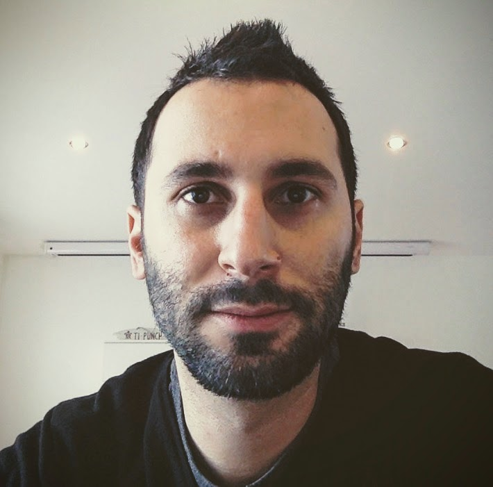
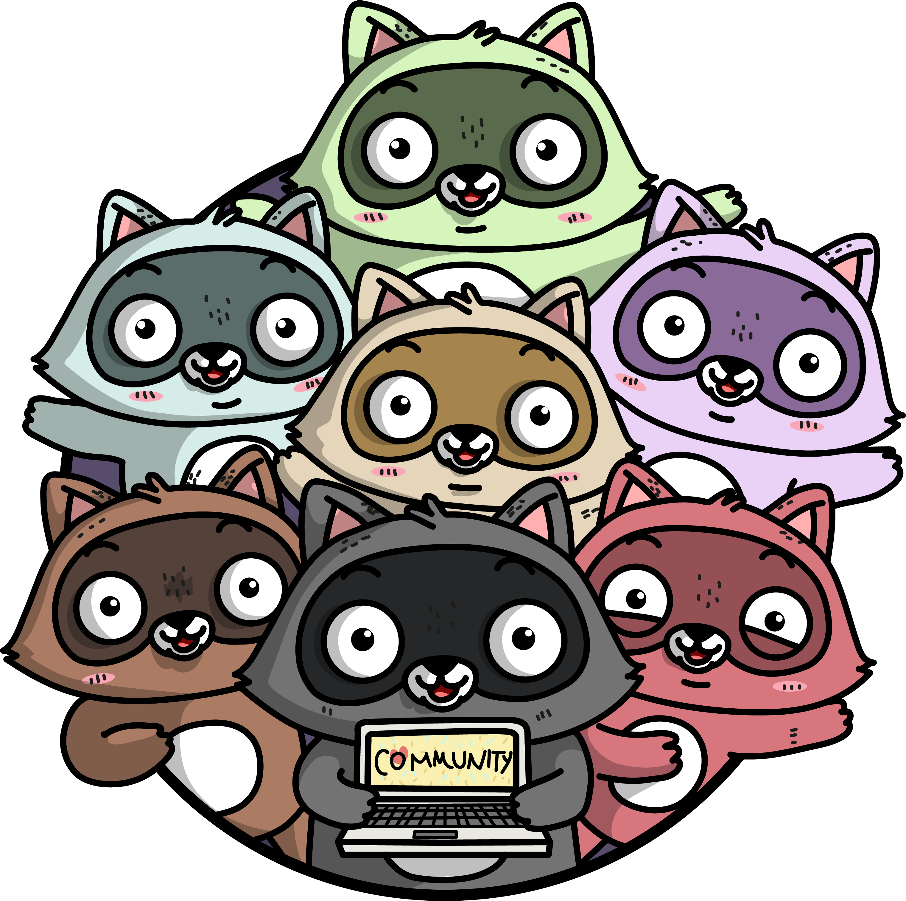

title: How I found my own path
class: animation-fade
layout: true

.twitter-handle[
  @sinedied
]

<!-- 
- Who am I?
- What's a DA?
- My Career in brief...
- Before that!

Tips I wish I knew
- Connect with people
- Set your own objectives
- Ask forgiveness, not permission

Tips I learned on the way
- Do what your love (ie don't seek the highest pay)
- You don't have to be a manager
- Learn fundamentals

Tips for students
- There's no end to your learning journey
- Try things. Fail. Start again.
- Listen to others, but think by yourself

 -->

---

class: middle, left, hide-handle, title
background-image: url(images/path.jpg)

# .light-text.large[How I found my __own__ path]
#### .alt-text[\* Getting lost in the way]

.full-layer.who.text-right.small.middle.light-text[
   
  .ms.responsive[]
  |
  Yohan Lasorsa
  |
  @sinedied
]

???

---

class: middle, center, hide-handle
# .large[Who am I?]

.table.row.middle[
.col-4.center[
  .w-70.responsive.avatar.tada.animated[]
]
.col-8.bit-larger.left[
  .e[Yohan Lasorsa] 
  .bit-larger[\[ Cloud Developer Advocate .mini-img[] \]] 
  .small.em-text[Web tech geek, OSS maintainer, DIY lover] 
]
]
.center.bit-larger[
.large.em-text[{]
.fab.fa-twitter[] .fab.fa-github[] .fab.fa-dev[]
.large.em-text[}] .e[@sinedied] 
]

???

- For the last 10 years, I've worked as a dev in:
* research, many ESN projects, product team

---

class: no-bullet
# What's a "Developer Advocate"?
--

## Someone who...
- .eb[🙌] Helps developers **be successful** with a platform or a technology
- .eb[🔗] Acts as a **bridge** between engineering and developer communities
- .eb[💙] Is a passionate **engineer** and continuous learner

.center[
  .w-25.responsive[]
]

???
Un boulot qui n'existait pas y'a 10 ans!

---

class: big-text, no-bullet, center, middle, clist
background-image: url(images/mission.jpg)

# My own mission
- .eb[💪] Help makers **build** things 
- .eb[📣] Spread my love for **Open Source**
- .eb[🎉] Have **fun** doing that!
   

---

# My journey

## 5 years &nbsp; .em-text[R&D Engineer | **INRIA**]
- Mobile AR/VR/MR, Indoor navigation, Sensor wizardry, Accessibility

--

## 5 years &nbsp; .em-text[Dev > Lead Dev > Architect | **Thales Service**]
- Web/Mobile/Hybrid apps, Cloud platforms, IoT, SDKs, Trainings...

--

## 1 year &nbsp; .em-text[Senior Dev | **Criteo**]
- Web dev, Tooling, Big data, Machine learning...

--

## Now &nbsp; .em-text[Senior Dev Advocate | **Microsoft**]

???
- 20% Thales OSS
- 10% Criteo OSS

---

class: big-text, no-bullet
# .sketch[My student journey]

- .eb[💙] Music production & programming
--

- .eb[❌] BTS Audio Visuel option Son
--

- .eb[❌] DEUG Sciences de Matière
--

- .eb[✅] IUT Info option Génie Logiciel
--

- .eb[✅] Polytech'Grenoble - RICM/Multimédia
???
Année d'échange a l'etranger!

---
class: cover, hide-handle, bottom, center, big-text, no-hmargin, black-border
background-image: url(images/surf.jpg)
# .dark-text[What I imagined]
### Surfing in Sydney 🏄

---
class: cover, hide-handle, bottom, center, big-text, no-hmargin, black-border
background-image: url(images/snow.jpg)
# .dark-text[What it was]
### Freezing to death in Montreal ⛄️

---
class: big-text, no-bullet
# .sketch[My student journey]

- .eb[💙] Electronic music & Programming
- .eb[❌] BTS Audio Visuel option Son
- .eb[❌] DEUG Sciences de Matière
- .eb[✅] IUT Info option Génie Logiciel
- .eb[✅] Polytech'Grenoble - RICM/Multimédia
- .eb[✅] Université de Montréal - Master Info (exchange)
--

- .eb[💿] Debut album

---

class: big-text, center, middle, clist
# .baseline[.animated.ib.tada.alt-text[**Tips**] I wish I knew earlier]
- **Connect** with people
- Set your own **objectives**
- Ask **forgiveness**, not permission

???
- Et chérissez vos relations!
- Fixez vous une cible a atteindre, au pire vous n'y perdrez rien!
- N'attendez pas l'aval des autres pour vous lancer

---

class: big-text, center, middle, clist
# .baseline[.animated.ib.bounce.alt-text[**Tips**] I learned along the way]
- Do what your **love** (don't be 🤑)
- You **don't** have to be a manager
- Learn **fundamentals**

---

class: big-text, center, middle, clist
# .baseline[.animated.ib.heartBeat.alt-text[**Tips**] for you]
- There's **no end** to your learning journey
- Try things. **Fail.** Start again.
- Listen to others, but **think by yourself**

---

class: middle, hide-handle

.table.row.middle[
.col-6[
# .large[Thank you!]
Slides:  .large[bit.ly/ylacareer]
]
.col-6.right[
  .w-50.responsive[]
]
]

.right.large[
.large.em-text[{]
.fab.fa-twitter[] .fab.fa-github[] .fab.fa-dev[]
.large.em-text[}] .e[@sinedied] 
]

