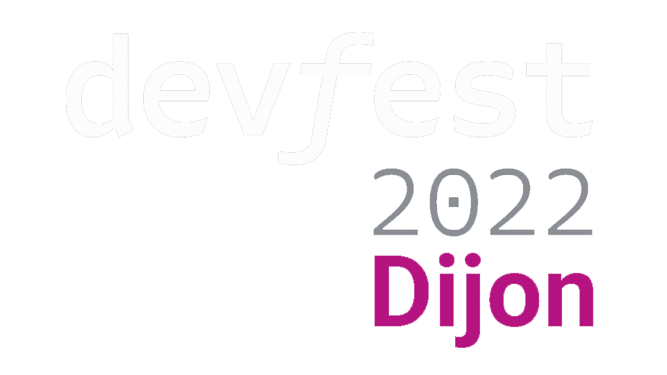
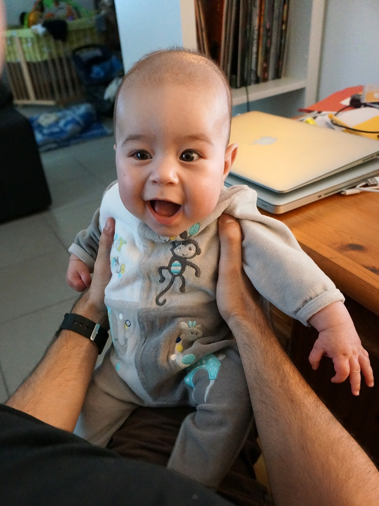
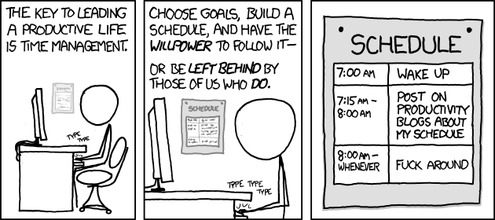
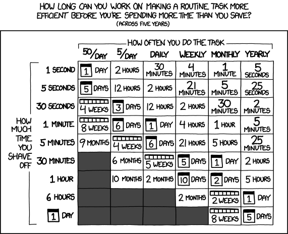
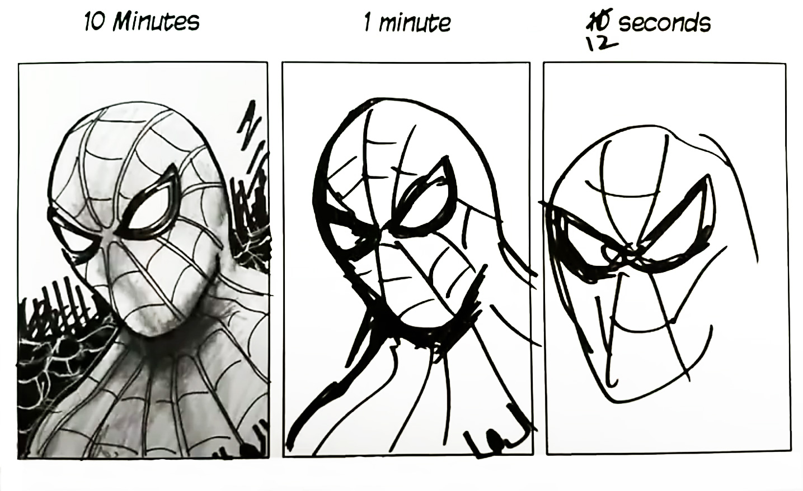

exclude: true
<!--
Embracing chaos for more efficient projects
Une touche de chaos pour plus d'efficacité

What do young parents and open source softwares have in common? Not much at first sight, yet either way surviving in the midst of daily chaos will force you to be more efficient at managing tasks. From onboarding to deployment, common tasks of development cycle are rarely optimized in enterprise projects and consume a lot of time and energy! But then how do open source projects deliver regular updates and quality code on a voluntary basis? Part of the secret lies in the necessity born out of chaos.

With my triple hat of dad, open source maintainer, and enterprise developer, I will share my experience, the mistakes I made and everything I learnt from it for the benefit of prioritization, time management and tools for different projects.

### Benefits
- Understand the intrinsic functioning of open source projects
- Discover simple ways to automate often manual tasks (onboarding, documentation, updating dependencies, writing a changelog, sorting the backlog...)
- Find new sources of inspiration to remove/modernize/simplify the dev cycle
- Know how to wisely introduce a little chaos into your project, to stimulate the creativity and efficiency of the team :)

D&D map: chaotics neutral good evil, OSS/closed source/ SCRUM etc
-->
---

title: Embracing chaos for more efficient projects
class: animation-fade
layout: true

.twitter-handle[
  @sinedied
]

---

class: hide-handle, middle, full, center, more-shadow
background-image: url(images/chaos5.jpg)

<!-- .full-layer.with-margins.left[
.w-15.responsive.img-shadow.logo-filter[]
] -->

.title-new[
# .baseline.sketch.big[Embracing .grad-text[chaos] ].tmatch.sketch[for more efficient projects]
]

.full-layer.who.text-right.small.middle.light-text.darkened[
  .ms.responsive[]
  |
  Yohan Lasorsa
  |
  @sinedied
]

???
Bienvenue dans ce talk ou on va joyeusement parler chaos!

LAUNCH CHRONO!

- https://github.com/azure/static-web-apps-cli
  * codespaces/devcontainers -> open in tab before!!!
  * issues/PRs
  * dependencies/audit
    - talk about dependabot hell / who has automated dep updates?
  * CI + release
  * conventional commits, changelog + manual release
  * talks about SWA Deploy GH Action v1 breaking change
  
- https://github.com/angular/angular
  * monorepo
  * issues templates + outil de debug
  * commit message format
  * bot lock issues
  * CODEOWNERS files (.pullapprove)

- https://github.com/ngx-rocket/generator-ngx-rocket
  * semantic release bot closed issue

- https://github.com/sinedied/devto-cli
  * github .
  * typescript
  * format/lint: xo
  * commitizen / semantic-release
  * update & publish release locally?

- https://github.com/jdubois/jhipster-lite/tree/env-demo
  * terraform  IaC

- https://github.com/sinedied/azure-checkin
  * CD / infra as code

- https://github.com/Azure/aca-java-runtimes-workshop
  * SHA versioning

---

class: middle, center, hide-handle
# .large.sketch[About me]

.table.row.middle[
.col-4.center[
  .w-70.responsive.avatar.tada.animated[]
]
.col-8.bit-larger.left.middle[

.responsive[
<object data="images/me.svg"></object>
]
]
]

???
Et vous?
Qui est dev dans la salle?
Qui est chef de projet, lead ou assimilé?

---

class: big-text, all-sketch, clist, center

# My experience
- Research team
- IT service company
- Startup
- Big tech company
- Open source (maintainer & contributor)
???
Je vais commencer par parler un peu de mon expérience,
J'ai la chance d'avoir pu travailler dans des contextes très différents
--

- .dad.relative[**Dad 🍼**]

???
Mais l'experience la plus importante, c'est celle là

---

class: big-text, all-sketch, middle, center
.col-6.float-left[
  &nbsp;
]
.col-6.float-left.space-left[
...and everything changed
]

.full-layer.full-left.no-margin.left[
  .w-50.responsive[]
]
???
- Voici mon 1er fils Oliver!
- Il est un peu plus grand maintenant, la photo date de 2015
- Si je vous parle de cela, c'est parce devenir papa a eu un gros impact sur ma vie de dev

(Ceci n'est pas talk sur la parentalité!)

---

class: huge-text, all-sketch, middle, center, no-animation
.nothing[Free time]

.hidden[Free schedule]

.hidden[Plans]

---

class: huge-text, all-sketch, middle, center, no-animation
.striked[Free time]

.hidden[Free schedule]

.hidden[Plans]

---

class: huge-text, all-sketch, middle, center, no-animation
.strikedfast[Free time]

.nothing[Free schedule]

.hidden[Plans]

---

class: huge-text, all-sketch, middle, center, no-animation
.strikedfast[Free time]

.striked[Free schedule]

.hidden[Plans]

---

class: huge-text, all-sketch, middle, center, no-animation
.strikedfast[Free time]

.strikedfast[Free schedule]

.nothing[Plans]

???
par ex se dire qu'on tranquillement se prevoir la semaine pour préparer son talk, mais qu'on enchaine:

- enfant positif au covid
- greve des profs/periscolaire

---

class: huge-text, all-sketch, middle, center, no-animation
.strikedfast[Free time]

.strikedfast[Free schedule]

.striked[Plans]

???
par ex se dire qu'on tranquillement se prevoir la semaine pour préparer son talk, mais qu'on enchaine:

- enfant positif au covid
- greve des profs/periscolaire

---

class: all-sketch, middle, center
.quote.large[
> Life is nothing without a little .dark-text.gradient-text[chaos] to make it interesting.  
> ― Amelia Atwater-Rhodes
]
???
Bon je vous parle ici uniquement sur un certains prisme de cet impact!
- Bien sur qu'à coté il y a eu bien d'autres changements positifs!
- Notamment un petit frere venu un peu plus tard

---

class: huge-text, all-sketch, middle, center

.circled[Open-source projects ?!]

???
- Aujourd'hui j'ai la chance de pouvoir passer une grande partie de mon temps pro sur de l'OSS,
ca n'a pas toujours été le cas
- Et a un moment donné la question se pose entre passer sa soirée/WE à OSS vs avec tes enfants
- Envie de continuer!
- Mais... comment?

---

class: cover
background-image: url(images/look.jpg)

???
- Si on regarde en arrière, comment ca s'est fini?
- Retournons au context de notre talk!

---

class: all-sketch, middle, center
# .striked[Time management]

.w-95.responsive[]

.small.em-text[https://xkcd.com/874/]

???

- Ceci n'est pas un talk sur la gestion du temps!
- Je serais incapable de vous donner des conseils là-dessus!

---

class: impact, big-text, all-sketch, middle, clist, center
# .alt-text[Agenda]

1. Context and tasks
2. .a[Impact of .chaos[chaos]]
2. Examples
3. Tools and tips

???
7 min !

Bref, why am I telling you my life?
- Au dela de la vie perso, avoir des contraintes fortes sur le temps, c'est le cas dans le monde du travail
  * avec une difference: on a pas le choix sur certains aspects (kids), le reste c'est: ce qu'on a envie de faire

---

class: impact, big-text, all-sketch, middle, clist, center
# .alt-text[Agenda]

1. Context and tasks
2. .a[Impact of .chaos[chaos]]
2. Examples
3. Tools and tips

---

class: all-sketch, center
# Project development cycle
.w-95.responsive[
<object data="images/dev-cycle.svg"></object>
]
???
- This is the heart of the talk, I tried to generalize it as much as possible
- A focus on the dev cycle tasks
- I used GitHub naming (issues, PRs)
- Explain
- Important VALUE!

---

class: all-sketch, center, middle
# Time allocation vs tasks
.responsive[
<object data="images/want-need.svg"></object>
]

???
- Besoin de passer du temps vs envie de passer du temps

(pas tache envie vs pas envie)

---

class: all-sketch, center, middle
# Time allocation vs tasks
.responsive[
<object data="images/want-need-2.svg"></object>
]

???
- A lot of the time in a project is spent on the "need to" tasks

---

class: all-sketch, center, middle
# Time allocation vs tasks
.responsive[
<object data="images/want-need-3.svg"></object>
]

???
- OSS at the beginning
- Then equilibrium comes by itself!

---

class: contain, dark, contain, center
background-image: url(./images/run.jpg)

.credits.light-text[
  r/ProgrammerHumor
]

???
Sauf qu'on finit toujours par se faire rattrapper

---

class: all-sketch, huge-text, center, middle, full, cover
background-image: url(./images/sonic-chaos.jpg)
# CHAOS  

???
Of course, there's always more fun in a project

---

class: all-sketch, center, middle
# .large[What's .alt-text[chaos]?]

.quote.large[
> Chaos is a state of disorder and confusion.  
> ― Collin's English Dictionary
]

???
Clairement, ca s'applique bien à la définition de jeune parent.
Par contre ca nous aide pas beaucoup ici.

---

class: contain, dark
background-image: url(./images/oops.jpg)

???
Clairement, ca s'applique bien à la définition de jeune parent.
Par contre ca nous aide pas beaucoup ici.

---

class: all-sketch, center, middle, clist
# .baseline[.large[What's .alt-text[chaos]?] .small[(*in science*)]]

.quote.large[
> Chaos implies the existence of .chaos[unpredictable] or random behavior.
]

---

exclude: true
class: all-sketch, big-text, center, middle, clist

# 3 principles
- Extreme sensitivity to initial conditions
- Cause and effect are not proportional
- Nonlinearity

???
- Si mon fils joue au foot dans le jardin ou dans le salon à coté de la TV...
- TODO FIND anecdotical example!!!!!!!!!! 
- 1 enfant vs 2 enfants, c'est pas 2x le chaos...

---

class: all-sketch, big-text, center, middle, clist
# .small[Chaos in software projects]

- Chaos engineering
- Monkey testing
- Last minute changes
- Company reorganizations
- ...

???
- Explain a bit
- Process pour mettre de l'ordre dans un projet

---

class: all-sketch, center
# Company types vs methodologies

.w-70.responsive[
<object data="images/methodologies.svg"></object>
] 
.small.em-text[Inspired by https://blog.pragmaticengineer.com/project-management-at-big-tech/]

???
- Attention, tentative de vulgarisation!
- General idea, not a ground thruth
- What about OSS? (see next slide)

---

class: all-sketch, center
# Company types vs methodologies

.w-70.responsive[
<object data="images/methodologies-full.svg"></object>
] 
.small.em-text[Inspired by https://blog.pragmaticengineer.com/project-management-at-big-tech/]

---

class: impact, big-text, all-sketch, middle, center
# Benefits of chaos?

???
C'est aussi le lien en parent, OSS et le travail

- Formulé autrement: quel est l'intéret de ne pas imposer un ordre ou des contraintes strictes?

---

class: huge-text, all-sketch, middle, center, more-shadow, full
background-image: url(./images/wild.jpg)
# .red-text[Survival &nbsp; instinct]

???
- C'est de faire appel, à plus ou moins fort degré, à notre instinct de survie
- le mot est fort, mais c'est bien ce qui pousse a un changement de priorités
- ca force à s'adapter!
- ca aide à éliminer les tâches/process inutiles
- Moins d'affect, plus de pragmatisme
- Soit je trouve un moyen d'y passer moins de temps, soit j'oublie l'OSS!

---

class: all-sketch, center
# Project development cycle?
.w-95.responsive[
<object data="images/dev-cycle.svg"></object>
]
???
Repartons de la base

- OSS -> issues n'importe qd, PRs le WE, release n'importe quand
  * release salle d'attente chez le medecin
- Si je vous dis qu'on peut releaser 5 fois par jour, n'importe quand (meme un vendredi)?
- Sur que votre process va changer!

---

class: alt, big-text, all-sketch, middle, clist, center
# .light-text[Examples]

???
25 min !

- https://github.com/azure/static-web-apps-cli
  * codespaces/devcontainers
  * issues/PRs
  * dependencies/audit
    - talk about dependabot hell / who has automated dep updates?
  * CI + release
  * conventional commits, changelog + manual release
  * talks about SWA Deploy GH Action v1 breaking change
  
- https://github.com/angular/angular
  * monorepo
  * issues templates + outil de debug
  * commit message format
  * bot lock issues
  * CODEOWNERS files (.pullapprove)

- https://github.com/sinedied/devto-cli
  * github .
  * typescript
  * format/lint: xo
  * commitizen / semantic-release
  * update & publish release locally?

- https://github.com/jdubois/jhipster-lite/tree/env-demo
  * terraform  IaC

- https://github.com/sinedied/azure-checkin
  * CD / infra as code

- https://github.com/Azure/aca-java-runtimes-workshop
  * SHA versioning

---

class: huge-text, all-sketch, middle, center
# Chaos .small.alt-text[⬇]
# Automation?

???
35 min !

I was surprised to find to find how much more automation is used on OSS vs the company projects I worked on, including enterprise OSS projects!

<!-- - Update dependencies->
   dependabot, Snyk (greenkeeper)
   -> screenshort dependabot hell
   => reduce 3rd party dependencies to a minimum!
- Define version -> semver semantic versioning, calver, build #, git hash... XXX no passionated debates
- Create PR -> PR template, bots
- Run tests -> CI, test envs, pre-commit hooks [linters, code formatters, tests]
- Update infra -> terraform, pulumi, bicep, ... IaC / DB migrations
- Changelog -> conventional commits, changelog generator
- Release -> semantic release, release-it, release drafter, ... -->

---

class: all-sketch, center, clist
# Examples of induced changes
.w-85.responsive[
<object data="images/example-tools.svg"></object>
]
???
* Not exhaustive

- Triage -> templates, bots
- Dev environment setup/switch -> cloud IDE, devcontainers
- Conventional commits
- TypeScript
- xo (prettier + eslint + more)
- Git pre-commit hooks 
  - xo
  - commitlint
- Pull requests
  - templates
  - bots (auto-assign, auto-label, auto-close, auto-merge)
- GitHub Actions 
  * Build & test (CI)
  * Release
- Semantic release 
  * version
  * changelog
  * NPM publish
  * GitHub release

---

class: all-sketch, center
# Is it worth the time?

.w-55.responsive[] 
.small.em-text[https://xkcd.com/1205/]

???
- Souvent le ratio/temps passé vs gain est pas évident à évaluer
- Effet d'echelle
- Impact sur la motivation
* Anecdote GHA deploiement breaking change v1 -> v2

---

class: all-sketch, center
# Time vs results

.w-70.responsive[] 
.small.em-text[Mo Selim Art - https://youtu.be/x9wn633vl_c]

???
Not every piece of code needs to be perfect
"Good enough" is sometimes better than perfect

Example: this slides! made with backslide

- Bad ex: twitter with 8$ in a week
- Good ex: rien a manger, pates au beurre en 7min

---

class: all-sketch, center, middle
# Chaos is .not[not] a bad thing

???
It highlights the painful/boring/difficult parts, and the amount of efforts needed in tasks

---

class: all-sketch, center, middle
# It's already part of your projects!

???
Build qui casse, sprint qui change, collegue qui part, ...

---

class: all-sketch, center, middle
# .use[Use] it instead of fighting it!

???
- Changes and uncertainty are part of life, and we can't avoid them, we can't control them. Just like in our projects.
Trying to over-engineer and over-structure everything is not the answer, something a bit of that chaos is just what you need to better adjust your priorities.
- Allowing for some chaos also helps responsibilize the team, and make them more autonomous.

---

class: all-sketch, bottom, center, full
background-image: url(images/art.jpg)

.inline-block.quote.large.light-text[
> Out of chaos comes order 
> ― Friedrich Nietzsche
]

.credits.left[
  Art by ddraw on Freepik
]
???
L'ordre vient du chaos

---

class: middle, center, hide-handle, clist

.w-90.responsive[
<object data="images/thanks.svg"></object>
]

???
Feedback please!

---

class: all-sketch
# References (1/3)
- [The Cathedral and the Bazaar](http://www.catb.org/~esr/writings/cathedral-bazaar/) (ebook)
- Triage
  * [GitHub Issue and Pull Request templates](https://docs.github.com/en/github/building-a-strong-community/about-issue-and-pull-request-templates) (docs)
  * [Awesome Issue and PR templates](https://github.com/devspace/awesome-github-templates) (repo)
- Dev environment setup/switch
  * [GitHub Codespaces](https://github.com/features/codespaces) / [Gitpod](https://www.gitpod.io/)
  * [Developing inside a Container](https://code.visualstudio.com/docs/devcontainers/containers) (docs)
- Find vulnerabilities and update dependencies
  * [Dependabot](https://github.com/features/security) / [Snyk](https://snyk.io/) / [Renovate](https://github.com/renovatebot/renovate)
- Tests and CI
  * [GitHub Actions](https://github.com/features/actions) / [Gitlab CI](https://docs.gitlab.com/ee/ci/)
  * [Prettier pre-commit hook](https://prettier.io/docs/en/precommit.html) (docs)
  * [Husky for git hooks](https://github.com/typicode/husky) (tool)

---

class: all-sketch
# References (2/3)
- Pull requests and reviews
 - [Pull approve](https://pullapprove.com/)
 - [GitHub CODEOWNERS](https://docs.github.com/en/repositories/managing-your-repositorys-settings-and-features/customizing-your-repository/about-code-ownerss) (docs)
 - [Gitlab CODEOWNERS](https://docs.gitlab.com/ee/user/project/code_owners.html) (docs)
- Define version
  * [SemVer (Semantic Versioning)](https://semver.org/) / [CalVer (Calendar Versioning)](https://calver.org/)
- Infrastructure as Code
  * [Terraform](https://www.terraform.io/) / [Pulumi](https://www.pulumi.com/) / [Bicep](https://learn.microsoft.com/azure/azure-resource-manager/bicep/overview?tabs=bicep)

---

class: all-sketch
# References (3/3)
- Release
  * [Semantic Release](https://github.com/semantic-release/semantic-release) / [Release-it](https://github.com/release-it/release-it) / [Release Drafter](https://github.com/release-drafter/release-drafter)
  * Shareable configs I used for my projects:
      - [Automated package publication to NPM and GitHub](https://github.com/sinedied/semantic-release-npm-github)
      - [Node.js package versioning with changelog generation](https://github.com/sinedied/semantic-release-node-prep)
- Changelog
  * [Conventional Commits](https://www.conventionalcommits.org/en/v1.0.0/) (docs)
  * [Semantic Release Changelog plugin](https://github.com/semantic-release/changelog) (repo)
  * [GitHub Changelog Generator](https://github.com/github-changelog-generator/github-changelog-generator) (repo)
  * [Release Please](https://github.com/googleapis/release-please) (repo)
