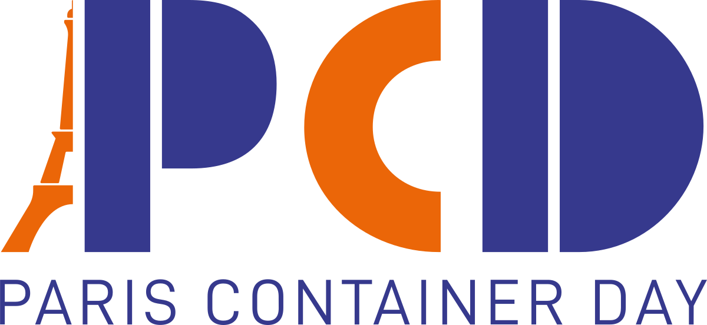
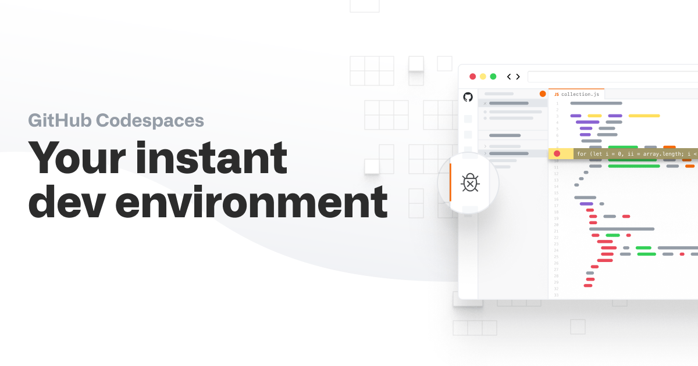

title: A clean dev env, working every time, everywhere
class: animation-fade
layout: true

<!-- 
Un environnement de dev propre et qui marche a tout les coups!

Vous n'avez jamais rêvé de pouvoir cloisonner parfaitement l'environnement
de chaque projet? Et de pouvoir le partager facilement, pour ne rien avoir à
faire lorsqu'un nouvel arrivant débarque sur votre projet?

C'est maintenant possible avec l'extension Remote Development de Visual Studio
Code! Venez découvrir comment tout ca fonctionne en live, et tout ca en gardant
ma machine propre :)
-->

---
class: right, middle
background-image: url(images/clean.jpg)
# .large[A **clean** dev env]
### Working every time, everywhere
.sep[
]
.w-20.responsive[]

.full-layer.bottom.right.text-right.small[
  .ms.responsive[]
  |
  Yohan Lasorsa
  |
  @sinedied
]

???
Hi everyone, I'm Yohan and if like me you like working in a clean environment, then this talk is for you.

I'll start by telling you the story of developer, that lands on a new project.

---

background-image: url(images/drop.jpg)
class: full, middle, center
.darktab[
# Welcome to this new project
]
.credits[Credits: NASA/JPL-Caltech]
???
What happens when you're dropped on a new project?

- Welcome to the team!

---

background-image: url(images/manual.jpg)
class: contain, full, middle, center
.darktab[
# Here's the doc
]
.credits.dark[Credits: Christie's]
???
- Here's the doc to setup your environment, provided there's one

Now, you take some time to install all the required tools and prepare your environment to work on the project.

And what usually happens next is...

---

background-image: url(images/mars.jpg)
class: full, middle, center
.darktab[
# Help 😞
]
.credits[Credits: NASA/JPL-Caltech]
???
- Fews days later, you still don't have a working environment

I have been that developer a few times already.

---

class: clist, big-text, center, middle

# Problems

- Docs are not .primary-text[up to date]
- Tools .primary-text[version] mismatch
- Other projects .primary-text[conflicts]
???
Common problems are...

We already know how to solve these problems, because we had the same issues for the runtime environement, when shipping applications to production.

---

background-image: url(images/containers.jpg)
class: full, middle, center, contrast
.darktab[
# Packaging environments
]
???
We solved these issues by packaging runtime environments into containers.

Then, why not also use containers for development environment?

---
class: middle, center, impact
# .small[.small[Containers + VS Code]]
.responsive.rounded[]

???
That's exactly what I'm going to show you!

Thanks to the remove development extension for VS Code, you can make project onboarding as simple as opening a new project.

DEMO

???
You can do exactly that with VS Code thanks to the Remote Development extension.

Now, I'll show you how that works on a project.

Prepare:
- browser localhost:5000
- browser https://github.com/sinedied/codespaces-demo
- `code dotnet-webapi`
  * open new cloned project
  * show local env: no `dotnet` tools
  * reopen in container
  * show `dotnet` tool available
  * detail .devcontainer files
  * build and run app
  * open URL in browser
  * reopen locally, show no impact on local env
- `code new-project`
  * show local `node -v` (old version)
  * init NodeJS 14 container from extension
  * reopen in container
  * show `node -v` (new version)
  * explain project files are local
- show dotnet project on GitHub, open Codespaces

---

.responsive[]
???
https://github.com/sinedied/codespaces-demo

---

class: middle, hide-handle

.table.row.middle[
.col-2[
]
.col-5[
# .large[Thank you!]
.em-text[Slides, extension, tutorials]  .large[aka.ms/clean-dev]
]
.col-3.right[
  .w-80.responsive[]
]
.col-2[
]
]

.center.large.baseline[
.large.em-text[{]
.fab.fa-twitter[] .fab.fa-github[] .fab.fa-dev[]
.large.em-text[}] .e[@sinedied] 
]
