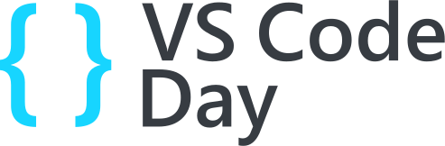

title: clean dev env
class: animation-fade
layout: true

<!-- 
Un environnement de dev propre et qui marche a tout les coups!

Vous n'avez jamais rêvé de pouvoir cloisonner parfaitement l'environnement
de chaque projet? Et de pouvoir le partager facilement, pour ne rien avoir à
faire lorsqu'un nouvel arrivant débarque sur votre projet?

C'est maintenant possible avec l'extension Remote Development de Visual Studio
Code! Venez découvrir comment tout ca fonctionne en live, et tout ca en gardant
ma machine propre :)

1. Slides
2. cd demo/donet
3. code-insiders .
4. disable all ext workspace + enable only remote dev extension
5. show icon in bottom left
6. add dev container for .net 2.1
7. show dockerfile
8. show .devcontainer config
9. init dotnet: dotnet new webapi
10: dotnet run, url https://localhost:5001/api/values
11. oups, port not exposed! -> forward port
12. show port to enable in .devcontainer config
13. talk about extension

-->

---
class: right, middle
background-image: url(images/clean.jpg)
# .large[A **clean** dev env]
### Working every time, everywhere
.sep[
]
.w-20.responsive[]

.full-layer.bottom.right.text-right.small[
  .ms.responsive[]
  |
  Yohan Lasorsa
  |
  @sinedied
]

???
Hi everyone, I'm Yohan and if like me you like working in a clean environment, you'll probably like this talk.

I'll start by telling you the story of developer, that has been dropped on a new project.

---

background-image: url(images/drop.jpg)
class: full, middle, center
.darktab[
# Welcome to this new project
]
.credits[Credits: NASA/JPL-Caltech]
???
What happens when you're dropped on a new project?

- Welcome to the team!

---

background-image: url(images/manual.jpg)
class: contain, full, middle, center
.darktab[
# Here's the doc
]
.credits.dark[Credits: Christie's]
???
- Here's the manual to setup your environment, provided there's one

---

background-image: url(images/mars.jpg)
class: full, middle, center
.darktab[
# Help 😞
]
.credits[Credits: NASA/JPL-Caltech]
???
- Fews days later, you still don't have a working environment

I have been that developer a few times.

---

class: clist, big-text, center, middle

# Problems

- Docs are not .primary-text[up to date]
- Tools .primary-text[version] mismatch
- Other projects .primary-text[conflicts]
???
Common problems are...

We already know how to solve these problems, because we had the same issues for the runtime environement, when shipping applications to production.

---

background-image: url(images/containers.jpg)
class: full, middle, center, contrast
.darktab[
# Packaging environments
]
???
We solved these issues by packaging runtime environments into containers.

Then, why not also use containers for development environment?

---
class: middle, center, impact
# .small[.small[Containers + VS Code]]
.responsive.rounded[]

???
That's exactly what I'm going to show you!

Thanks to the remove development extension for VS Code, you can make project onboarding as simple as opening a new project.

DEMO

???
- code dotnet-webapi

---

.responsive[]
???
https://github.com/sinedied/codespaces-demo

---

class: middle, hide-handle

.table.row.middle[
.col-2[
]
.col-5[
# .large[Thank you!]
.em-text[Slides, extension, tutorials]  .large[aka.ms/clean-dev]
]
.col-3.right[
  .w-80.responsive[]
]
.col-2[
]
]

.center.large.baseline[
.large.em-text[{]
.fab.fa-twitter[] .fab.fa-github[] .fab.fa-dev[]
.large.em-text[}] .e[@sinedied] 
]
