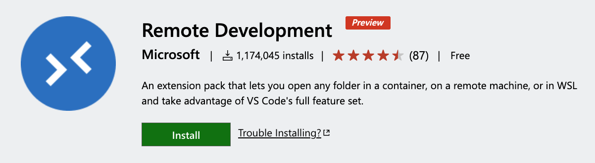

title: clean dev env
class: animation-fade
layout: true

<!-- 
Un environnement de dev propre et qui marche a tout les coups!

Vous n'avez jamais rêvé de pouvoir cloisonner parfaitement l'environnement
de chaque projet? Et de pouvoir le partager facilement, pour ne rien avoir à
faire lorsqu'un nouvel arrivant débarque sur votre projet?

C'est maintenant possible avec l'extension Remote Development de Visual Studio
Code! Venez découvrir comment tout ca fonctionne en live, et tout ca en gardant
ma machine propre :)

1. Slides
2. cd demo/donet
3. code .
4. disable all ext workspace + enable only remote dev extension
5. show icon in bottom left
6. add dev container for .net 2.1
7. show dockerfile
8. show .devcontainer config
9. init dotnet: dotnet new webapi
10: dotnet run, url https://localhost:5001/api/values
11. oups, port not exposed! -> forward port
12. show port to enable in .devcontainer config
13. talk about extension
bonus: show SSH remote extension

-->

---
class: right, middle
background-image: url(images/clean.jpg)
# .large[a **clean** dev env]
### working every time, everywhere
<!-- ### with Remote Development Extension -->

.full-layer.bottom.right.text-right.small[
  .ms.responsive[]
  |
  Yohan Lasorsa
  |
  @sinedied
]

---
class: big-text
# (Every) dev story

1. 🎉 Welcome in the team!
--

2. 📘 Here's the dev env setup doc (3 pages long)
--

3. 😞 [2 days later] Help me, I still can't build

---
class: impact
# Can we do better?

---
class: contain, middle, bg-right
background-image: url(images/docker.jpg)

.col-1.float-left[
  &nbsp;
]
.col-5.float-left.space-left[
  .responsive[]
]

---
class: middle, center
# ️Docker + VSCode ️💙
.responsive.rounded[]

---
class: contain, dark
background-image: url(images/showme.gif)

---

.big-text[
# Links

- [Remote Development Extension](https://marketplace.visualstudio.com/items?itemName=ms-vscode-remote.vscode-remote-extensionpack&WT.mc_id=humantalks1009-event-yolasorsa)
- [Visual Studio Code](https://code.visualstudio.com?WT.mc_id=humantalks1009-event-yolasorsa)
- [Getting Started with Remote Development](https://code.visualstudio.com/docs/remote/containers#_getting-started?WT.mc_id=humantalks1009-event-yolasorsa)
- [Advanced Container Configuration](https://code.visualstudio.com/docs/remote/containers-advanced?WT.mc_id=humantalks1009-event-yolasorsa)
]

.who-box[
  .row.table.middle.text-center[
  .col-3.small.text-left[
  Slides
  .large[bit.do/cleanenv]
  ]
  .col-6.small.half[
  ]
  .col-3.small.text-right[
  Yohan Lasorsa 
  .fab.fa-github[] &nbsp;&nbsp;/sinedied 
  .fab.fa-twitter[] @sinedied
  ]
  ]
]
