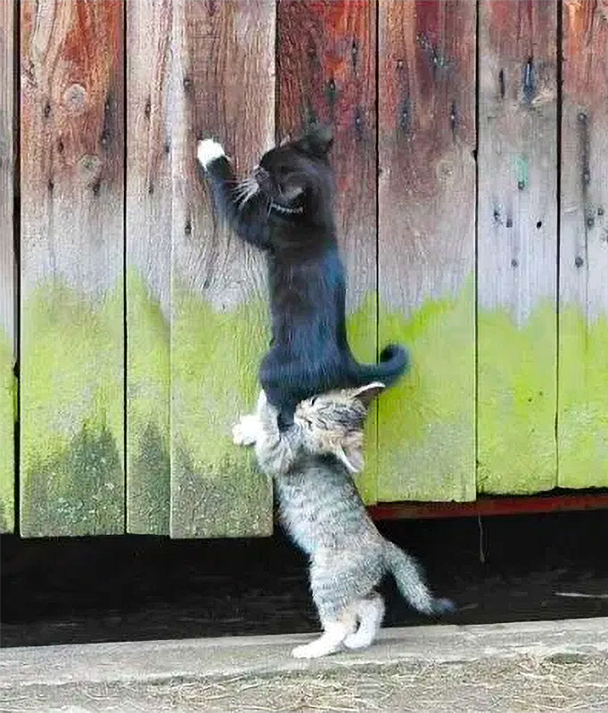

title: Become an OSS contributor
class: animation-fade
layout: true

<!-- Target duration: 20min -->

<!--
Contribuer à l'Open Source

# Open source c'est quoi?
- definition
- paysage OSS, licences
- OSS != gratuit

# pourquoi contribuer?
* Philisophie
- Utilisé partout en entreprise
* Personnel
- Apprentissage: 
  * tech
  * collaboration
  * review

Slides cercles communication

* Visibilité
- Recrutement
- Faire valoir Technique
- Portfolio

# Contribuer
- don't fear!
- docs, bugs, tests, code, articles, resources...

# Pratique
- good first issue
- contributor guide, CLA
- code of conduct
- chats: slack, gitter...

# Créer un projet OSS
- licence
- README
- contributor guide
- code of conduct
- tests, env with VSCode remote dev
- CI

events: hacktoberfest
 -->

.twitter-handle[
  @sinedied
]

---

class: middle, center, hide-handle, full
background-image: url(images/seeds.jpg)
background-position: center center

## .bit-larger[Why contribute to]
# .large[**Open Source**]

.full-layer.text-left.stick-left.stick-top[
.logos.no-margin[
  
  
]
]

.full-layer.who.text-right.small.middle.light-text[
  .ms.responsive[]
  |
  Yohan Lasorsa
  |
  @sinedied
]

???

Hi, everyone! Thanks for inviting me, it's my first at a PyLadies meeing and I'm really having to be with you today!

I'll start with a talk about an intersting subject, especially since it's the first day of hacktoberfest. I'm sure many of you have probably ask themselves this question: Why....

---
exclude: true

class: middle, center, hide-handle
# .large[Who am I?]

.table.row.middle[
.col-4.center[
  .w-70.responsive.avatar.tada.animated[]
]
.col-8.bit-larger.left[
  .e[Yohan Lasorsa] 
  .bit-larger[\[ Cloud Developer Advocate .mini-img[] \]] 
  .small.em-text[Web tech geek, OSS maintainer, DIY lover] 
]
]
.center.bit-larger[
.large.em-text[{]
.fab.fa-twitter[] .fab.fa-github[] .fab.fa-dev[]
.large.em-text[}] .e[@sinedied] 
]

---
class: middle, center
# What is Open Source Software?
???
Quelqu'un peut me donner une definition?
--

 

.quote.baseline[
> Open source software is a software whose .alt-text[source code] is released under a .alt-text[license] which grants anyone the rights to inspect, modify, and distribute it for any purpose.
]
???
- opposition a logiciel fermé, propriétaire
- = logiciel libre

---
class: middle, center
# .large[⚠️ Open Source ≠ Free]
### (as in free 🍺)
???
- OSS != gratuit
- OSS -> Eviter la confusion sur free
--

 
# 👉 Christine Peterson
???

- Coined by Christine Peterson
---

# Popular OSS licenses
???
- Qu'est ce que vous connaissez comme licences?
--

.full-layer.right[
.w-30[
  

  .center[
  ### .bit-larger[[opensource.org](https://opensource.org)]
  .responsive[]&nbsp;&nbsp;&nbsp;&nbsp;
  ]
]
.w-5[]
]

## Permissive licenses

- [MIT license (MIT)](https://opensource.org/licenses/MIT)
- [Apache License 2.0 (Apache-2.0)](https://opensource.org/licenses/Apache-2.0)
- [3-clause BSD license (BSD-3-Clause)](https://opensource.org/licenses/BSD-3-Clause)

## Copyleft licenses

- [GNU General Public License (GPL)](https://opensource.org/licenses/gpl-license)
- [GNU Lesser General Public License (LGPL)](https://opensource.org/licenses/lgpl-license)
- [Mozilla Public License 2.0 (MPL-2.0)](https://opensource.org/licenses/MPL-2.0)

???
- C'est quoi une licence?
  * un ensemble de droits et de restrictions
- OSI Open Source Initiative
- Qui connait la particularité des licenses copyleft?

---

class: impact
# Why contribute?

---

class: center, middle
# .baseline[OSS drives .alt-text[**YOUR**] (next) company]
???
- Vous utilisez deja beaucoup de logiciels OSS au quotidien:
  * PC, smartphone, TV, voiture, frigo...

- Vous allez travaillez et gagner de l'argent grace a l'open source:
  * en tant que dev c'est notre quotidien
  * l'ecosysteme startup et l'évolution tech depuis 2000 est possible grace a l'open source 

---
class: middle
.responsive[]

???
L'open source est une culture, qui sert de pilier à beaucoup de domaine et qui ouvre beaucoup de porte.
---

class: big-text, clist, center, no-bullet, middle
# .baseline.small[Why .alt-text[YOU] should contribute?]
--

- .eb[❤️] Love the philosophy
--

- .eb[📚] Learn and hone your skills
???
- tech, collaboration, review, 
--

- .eb[🤝] Build your network
???
- rencontrer des gens qui partagent vos valeurs et centres d'intérets
- trouver votre prochain boulot
--

- .eb[🙂] Fun!

---

class: middle, center

.w-30.responsive[]

???

Certes, un dev doit communiquer avec des machines

---

class: center
# .baseline[Development is .alt-text[Communication]]

.no-margin[
 
]
.col-5.responsive[]

???
Mais pas que!
- machines
- autres devs
- utilisateurs
- PMs
- toutes parties prenantes

---

class: center
# .baseline[Development is .alt-text[Communication]]

.no-margin[
 
]
.col-5.responsive.animation-fade-in.fade-in-delayed[]

???
Et ca c'est pour le 1er cercle (projet)

---

class: center
# .baseline[Development is .alt-text[Communication]]

.no-margin[
 
]
.side-layer.no-margin[
.col-5.responsive.zoom-out-circle[]
]
.col-5.responsive.animation-fade.fade-in-delayed[]

???
- projet
- entreprise(s) (/autres projets)
- communautés (OSS, confs, meetups...)

! important pour éviter l'effect "echo chamber"
* only positive feedback from people close, because of habits and proximity...

---

class: contain, full, overlay-dark, middle, center
background-image: url(images/profile.png)
# .baseline[Contributions gives .alt-text[visibility]]

???
- portfolio
- faire-valoir technique
- aide au recrutement

---

class: cover, full
background-image: url(images/ok.jpg)

---

class: clist, hide-handle
.side-layer.right.space-right[
  

  .w-45.responsive[]
]

# Different ways to help

.bit-larger.w-50.no-margin[
- Promote the project
- Help answering questions
- Fix typos in documentation
- Write tutorials
- Translate documentation
- Report bugs
- Write unit tests
- Design a nice logo
- **You name it!**
]

---
exclude: true
class: impact
## .large[Making your .alt-text[OWN] OSS project]

---
exclude: true
# Your own OSS project

- 👉 [choosealicense.com](https://choosealicense.com)
- 🗒 Write a good **README.md**
- ❓ Add a contributor guide
- 👮 Add a [Code of Conduct](https://www.contributor-covenant.org)
- 🤖 Write automated tests
- 📢 Let the world know about it!

---

class: hide-handle, center, middle

# Thank you!

.side-layer.right.through.no-margin[
  

  .w-15.responsive[]
]

.col-2.small.text-left.float-left[

 
]
.col-3.float-left[
  .responsive[]
]
.col-5.right.large.middle.float-left[
.large.em-text[{]
.fab.fa-twitter[] .fab.fa-github[] .fab.fa-dev[]
.large.em-text[}] .e[@sinedied] 
]
