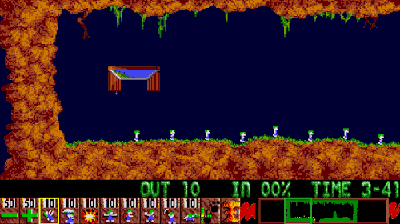

title: The fast and the furious developer
class: animation-fade
layout: true

<!--
"Comment peut-on aller plus vite?" - Qui n'a jamais entendu et subi les travers de cette question dans un projet?

Les développeurs sont pourtant très efficaces dans leur coeur de métier qui est la production de code, mais une grande partie de cette efficacité se perd très souvent au milieu des nombreux process et meetings intermédiaires. La communication reste pourtant un point crucial de ces process, un développeur devant communiquer avec presque tout le monde: le produit, les designers, les autres développeurs, les manageurs, etc.

En tant que développeur, je souhaite partager les pièges et fausses bonnes idées que j'ai pu entendre et subir dans différents projets. Nous analyserons tous cela ensemble pour découvrir comment éviter de faire perdre du temps aux développeurs (et les rendre furieux au passage), pour leur permettre d'exploiter leur plein potentiel et redevenir rapides et efficaces.

Make your developers fast again!

Bénéfices de la session :
- Mieux comprendre les points de stress quotidien d'un dev au sein d'un process Agile
- Découvrir les pièges fréquents à éviter qui font perdre du temps (et de l'argent) à vos équipes
- S'approprier les liens indissociables entre temps de développement et qualité logicielle
- Accepter l'impact technique de l'organisation et du planning projet, et inversement
 -->

.twitter-handle[
  @sinedied
]

---

class: bottom, left, hide-handle
background-image: url(images/fast-dev.jpg)
background-position: center center

.full-layer.who.text-right.small.middle.light-text[
  .w-10.responsive[] .bottom.bit-larger[**Agile Grenoble 2019**]  
  .ms.responsive[]
  |
  Yohan Lasorsa
  |
  @sinedied
]

???
On parler efficacité: comment rendre plus efficace et ne pas aliéner vos équipes de dev?

- Qui est dev?
Ce talk s'adresse a tous: non-dev, mais dev aussi!

---

class:  center, middle
# .large[Developer time]

???
Parlons de l'utilisation du temps d'un dev
- A quoi passe-t-il son temps?

---

class:  center, middle
# .large[Developer time]

.devtime[
.w-100.tbar.progress[100% Writing code]
]

???
- Beaucoup voient un dev ideal comme quelqu'un qui ecrit juste du code
- Qui pense comme ca?

Si vous arriver a trouver un dev comme ca, vous etes surement tombé sur...

---

class:  center, middle
# .large[The .large[.big[**10x**]] Developer]

???
- Qui a deja entendu parlé de 10x developer/engineer?

- PS: je ne fais pas de disctinction dev/engineer

---

class:  center, middle
# .large.baseline[The .animated.swing.ib.alt-text.small[(mythical)] .large[.big[**10x**]] Developer]

???
- Vous en avez peut etre deja vu ou non,

- Il a eu beaucoup de debat sur twitter ces derniers temps sur ce sujet

---

class: middle, center, hide-handle, dark, light-text

.w-60.responsive[]

.small[https://twitter.com/skirani/status/1149302828420067328]

???
- Vous avez peut etre deja vu ce thread?
- Si non, je vous invite a aller le lire un peu plus tard...

- Un business angel decrit un dev 10x:
  * pas de meeting
  * travaillent en solo
  * du code de qualité qui n'a pas besoin d'etre refactoré
  * regardent jamais la doc (connaissent par coeur)

---

class: center, middle
# But it's all wrong.

???
On reste dans le cliché du dev geek solo dans son coin...

Ma présentation d'aujourdhui est en partie la pour metter un bon coup de pied a tout ca,
et voir vraiment ce qui est important pour qu'un dev soit efficace... dans une EQUIPE.

---

class: primary, light-text, center, middle
# .baseline.light-text[Development is all about] .alt-text.large[**communication**]

???
- Le developpement avant tout une histoire de communication!
- Meme pour le side projects perso (github, twitter etc...)

---

class: dark, contain
background-image: url(images/why2.gif)

???

Ne prenez pas peur, on va prendre le temps de détailler tout ca...

---

class: middle, center, hide-handle
# .large[Who am I?]

.table.row.middle[
.col-4.center[
  .w-70.responsive.avatar.tada.animated[]
]
.col-8.bit-larger.left[
  .e[Yohan Lasorsa] 
  .bit-larger[\[ Cloud Developer Advocate .mini-img[] \]] 
  .small.em-text[Web tech geek, OSS maintainer, DIY lover] 
]
]
.center.bit-larger[
.large.em-text[{]
.fab.fa-twitter[] .fab.fa-github[] .fab.fa-dev[]
.large.em-text[}] .e[@sinedied] 
]

???

- For the last 10 years, I've worked as a dev in:
* research, many ESN projects, product team

- j'ai experimenté toutes sortes de methodes Agiles: SCRUM, Kanban, Lean, La Rache(tm)

Now I started working as a dev advocate, and I'll do just that: advocate for developers :)

---

class: left, middle
# Why "solo-style" development is bad?
.bit-larger[
- Product communication (estimates, specs, feedback)
- Dev communication (knowledge sharing, tech decisions)
- Code quality (reviews, breaking changes, conflicts)
]

???

Pkoi c'est un pb?
Pour savoir ce qu'on fait et avancer, il faut communiquer!!!

---

class: cover, impact, middle, center
background-image: url(images/tunnel.jpg)

        
## Tunnel effect

???

Le truc a éviter!
- Quitte ou double
- == risque
- Ca nous est tous arrivé un moment ou un autre...
- Anecdote du gars qui s'est enfermé 3 semaines pour coder une API estimée a 3 mois par son équipe

---

class: middle, center

.w-30.responsive[]

???

Certes, un dev doit communiquer avec des machines

---

class: center
# .baseline[Development is .alt-text[Communication]]

.no-margin[
 
]
.col-5.responsive[]

???
Mais pas que!
- machines
- autres devs
- utilisateurs
- PMs
- toutes parties prenantes

---

class: center
# .baseline[Development is .alt-text[Communication]]

.no-margin[
 
]
.col-5.responsive.animation-fade-in.fade-in-delayed[]

???
Et ca c'est pour le 1er cercle (projet)

---

class: center
# .baseline[Development is .alt-text[Communication]]

.no-margin[
 
]
.side-layer.no-margin[
.col-5.responsive.zoom-out-circle[]
]
.col-5.responsive.animation-fade.fade-in-delayed[]

???
- projet
- entreprise(s) (/autres projets)
- communautés (OSS, confs, meetups...)

En general, plus un dev prend de l'experience, plus son cercle de communication s'agrandit

! important pour éviter l'effect "echo chamber"
* only positive feedback from people close, because of habits and proximity...

- Dev vs conferences
Ce n'est pas que pour aller boire des bieres

---

class: middle, light-all, light-text
.full-layer.full-left.v-center-flex.w-30[
  .responsive[]
]
.full-layer.v-center-flex.full-right.w-70.red.space.big-text[
  # #angry
  « Black hole » projects &nbsp;&nbsp; .ib.rotating[]
]

???
- All in, nothing out
- Aucune contribution/echange externe au projet

Anecdote 2j de conf = vacances

---

class:  center, middle
# .large[Developer time]

.devtime[
.w-50.tbar[50% Coding].w-50.tbar.alt[50% Communication]
]

???

- Moitié echange, moitié du temps aux activités de codage
- Non exclusif: pair programming = les 2 en meme temps

La qualité/efficacité de la com est importante pour que le code avance

---

class: full, center, middle, cover, overlay-dark
background-image: url(images/teamplay.jpg)

## .large[Development  =  .alt-text[Communication]  +  .red-text[Teamplay]] 

???

Je rajoute un autre ingrédient non mesurable en terme de temps

* stakeholders
* clients, end-users
* manager
* code communities (OSS...)

---

class: impact
# .ib.animated.zoomIn[Team size]

???
Le 1e élément le + important, c'est la taille d'équipe
Scrum recommande entre 5 et 10

---

class: contain, hide-handle
background-image: url(images/lines-com.jpg)

???
- Plus de gens, plus de lignes de communications
- Plus de chance que la com se deteriore et que les infos circulent mal

---

class: middle

# Brooks' law
 

.quote.large[
> Adding human resources to a late software project makes it later.
]

???
Frederick Brooks
- Il faut savoir quand faire entrer des nouvelles personnes sur un projet
- Plus de gens ne veut pas dire plus rapide/efficace

+ de 40 ans! (1975)

---

class: middle, light-all, light-text
.full-layer.full-left.v-center-flex.w-30[
  .responsive[]
]
.full-layer.v-center-flex.full-right.w-70.red.space.big-text[
  # #angry &nbsp; .w-50.responsive[]
  Don't add new devs and expect your team to figure it out
]

???
- il faut planifier
- prevoir le ramp-up et la dispo des autres
- ne pas imaginer qu'un dev va etre immediatement efficace (ex criteo)

---

class: center, middle

# Microservices, Microfrontends
???
- Pourquoi je vous parle technique?
- Oui, c'est principalement pour du passage a l'échelle...
--

# .large.alt-text.animated.ib.bounceIn[.large[MICROTEAMS]]

???
- microservices, microfrontends?
  * split responsibilities, reduce team size

Si votre projet n'avance pas assez vite, commencez par voir si il n'y a pas trop de gens...

Pas intuitif, et pourtant!!!

---
exclude: true
class: cover, full, hide-handle, middle
background-image: url(images/balance.jpg)

## .large[Team balance]

???
composition d'equipe

=> on veux les meilleurs!

---
exclude: true
class: cover, center
background-image: url(images/junior.jpg)
# You need senior devs

???
Lead/Senior

- Need to learn
- Quality
- Senior != I'm always right
- Senior = teach, mentor, guide (& learn)
- Key is open discussion, everyone with equal weight

---
exclude: true
class: cover, full, hide-handle, center, bottom, bg-offset-bottom
background-image: url(images/senior.jpg)
# But you also need juniors

???
pas une question d'age!
- Faites tourner vos equipes
- Seniors devs (with project legacy) tend to overestimate
- Juniors devs tend to underestimate

---

class: impact
## Don't forget the most important thing...

---

class: full, middle, overlay-dark
background-image: url(images/trust.jpg)

.no-margin[
Everything depends on
# .large[.large[Trust]]
]

???
Ne pas oublier la CONFIANCE!

---

class: middle, light-all, light-text
.full-layer.full-left.v-center-flex.w-30[
  .responsive[]
]
.full-layer.v-center-flex.full-right.w-70.red.space.big-text[
  # #angry &nbsp; .w-40.responsive.rounded[]
  - Daily standup as report duty
  - Micro management
  - Dishonesty
]

???
- agile = reporting
- "surveiller" son equipe / micromanagement, flexible work (si pas confiance, embauchez pas!)
- Oui oui tout va bien > dans le dos bam!
- recoder derriere son collegue
- avoir confiance dans les choix produits/UX

MAIS ca fonctionne dans les 2 sens

---

class: impact
## .large.middle[Estimates &nbsp; .big.mini-img[] &nbsp; roadmaps]
???
Passons au nerf de la guerre de bcp de projets...

---

class: middle, center, hide-handle, dark, light-text

.w-80.responsive[]

.small[https://twitter.com/nick_craver/status/1180624053805240326]

???
En vrai, qui travaille sans deadline ici?

---

class: middle, center
.baseline[
# .bit-larger[Planning with estimations]
.ib.left.no-margin.big-text[
- Aknowledge **uncertainty**
- **Priorities** are everything
<!-- - Need to refine? **Split** up -->
- Don't **micro-estimate**
]
]

???
Accepter qu'on va se planter!
- On est mauvais pour estimer
- L'important c'est les priorités
- On ne raffine pas une roadmap 6-12 mois!

---

class: middle, center

# .sketch.large[Estimation tips]
.ib.left.no-margin.larger[
- Roadmaps: use **buckets**
<!-- - Sprints: split and use **points** -->
- Do **short sessions** (1-2h)
- Unclear about spec/tech? **put aside**
]

.w-60.responsive[]

???
- roadmap: 3-6 month -> buckets
- sprint -> split + points
- short sessions 1-2h MAX
- if unclear or subject to (tech) debate

---

exclude: true
class: contain, hide-handle, dark, center
background-image: url(images/man-month.png)
# .light-text[Man month drama]

???
- Bien sur, une fois chiffrée la roadmap colle pas et...

Mythical Man Month
- more people, more complexity != more speed

---

class: contain, dark, light-text
background-image: url(images/story-points.png)

???
Tout le monde connait bien ca j'imagine
- rule of 3 = days \o/
- Pressure and irrealistic goals!!!
* impact morale
* perverse negative effects (= estimation overhead, quality loss)

---

class: contain, dark, light-text
background-image: url(images/spent-time.jpg)

---
exclude: true
class: cover, full, light-text, bottom, overlay-dark, center
background-image: url(images/sad.jpg)

# Estimates in hours/days impact **morale**
 
???
- On se sent pourri a force, et moins efficace
- Ca depasse a chaque fois, donc autant pas faire d'efforts...
- Surchiffrage par la suite

You will never win...

---

class: middle
.baseline.big-text.no-bullet[
# Estimate vs time spent
- .eb[😱] **Under** > bye bye tests & quality
- .eb[🤫] **Slightly over** > let's catch up UT/refactoring
- .eb[😎] **Way over** > what's next story?
]

---

class: middle, center, big-text, full, cover
background-image: url(images/underwater.jpg)
# .small[Leave room for breathing]

--
exclude: true
& define sprint **goals**

---

exclude: true
class: middle
.quote.large[
> It's just a [button]?

.right[
— *Every product owner*
]
]

???
- Existing code vs Design vs Data vs Constraints vs Tests

---

exclude: true
class: center, botton, contain
background-image: url(images/button1.png)

---

exclude: true
class: center, botton, contain
background-image: url(images/button2.png)

---

exclude: true
class: middle, center, clist
# Don't challenge to **retrofit** your backlog
--

exclude: true
.big-text[
- Ask about tech difficulties
- Aim lower and adapt
]

---

exclude: true
class: cover, full, center
background-image: url(images/measure.jpg)
## .large[.large[Measure]]
Otherwise it's just a lucky guess

???
ce qui est important c'est de mesurer l'avancement,
pas de

---

exclude: true
.col-6.ib.left[
# .green-text[We measure (KPI)]

.no-margin.no-hmargin[
### Usage
- Acquisition
- Engagement / Satisfaction / Churn
- Feature usage
  
]
.no-margin.no-hmargin[
### Velocity
- Time to build / test / deploy / learn
  
]
.no-margin.no-hmargin[
### Production health
- Time to detect / inform / mitigate
- Customer impact
- SLA per customer
]
]
--
exclude: true
.col-6.float-right.space-left.left[
# .red-text[We don't watch]

.no-margin.no-hmargin[
### Useless metrics
- Original estimate
- Completed hours
- Team capacity / velocity
- Burndown
- \# of bugs found
- Lines of code
  
]
.center.large[.large[.large[🙅‍♀️]]]
]

???
Measure what's meaningful to you

---

class: impact
## .large[Growth culture]
???
Un élément important c'est la culture d'amelioration et de croissance

---

class: full, center, over
background-image: url(images/grow.jpg)

# Learn & share

???
- Et si machin se casse une jambe?
- La connaissance doit etre partagée
- Prevoyez du temps de partage! doc, meeting, pair
- Pair programming
- Voyager

---

class: center, middle
# .baseline[.red-text[Test,] .green-text[code,] refactor]

???
- 3 elements indispensable dans un projet!
- pas seulement un mantra du TDD, c'est pour le bien de VOS APPS
- refactoring = dette, qui se paye a chaque nouvelle feature
- pas de valeur immediate, mais valeur + rapidement sur le long terme

---

class: right, full, cover, big-text, no-bullet, overlay-dark, light-text
background-image: url(images/tools.jpg)

# **Tools**
--

- "We only use **OSS**" .small[(because it's free 😓)]

--

## .alt-text[You should consider]

- Premium tools for **productivity**
- **Off-the-shelf** before homemade
- Tailored **helper tools**
???
- Gain de temps et santé mentale pour vos devs
- License, ne pas redévelopper vos composants ca coutera presque toujours plus cher (et + support)
- Invest in your own tooling!

---

# "We tried, but nobody listens..."
--

.large[Potential gain: **15 min/day** for **500€ yearly** license]  

--
.float-left.w-30.space-right.no-margin[
  .responsive[]
]

--
.float-left[
### Cost of *not having* this license
- Minute cost: 500€ / (8 * 60) = __1.04€__
- Yearly cost: 200 \* 15 * 1.04 = __3120€__

]
--

.float-left[
### Gain of *buying* licences for the team
- 5 devs * (3120 - 500) = __13100€__

]

---

class: middle, light-all, light-text
.full-layer.full-left.v-center-flex.w-30[
  .responsive[]
]
.full-layer.v-center-flex.full-right.w-70.red.space.big-text[
  # #angry
  - Pair prog. is a waste of time
  - Refactoring is a waste of time
  - Wasting time with unsuited tools
]

---

class: cover, center, full, big-text
background-image: url(images/focus.jpg)

# Focus

---

class: contain, dark, no-handle
background-image: url(images/interrupt.jpg)

???
Un dev a besoin de concentrer
- interruptions are bad => we need continuous focus time
- 25min (23m15s) = cout d'une interruption
- context switching COST A LOT

---

class: big-text, center, clist, middle, no-bullet
# Improve focus
.baseline[
- .eb[🤝] Focus days/meeting days
- .eb[🧹] Interrupt chore (with rotation)
- .eb[💬] Async messaging: Slack, Teams...
- .eb[🏠] Remote work
]

???
- plannifier, eviter meeting de derniere minute
- "Hey t'as vu mon message sur slack?"
- Etiquette Slack
- Presentiel, rester tard = bien vu

---

class: middle, light-all, light-text
.full-layer.full-left.v-center-flex.w-30[
  .responsive[]
]
.full-layer.v-center-flex.full-right.w-70.red.space.big-text[
  # #angry
  - Open shouting spaces
  - Headphones = please come later
  - Hey, did you see my email?
]

???
- Hey, t'en es ou sur la tache XXX?

---

class: impact
## .large[Wrapping up]

---

class:  center, middle
# .large[Developer time]

.devtime[
.w-50.tbar[50% Coding].w-50.tbar.alt[50% Communication]
]

.w-50.float-left.no-bullet.baseline[
.left[
- .w-35.ibar[.s[35%]] Read code
- .w-5.ibar[.s[5%]].w-30[] Write feature code
- .w-5.ibar[.s[5%]].w-30[] Write test code
- .w-5.ibar[.s[5%]].w-30[] Fix, update, refactor code
]
]
.w-50.float-left.no-bullet.baseline[
.left[
- .w-20.ibar.alt[.s[20%]] Learn, share
- .w-15.ibar.alt[.s[15%]].w-5[] Design, estimate
- .w-10.ibar.alt[.s[10%]].w-10[] Read docs, specs
- .w-5.ibar.alt[.s[5%]].w-15[] Write docs
]
]

???

Ces chiffres sont faux! -> ordres d'idées

- Maintain: (refactor, update, fix...)
- “Indeed, the ratio of time spent reading versus writing is well over 10 to 1. We are constantly reading old code as part of the effort to write new code. ...making it easy to read makes it easier to write.”

Robert C. Martin, Clean Code: A Handbook of Agile Software Craftsmanship

---

class: big-text, center
# .small[How to keep your devs fast?]
Refine **communication flows** 
--
Allow them to **focus** 
--
Invest in **good tools** 
--
Don't **micro-manage**  
--
.large[**Trust** them.]

---

class: center, middle
### Otherwise...
.w-50.responsive[]

???
Devs content = 12% plus productifs

---

class: middle, hide-handle

.big-text.no-bg.baseline[
As a **developer**, 
I want to **THANK YOU** 
Because **of your presence**.
]
.large.baseline[
Slides: [bit.ly/fastdev](https://bit.ly/fastdev)
]

.right.large[
.large.em-text[{]
.fab.fa-twitter[] .fab.fa-github[] .fab.fa-dev[]
.large.em-text[}] .e[@sinedied] 
]

<!--
# Wrapping up

Dev = Understand, Challenge, Design, Estimate, Build, Test, Learn, Write docs, Deliver, Maintain

1. Write feature code
2. Rewrite existing code (maintain, fix, perf...)   | write other code
2. Write tests                                      |
3. Read code, docs, specs                           | understand & learn
3. Learn: pair, docs, share                         |
4. Write docs                                       | collaborate
4. Discuss: challenge, design, estimate, share      |
-->
