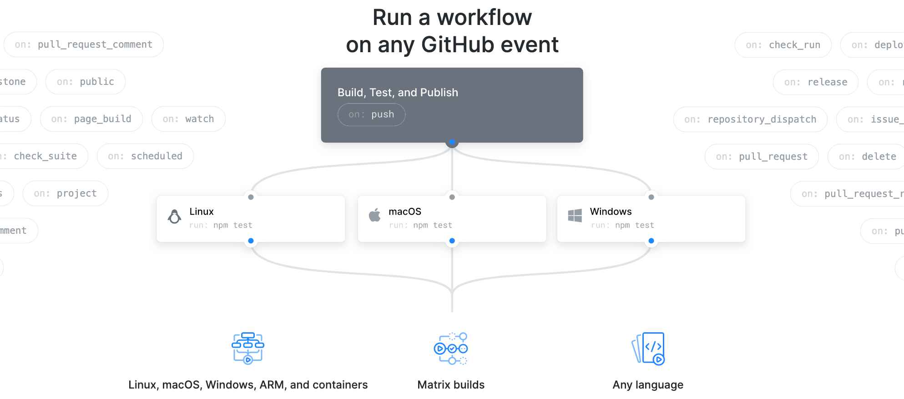
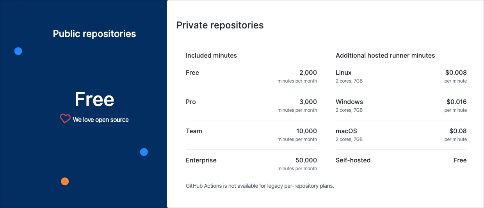

class: middle, black, right, hide-handle, contain
background-image: url(images/github-actions-hero.jpg)

.full-layer.who.text-right.small.middle.light-text[
   
  .ms.responsive[]
  |
  Yohan Lasorsa
  |
  @sinedied
]

<!-- 
Devenez un GitHub Actions Hero!

GitHub Actions, c'est le nouveau système de worflow intégré à GitHub pour automatiser tous vos projets, CI/CD mais pas que! Et en plus, ca ne coute rien pour les projets open source, c'est le moment de s'y mettre non?
Plutot qu'un long discours, rien ne vaut une belle démo live pour découvrir tout cela!

# GitHub Actions?

# Demo
- new project, create repo
- CI!
- CD -> github pages
- show actions marketplace
- talk about custom actions
- talk about docker compose

# Conclusion
- pricing, laius Az DevOps
- semantic release, Google home...

-->

---

class: center
# GitHub Actions
.expand[
.responsive[]
]

???
- Actions = GH Events -> Workflow -> jobs -> steps
- Platforms: linux, mac windows & arm/64
- CI/CD, but not only
- Fully integrated to Github

---
class: impact
# Demo time

???
- Repo to be prepared in advance, see prepare.sh
- Click on "Actions" tab on GH
- CI is the default workflow proposed
- Show other proposed workflows
- Explain editor, show completion, platforms & archs
- CD -> github pages
- show actions marketplace
- talk about custom actions
- talk about docker compose
---

class: center, clist, middle, big-text
# There's more!

- Run in Docker container
- Write your custom actions
- Use your own runner
- Use `docker compose` to spawn testing env
- Triage issues and clean up backlog

???
- SDK
- Bring your own env/server (on-premise or cloud-based)
- E2E testing
- Auto labelling/closing/need more info/CLA

---

# Pricing 🎁

.responsive[]

???

- OSS: 20 runners en parallèle
- 7 Go RAM, 2-core CPU, 14 Go SSD VM, 6H per workflow clean for each job

---

class: clist
# Not using GitHub? .float-right[👉 [aka.ms/git-azdo](https://aka.ms/git-azdo)]

 
.big-text[
### .bit-larger[Take a look at Azure Pipelines!]

.side-layer.right[
.w-20.responsive[]
]

- Still free for OSS
- Same platform support
- Similar syntax
]

???
- Actions use AZ Pipelines under the hood but shhh
- Example with GitHub but using an external git repo (Gitlab, Bitbucket...)

---

class: middle, center, big-text
# More automation, more fun  🤖

---

.center[
.quote.bit-larger.ib[
> Hey Google, release a new version
]
]
--

- Conventional commits: `feat: | fix: | docs: | refactor: | ci: | ...`
--

- Semantic release:
  * Check commits, decide if new release
  * Bump version according to semantic versioning
  * Generate changelog
  * Publish NPM package
  * Create release commit and tag it
  * Create GitHub release with changelog and artifacts
--

- GitHub Action with HTTP trigger (`on: repository_dispatch`)
--

- IFTTT + Google Home

---

class: cover, bottom, full, center
background-image: url(images/enjoy.jpg)
# .large[**ENJOY YOUR FREE TIME!**]

---

class: hide-handle, middle

# Thank you!

.side-layer.right.through.no-margin[
  

  .w-15.responsive[]
]

.baseline[
- .w-35[[aka.ms/gh-actions](https://aka.ms/gh-actions)] → GitHub Actions docs
- .w-35[[aka.ms/awesome-actions](https://aka.ms/awesome-actions)] → Awesome Actions
- .w-35[[aka.ms/gha-example](https://aka.ms/gha-example)] → Example repo
- .w-35[[aka.ms/git-azdo](https://aka.ms/git-azdo)] → Git+Azure DevOps
]

.col-3.small.text-left.float-left[

 
Slides: 
.large[bit.ly/gha-hero]
]
.col-9.right.large.middle.float-left[
.large.em-text[{]
.fab.fa-twitter[] .fab.fa-github[] .fab.fa-dev[]
.large.em-text[}] .e[@sinedied] 
]
