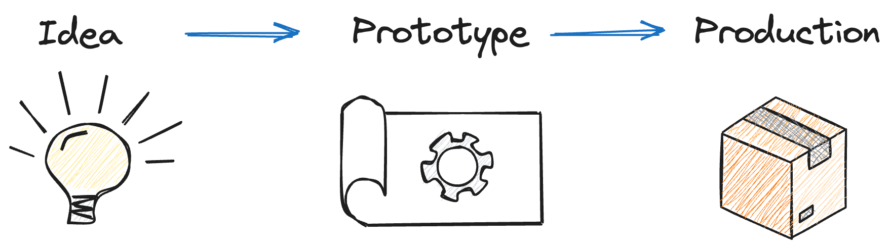
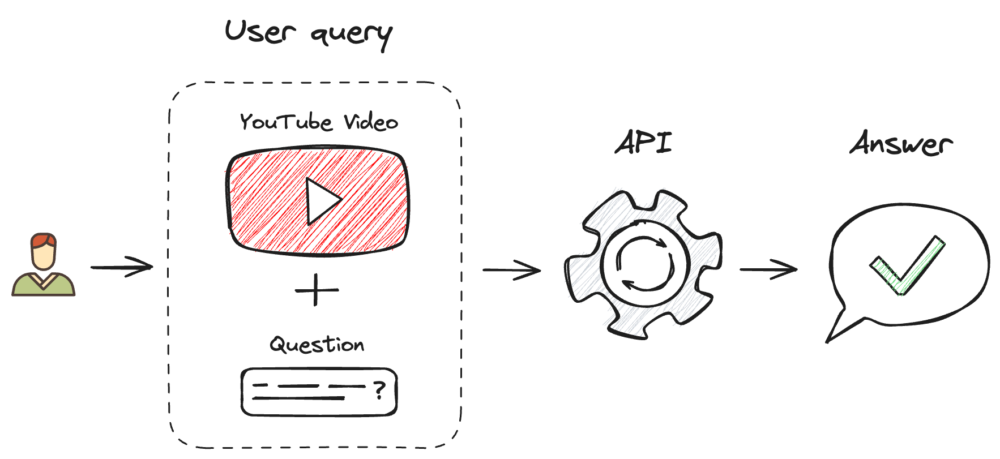
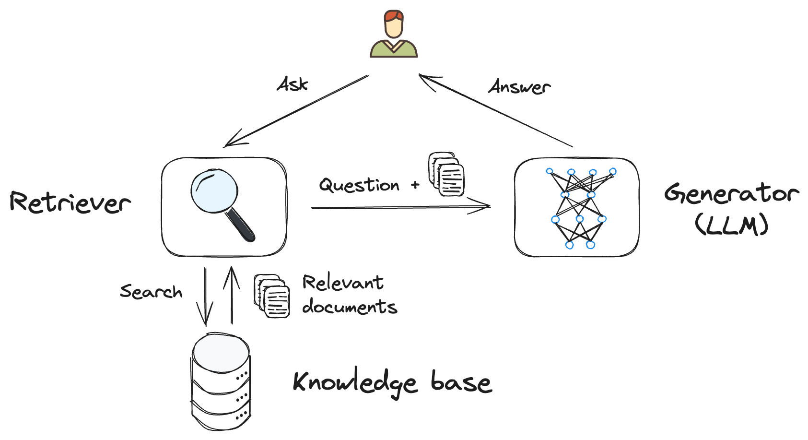
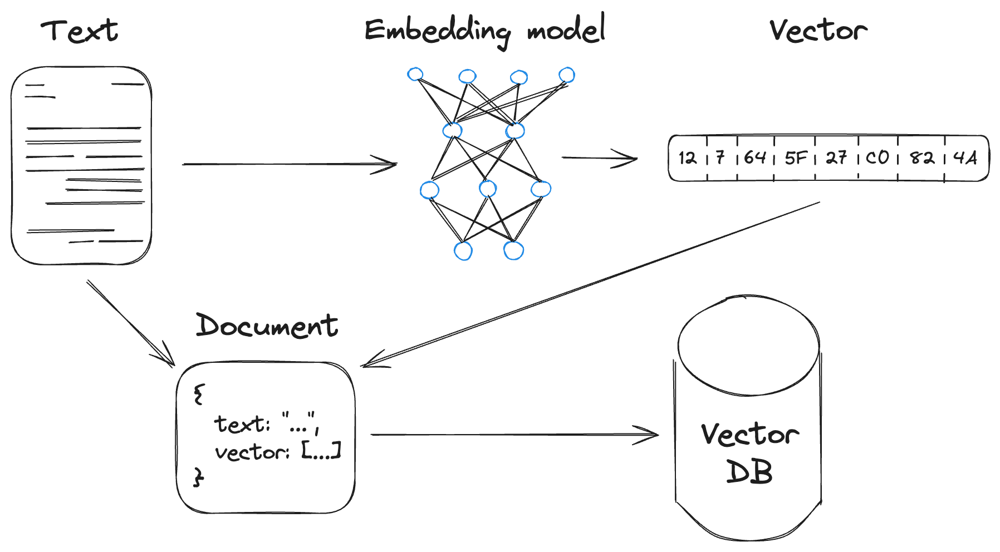
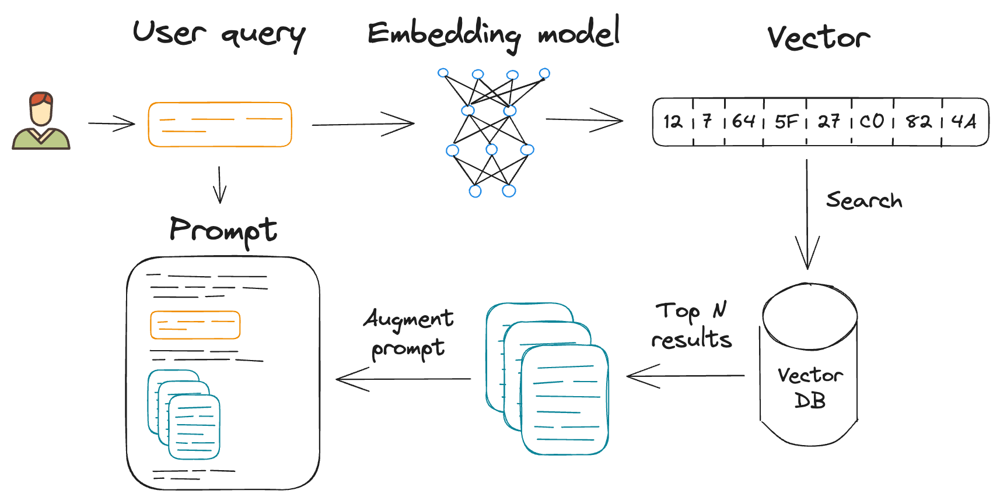

title: LangChain.js + Azure - A Generative AI App Journey
class: animation-fade
layout: true

<!-- .twitter-handle[
  @sinedied
] -->

---

class: hide-handle, middle
background-image: url(images/bg-main.jpg)

# .text-tight.baseline.dark-text[LangChain.js + Azure .tiny.block[A Generative AI App Journey]]
.dark-text[
Yohan Lasorsa
]

???
- Hi everyone, I'm Yohan and I work as a senior cloud developer advocate in the JS team here at Microsoft

- In this session, we'll explore how you can develop generative AI apps using LangChain.js and Azure

---

# Developing apps with Generative AI

.center[
   
.w-80.responsive[]
]

???
- We're still at the beginning of exploring what you can do with generative AI, and the field is moving fast, very fast!

- When things move fast like this, you need to be able to experiment and iterate quickly. First to validate your ideas with a prototype, then to scale up to production if it works.

---

class: light-gbg
# Introducing LangChain.js 🦜🔗

.bit-larger.blist.baseline[
- **Open-source JavaScript library for working with .blue-text[LLMs]**
- **Provides high-level .blue-text[abstractions]:**
  * models, vector databases, agents, and more
- **Bridge between .blue-text[local and cloud-based] components**
- **Allows complex .blue-text[compositions] of models and data**
]

???
- So, let me introduce you to LangChain.js, a JavaScript library for working with large language models (LLMs). If the name sounds familiar, it's because it's the sister project of LangChain, which is made for Python, and a hugely popular open-source project in the AI community.

- It's a great tool for building generative AI apps.

---

# Idea 💡

#### API for a Q&A system on YouTube video content

.center[
.w-80.responsive[]
]

???
- Let's start with a simple idea:
- I'm from a generation who grew up reading books and articles, but nowadays most of the interesting content is in video format.

- So, I thought it would be nice to have a system where you can ask questions about a YouTube video, and get answers quickly in a text format without having to watch the whole video.

---

# Retrieval-Augmented Generation (RAG)

- **Combination of a .blue-text[retriever] and a .blue-text[generator]**
- **Allows for more precise and relevant answers**

.center[
.w-70.responsive[]
]

???
- To implement this idea, we'll use this approach called Retrieval-Augmented Generation (RAG)

- Why use RAG? Video content is often long and contains a lot of information. We want to be able to retrieve the most relevant information and then generate a precise answer to a question.

- It grounds the answer in a set of documents, to avoid the generation of irrelevant or even made up information.

---

# Retrieval-Augmented Generation (RAG)
.no-margin[
#### Knowledge base builder
Create document embeddings from text data to be used in the retriever
]
.center[
.w-70.responsive[]
]
???
- Embedding: vector representation of a piece of data, that captures the underlying structure and relationships between pieces of data

- Embeddings are used to build vector DBs

- This is how we "memorize" things (ie your data) in LLMs

- Example: law texts, medical texts, etc.

---

# Retrieval-Augmented Generation (RAG)
.no-margin[
#### Retrieval and context augmentation
Use a vector DB to retrieve relevant information and add it to the context
]
.center[
.w-75.responsive[]
]

---

class: middle
background-image: url(images/bg-demo.jpg)
# Demo

???
Now, let's see how we can implement all of that using LangChain.js!

First, we'll start with a local prototype, as it's easier and cheaper to experiment when working locally.

#### Show Ollama

- explain what ollama is
  * run `ollama` command
- `ollama list` => show installed models
  * explain we'll use all-minilm:l6-v2 for embeddings and llama2 for the model
- `ollama run llama2` => show the model
  * "How are you?"
  * It's a minimal version of ChatGPT running on your machine
  * It also provide an API that you can use in your apps
  * ctrl+d to exit

#### Explain the prototype

- open `prototype.js`
  * explain the code step by step
- `npm start` to run the demo

#### Update the prototype to use Azure

- replace model/db imports
  * `imp` snippet
- replace the model init sections
  * use Copilot or `newai` snippet for the AI Search part
  * explain that the models are defined in `.env` file (show the file)
- replace the embeddings part
  * `sea` snippet => first need to check if documents are already indexed
  * `add` snippet (or use Copilot) to complete the embedding part
- `npm start` to run the demo again

---

class: light-gbg
# Wrap-up

.bit-larger[
**RAG implementation** 
Using LangChain.js abstractions and utilities
]

--
.bit-larger[
**Local prototype** 
FAISS vector DB and Ollama + LLaMa2 7B / all-minilm-l6-v2 models
]

--
.bit-larger[
**Production on Azure** 
Azure AI Search and GPT-4-turbo / text-embedding-3-large models
]

---

class: hidden-table, middle
background-image: url(images/bg-main.jpg)
# .large[Thank you!]

- .w-35[Slides] [aka.ms/lcjs-azure](https://aka.ms/lcjs-azure)
- .w-35[Demo source code] [aka.ms/lcjs-azure/demo](https://aka.ms/lcjs-azure/demo)
- .w-35[Serverless ChatGPT sample] [aka.ms/lcjs/chat/sample](https://aka.ms/lcjs/chat/sample)
- .w-35[Enterprise AI sample] [aka.ms/azai/js/code](https://aka.ms/azai/js/code)
- .w-35[In-depth RAG workshop] [aka.ms/ws/openai-rag](https://aka.ms/ws/openai-rag)
