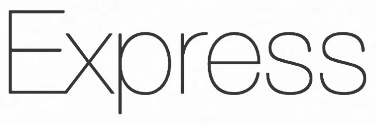
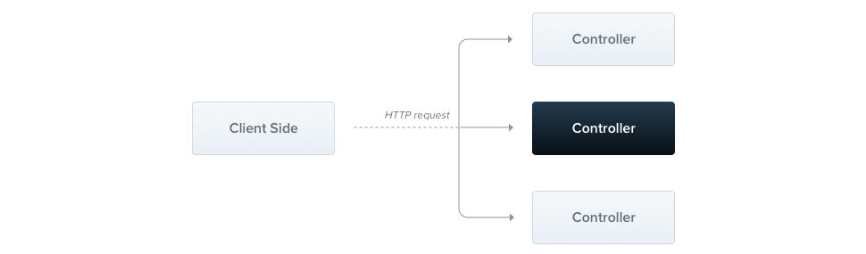
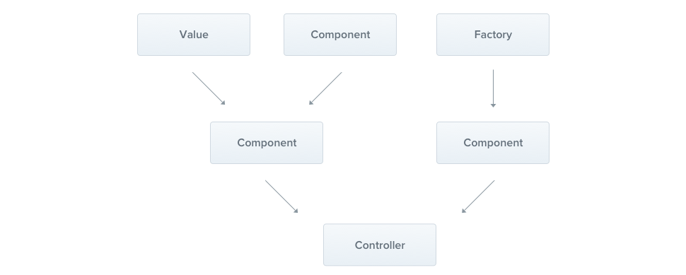
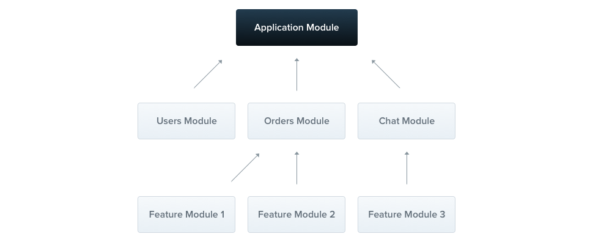

title: Discover NestJS
class: animation-fade
layout: true

.twitter-handle[
  @sinedied
]

---
class: left, hide-handle, full
background-image: url(images/cat.jpg)
background-position: center center

.float-left.w-15.responsive.margin-right.space-right[]

# Discover NestJS
### .alt-text[The fastest growing Node.js framework]

.full-layer.who.text-right.small.middle.light-text[
  .ms.responsive[]
  |
  Yohan Lasorsa
  |
  @sinedied
]

---

class: middle, center


???
- Commencons avec la base, Node.js!
- Qui fait deja du Node.js ici?

- 10 de ans d'existence (2009)
- Netflix, Paypal, LinkedIn, Yahoo, Ebay, Uber, Groupon, Nasa...

---

class: middle, center

.w-30.space-right.space-left[
  .responsive[]  
]
.w-30.space-right.space-left[
  .responsive[]  
]
.w-20.space-right.space-left[
  .responsive[]  
]
.w-35.space-right.space-left[
  .responsive[]  
]
.w-30.space-right.space-left[
  .responsive[]  
]

???
Il existe beaucoup de libaries pour faire des APIs

---

class: dark, contain
background-image: url(images/no-opinion.jpg)

---

background-image: url(images/knife.jpg)
???
- Here's the tool

---

class: dark, contain
background-image: url(images/try-survive.jpg)
???
- Largué dans la jungle avec juste un couteau pour survivre

-> bien utilisé ca passe, mais...

---

class: middle, center
.w-30.space-right.space-left[
  .responsive[]  
]
.w-30.space-right.space-left[
  .responsive[]  
]
.w-30.space-right.space-left[
  .responsive[]  
]
.w-30.space-right.space-left[
  .responsive[]  
]
.w-25.space-right.space-left[
  .responsive[]  
]
???

Il existe d'autre framework de plus haut niveau, mais y'a toujours un truc qui cloche a l'usage: robustesse, archi, flexibilité, quand c'est pas simplement une usine a gaz...

---

class: dark, contain
background-image: url(images/too-light.jpg)
???
don't bring much

---

class: dark, contain
background-image: url(images/too-much.jpg)
???
bloated

---

class: dark, contain
background-image: url(images/too-prescriptive.jpg)
???
not flexible

---

class: contain, dark
background-image: url(images/new-framework.jpg)
???
Dans la communauté JS, on a plutot tendance a célébrer l'arrivée d'un nouveau FW

---

class: contain, dark
background-image: url(images/backend-new-framework.jpg)
???
- A l'inverse, en général les dev backend préfèrent s'appuyer sur des techno matures et éprouvées
- voient rarement d'un bon oeil la nouveauté

---

class: middle, center

.w-30.responsive[]
???
Aujourd'hui on va parler NestJS.

---

exclude: true
class: full
background-image: url(images/oops.gif)
???
- Bon j'espere froisser personne,
- et peut etre convaincre que c'est techno intéressante

---

class: middle, center, hide-handle
# .large[Who am I?]

.table.row.middle[
.col-4.center[
  .w-70.responsive.avatar.tada.animated[]
]
.col-8.bit-larger.left[
  .e[Yohan Lasorsa]<br>
  .bit-larger[\[ Cloud Developer Advocate .mini-img[] \]]<br>
  .small.em-text[Web tech geek, OSS maintainer, DIY lover]<br>
  .left[
  .w-40.responsive[]
  ]
]
]
.center.bit-larger[
.large.em-text[{]
.fab.fa-twitter[] .fab.fa-github[] .fab.fa-dev[]
.large.em-text[}] .e[@sinedied]<br>
]

???

- For the last 10 years, I've worked as a dev in:
* research, many ESN projects, product team

- plus de 5 ans d'XP avec Node.js, sur des petit & gros projets en prod, beaucoup d'OSS

Now I started working as a dev advocate, and I'll do just that: advocate for developers :)

---

class: clist, middle, center, big-text
# Why NestJS?

- **TypeScript** ❤️
- Driven by Express or Fastify
- Follows SOLID principles
- Opinionated
- 1<sup>st</sup> class CLI

???
- written in TS!
- pas entierement nouveau

--

.full-layer.stick-bottom[
  .w-20.responsive.ib.slideInUp.no-margin.animated.ng-logo[]
]

???
- NestJS takes a lot from Angular: TS, annotations, DI, tooling

---

class: dark, contain
background-image: url(images/finally.jpg)

---

class: middle, center, impact
## .big[NestJS]
## .alt-text[=]
## Express or Fastify
--

## .alt-text[+]
## Architecture
???
+ Abstraction, Structure & Best practices
--

## .alt-text[+]
## Tooling
???
Outillage qui passe par l'integration directe de 
- Authentication
- ORM
- Loggers

---

class: contain, dark
background-image: url(images/nest-tweet.png)
???
C'est le FW Node.js avec la croissance la plus rapide jamais vue

---

class: impact
# Let's dive in! 🤿
## DEMO TIME

???
- nest new demo
- nest start --watch
- show structure
- show module
- show controller
- add controller, query param, POST+body, status + http requests.http

---

class: vexpand
# Controllers
.responsive[]
.cli[
`$ nest generate controller books`
]

---

class: center
# Controllers
.ib.no-margin[
```ts
@Controller('books')
export class BooksController {

  @Get()
  findAll() {
    return [`Get`, `All`, `The`, `Books`];
  }

  @Get(':id')
  find(@Param('id') id: string) {
    return `Get book with ID #${id}`;
  }

  @Post()
  create(@Body() book: BookDto) {
    return `Create book with name ${book.name}`;
  }
}
```
]

---

class: center
# Controllers
.ib.no-margin[
```ts
*@Controller('books')
export class BooksController {

  @Get()
  findAll() {
    return [`Get`, `All`, `The`, `Books`];
  }

  @Get(':id')
  find(@Param('id') id: string) {
    return `Get book with ID #${id}`;
  }

  @Post()
  create(@Body() book: BookDto) {
    return `Create book with name ${book.name}`;
  }
}
```
]

???
- Annotations + route

---

class: center
# Controllers
.ib.no-margin[
```ts
@Controller('books')
export class BooksController {

* @Get()
  findAll() {
    return [`Get`, `All`, `The`, `Books`];
  }

* @Get(':id')
  find(@Param('id') id: string) {
    return `Get book with ID #${id}`;
  }

* @Post()
  create(@Body() book: BookDto) {
    return `Create book with name ${book.name}`;
  }
}
```
]

???
- Route, HTTP verb

---

class: center
# Controllers
.ib.no-margin[
```ts
@Controller('books')
export class BooksController {

  @Get()
  findAll() {
    return [`Get`, `All`, `The`, `Books`];
  }

* @Get(':id')
* find(@Param('id') id: string) {
*   return `Get book with ID #${id}`;
* }

  @Post()
  create(@Body() book: BookDto) {
    return `Create book with name ${book.name}`;
  }
}
```
]

???
- Route params


---

class: center
# Controllers
.ib.no-margin[
```ts
@Controller('books')
export class BooksController {

  @Get()
  findAll() {
    return [`Get`, `All`, `The`, `Books`];
  }

  @Get(':id')
  find(@Param('id') id: string) {
    return `Get book with ID #${id}`;
  }

* @Post()
* create(@Body() book: BookDto) {
*   return `Create book with name ${book.name}`;
* }
}
```
]

???
- Body

---

class: center
# Controllers
.ib.no-margin[
```ts
@Controller('books')
export class BooksController {

  @Get()
* findAll(@Query('name')) {
    return [/* All book with matching name */];
  }

  @Post()
  @HttpCode(204)
  create(@Body() book: BookDto) {
    return `Book will be created later`;
  }

  @Delete(':id')
  remove(@Req() req, @Res() res, @Next() next) {
    return res.send(`Deleted ${req.params.id}`)
  }
}
```
]

???
- query params

---

class: center
# Controllers
.ib.no-margin[
```ts
@Controller('books')
export class BooksController {

  @Get()
  findAll(@Query('name')) {
    return [/* All book with matching name */];
  }

  @Post()
* @HttpCode(204)
  create(@Body() book: BookDto) {
    return `Book will be created later`;
  }

  @Delete(':id')
  remove(@Req() req, @Res() res, @Next() next) {
    return res.send(`Deleted ${req.params.id}`)
  }
}
```
]
???
- status code

---

class: center
# Controllers
.ib.no-margin[
```ts
@Controller('books')
export class BooksController {

  @Get()
  findAll(@Query('name')) {
    return [/* All book with matching name */];
  }

  @Post()
  @HttpCode(204)
  create(@Body() book: BookDto) {
    return `Book will be created later`;
  }

  @Delete(':id')
* remove(@Req() req, @Res() res, @Next() next) {
    return res.send(`Deleted ${req.params.id}`)
  }
}
```
]
???
- underlying req/res object

---

class: vexpand
# Providers
.responsive[]
.cli[
`$ nest generate service books`
]

---

class: center
# Providers
.ib.no-margin[
```ts
@Injectable()
export class BooksService {
  private readonly books: Books[] = [];

  findAll(): Books[] {
    return this.books;
  }

  find(id: string): Book {
    return this.books.find(b => b.id === id);
  }

  create(book: Book) {
    this.books.push(book);
  }
}
```
]

---

class: center
# Providers
.ib.no-margin[
```ts
*@Injectable()
export class BooksService {
  private readonly books: Books[] = [];

  findAll(): Books[] {
    return this.books;
  }

  find(id: string): Book {
    return this.books.find(b => b.id === id);
  }

  create(book: Book) {
    this.books.push(book);
  }
}
```
]

---

class: center
# Dependency Injection
.ib.no-margin[
```ts
@Controller('books')
export class BooksController {
* constructor(private readonly booksService: BooksService) {}

  @Get()
  async findAll() {
    return this.booksService.findAll();
  }

  @Get(':id')
  async find(@Param('id') id: string) {
    return this.booksService.find(id);
  }

  @Post()
  async create(@Body() book: BookDto) {
    return this.booksService.create(book);
  }
}
```
]
???
- Why DI? decouplage, tests

---

class: vexpand, center
# Modules
.w-90.responsive[]
.cli[
`$ nest generate module books`
]

---

class: center
# Modules
.ib.no-margin[
```ts
// books/books.module.ts
@Module({
  controllers: [BooksController],
  providers: [BooksService],
  exports: [BooksService]
})
export class BooksModule {}
```
]
--

<br><br>
.ib.no-margin[
```ts
// app.module.ts
@Module({
  controllers: [AppController],  
  providers: [],
* imports: [BooksModule]
})
export class AppModule {}
```
]

???
- organize your app by domain/features
- no global service

---

class: vexpand
# Pipes
.responsive[]

.bl[
### Typical use cases
- Transformation
- Validation
]

.cli[
`$ nest generate pipe validation`
]

---

class: center
# Pipes
.ib.no-margin[
```ts
@Injectable()
export class ValidationPipe implements PipeTransform {
  transform(value: any, metadata: ArgumentMetadata) {
    // Do something
    return value;
  }
}
```
]

---

class: center
# Pipes

.ib.no-margin[
### Use in method
```ts
@Post()
*@UsePipes(ValidationPipe)
async create(@Body() book: BookDto) {              
  this.booksService.create(book);
}
```
]
--

.ib.no-margin[
<br>
### Use in param
```ts
@Post()
*async create(@Body(ValidationPipe) book: BookDto) {
  this.booksService.create(book);
}
```
]

---

class: center
# Pipes

.ib.no-margin[
### Use Globally
```ts
async function bootstrap() {
  const app = await NestFactory.create(AppModule);
* app.useGlobalPipes(new ValidationPipe());
  await app.listen(3000);
}
```
]

---

class: center
# Pipes

.ib.no-margin[
### Type-based validation
```ts
import { IsNotEmpty, IsOptional, IsDate, MaxLength } from 'class-validator';

export class BookDto {
  @IsNotEmpty()
  name: string;

  @IsOptional()
  @MaxLength(240)
  description: string;

  @IsOptional()
  @IsDate()
  createdAt: Date;
}
```
]

---

class: center, no-bullet
# There's .large[**MORE**!] 🤩

.w-50.float-left.large[
- Exception filters
- Interceptors
- Guards
- Authentication
- ORM
- Caching
]
.w-50.float-left.large[
- Microservices
- GraphQL
- Websockets
- CQRS
- OpenAPI
- ...
]

---

class: impact
## .large[NestJS ❤️ Serverless]

---

class: big-text, middle, center, clist, no-bullet

# Serverless?
- .eb[🙌] Fully managed
- .eb[📈] Auto-scale
- .eb[💵] Pay as you go
- .eb[🌱] No wasted resources

---

class: contain, middle, center
background-image: url(images/nitro-web.png)
### .large[https://nitr.ooo]

---

class: hide-handle, middle

# Thank you!

.side-layer.right.through.no-margin[
  <div style="height: .5em"></div>
  .w-15.responsive[]
]

.baseline[
- .w-30[[nestjs.org](https://nestjs.org)] → NestJS website
- .w-30[[aka.ms/nitro-ws](https://aka.ms/nitro-ws)] → Hands-on Nitro workshop
- .w-30[[aka.ms/go/serverless](https://aka.ms/go/serverless)] → Learn more about Azure Serverless
]
<hr class="hr-right more-space">

.col-4.small.text-left.float-left[
<div style="height: .5em"></div><br>
Slides:<br>
.large[bit.ly/nest-intro]
]
.col-3.float-left[
  &nbsp;
]
.col-5.right.large.middle.float-left[
.large.em-text[{]
.fab.fa-twitter[] .fab.fa-github[] .fab.fa-dev[]
.large.em-text[}] .e[@sinedied]<br>
]

<!--
Découvrez NestJS, le framework Node.js qui monte!

(# Node.js, mais pourquoi?
- Migration: Paypal & co
- Fullstack
- Node is the new Ruby
- VS Java, VS .Net Core)

# NestJS?
- NestJS = Express or Fastify + structure, abstraction, guidance and best practices
- NestJS takes a lot from Angular: TS, annotations, DI, tooling

# Getting started with CLI (DEMO)
- boostrap
- architecture
- generators
- testing, build, deployment

# Controllers
# Services
# Pipes, interceptors
# Validation
# And more: GraphQL, Microservices, WebSockets & Swagger
-->