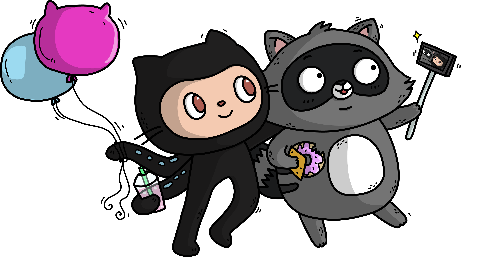

title: Discover NestJS
class: animation-fade
layout: true

.twitter-handle[
  @sinedied
]

---

class: center, hide-handle, full
background-image: url(images/fast.jpg)
background-position: center center

.float-left.w-15.responsive.margin-right.space-right[]
.float-right.w-15.responsive.margin-right.space-left[]

# Blast off with Nitro!
#### .alt-text[Build a Serverless API with NestJS at top speed]

.full-layer.who.darkened.text-right.small.middle.light-text[
    
  .ms.responsive[]
  |
  Yohan Lasorsa
  |
  @sinedied
]

---
exclude: true
class: left, hide-handle, full
background-image: url(images/cat.jpg)
background-position: center center

.float-left.w-15.responsive.margin-right.space-right[]

# Discover NestJS
### .alt-text[The fastest growing Node.js framework]

.full-layer.who.text-right.small.middle.light-text[
  .ms.responsive[]
  |
  Yohan Lasorsa
  |
  @sinedied
]

---

class: middle, center

???
- Commencons avec la base, Node.js!
- Qui fait deja du Node.js ici?

- 10 de ans d'existence (2009)
- Netflix, Paypal, LinkedIn, Yahoo, Ebay, Uber, Groupon, Nasa...

---

class: middle, center

.w-30.space-right.space-left[
  .responsive[]  
]
.w-30.space-right.space-left[
  .responsive[]  
]
.w-20.space-right.space-left[
  .responsive[]  
]
.w-35.space-right.space-left[
  .responsive[]  
]
.w-30.space-right.space-left[
  .responsive[]  
]

???
Il existe beaucoup de framework pour faire des APIs

---

class: dark, contain
background-image: url(images/no-opinion.jpg)

---

background-image: url(images/knife.jpg)
???
- Here's the tool

---

class: dark, contain
background-image: url(images/try-survive.jpg)
???
- Largué dans la jungle avec juste un couteau pour survivre

-> bien utilisé ca passe, mais...

---

class: middle, center
.w-30.space-right.space-left[
  .responsive[]  
]
.w-30.space-right.space-left[
  .responsive[]  
]
.w-30.space-right.space-left[
  .responsive[]  
]
.w-30.space-right.space-left[
  .responsive[]  
]
.w-25.space-right.space-left[
  .responsive[]  
]
???

Il existe d'autre framework de plus haut niveau, mais y'a toujours un truc qui cloche a l'usage: robustesse, archi, flexibilité, quand c'est pas simplement une usine a gaz...

---

class: dark, contain
background-image: url(images/too-light.jpg)
???
don't bring much

---

class: dark, contain
background-image: url(images/too-much.jpg)
???
bloated

---

class: dark, contain
background-image: url(images/too-prescriptive.jpg)
???
not flexible

---

class: contain, dark
background-image: url(images/new-framework.jpg)
???
Dans la communauté JS, on a plutot tendance a célébrer l'arrivée d'un nouveau FW

---

class: contain, dark
background-image: url(images/backend-new-framework.jpg)
???
- A l'inverse, en général les dev backend préfèrent s'appuyer sur des techno matures et éprouvées
- voient rarement d'un bon oeil la nouveauté

---

class: middle, center

.w-30.responsive[]
???
Aujourd'hui on va parler NestJS.

---

exclude: true
class: full
background-image: url(images/oops.gif)
???
- Bon j'espere froisser personne,
- et peut etre convaincre que c'est techno intéressante

---

class: middle, center, hide-handle
# .large[Who are we?]

.table.row.middle[
.col-4.center[
  .w-50.responsive.avatar.bounceInLeft.animated[]
]
.col-8.bit-larger.left[
  .e[Yohan Lasorsa |] .fab.fa-twitter[] .e[@sinedied] 
  .bit-larger.baseline[\[ .mini-img.mini-ms[ Cloud Developer Advocate ] \]] 
]
]

.table.row.middle[
.col-4.center[
  .w-50.responsive.avatar.red.bounceInUp.animated[]
]
.col-8.bit-larger.left[
  .e[Wassim Chegham |] .fab.fa-twitter[] .e[@manekinekko] 
  .bit-larger.baseline[\[ .mini-img.mini-ms[ Cloud Developer Advocate ] \]] 
]
]

---

exclude: true
class: middle, center, hide-handle
# .large[Who am I?]

.table.row.middle[
.col-4.center[
  .w-70.responsive.avatar.tada.animated[]
]
.col-8.bit-larger.left[
  .e[Yohan Lasorsa] 
  .bit-larger[\[ Cloud Developer Advocate .mini-img[] \]] 
  .small.em-text[Web tech geek, OSS maintainer, DIY lover] 
]
]
.center.bit-larger[
.large.em-text[{]
.fab.fa-twitter[] .fab.fa-github[] .fab.fa-dev[]
.large.em-text[}] .e[@sinedied] 
]

???

- For the last 10 years, I've worked as a dev in:
* research, many ESN projects, product team

- plus de 5 ans d'XP avec Node.js, sur des petit & gros projets en prod, beaucoup d'OSS

Now I started working as a dev advocate, and I'll do just that: advocate for developers :)

---

class: clist, middle, center, big-text
# Why NestJS?

- **TypeScript** ❤️
- Driven by Express or Fastify
- Follows SOLID principles
- Opinionated
- 1st class CLI

???
- written in TS!
- pas entierement nouveau

--

.full-layer.stick-bottom[
  .w-20.responsive.ib.slideInUp.no-margin.animated.ng-logo[]
]

???
- NestJS takes a lot from Angular: TS, annotations, DI, tooling

---

class: middle, center, impact
## .big[NestJS]
## .alt-text[=]
## Express or Fastify
--

## .alt-text[+]
## Architecture
???
+ Abstraction, Structure & Best practices
--

## .alt-text[+]
## Tooling
???
Outillage qui passe par l'integration directe de 
---

exclude: true
class: contain, dark
background-image: url(images/nest-tweet.png)
???
C'est le FW Node.js avec la croissance la plus rapide jamais vue

---

exclude: true
class: center, no-bullet
# There's .large[**MORE**!] 🤩

.w-50.float-left.large[
- Exception filters
- Interceptors
- Guards
- Authentication
- ORM
- Caching
]
.w-50.float-left.large[
- Microservices
- GraphQL
- Websockets
- CQRS
- OpenAPI
- ...
]

---

class: impact
## .large[NestJS ❤️ Serverless]

---

class: big-text, middle, center, clist, no-bullet

# Serverless?
- .eb[🙌] Fully managed
- .eb[📈] Auto-scale
- .eb[💵] Pay as you go
- .eb[🌱] No wasted resources

---

class: contain, middle, center
background-image: url(images/nitro-web.png)
### .large[https://nitr.ooo]

---

class: middle, center, big-text
# .sketch[Let's get started!]
.large[👉 [aka.ms/nitro-ws](https://aka.ms/nitro-ws)]

<!-- .large[wifi: visiteur / xuxoFabr] -->

---

class: hide-handle, middle

# Thank you!

.side-layer.right.through.no-margin[
  

  .w-15.responsive[]
]

.baseline[
- .w-30[[aka.ms/nitro-fb](https://aka.ms/nitro-fb)] → Give **YOUR** feedback! ⚠️
- .w-30[[aka.ms/nitro-ws](https://aka.ms/nitro-ws)] → Nitro workshop
- .w-30[[aka.ms/go/serverless](https://aka.ms/go/serverless)] → Learn more about Azure Serverless
- .w-30[[aka.ms/go/hexa](https://aka.ms/go/hexa)] → CLI for quick & easy Azure integration
]

.col-4.small.text-left.float-left[

 
Slides: 
.large[bit.ly/nest-workshop]
]
.col-3.float-left[
  .responsive[]
]
.col-5.right.large.middle.float-left[
.large.em-text[{]
.fab.fa-twitter[] .fab.fa-github[] .fab.fa-dev[]
.large.em-text[}] .e[@sinedied] 
]
