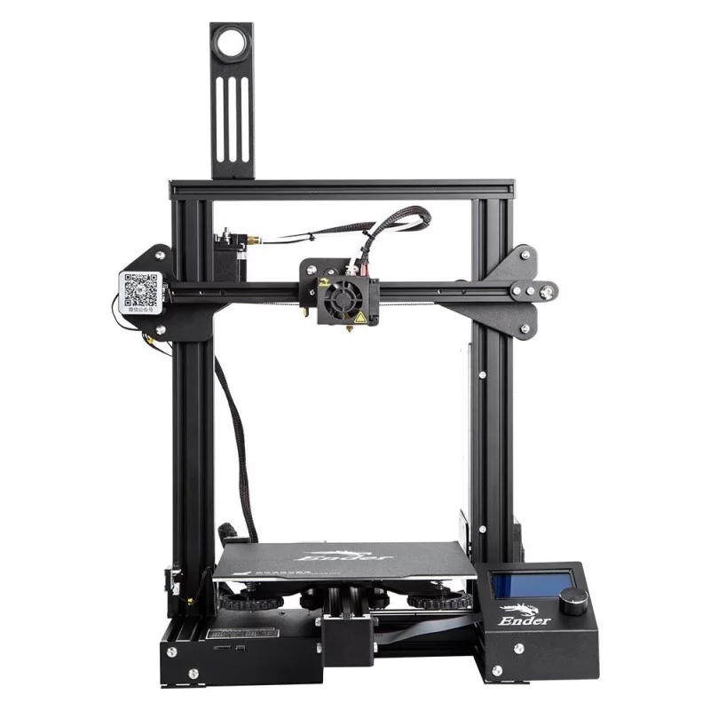
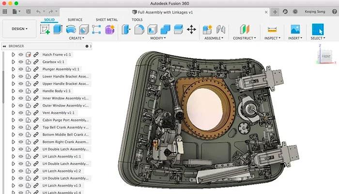
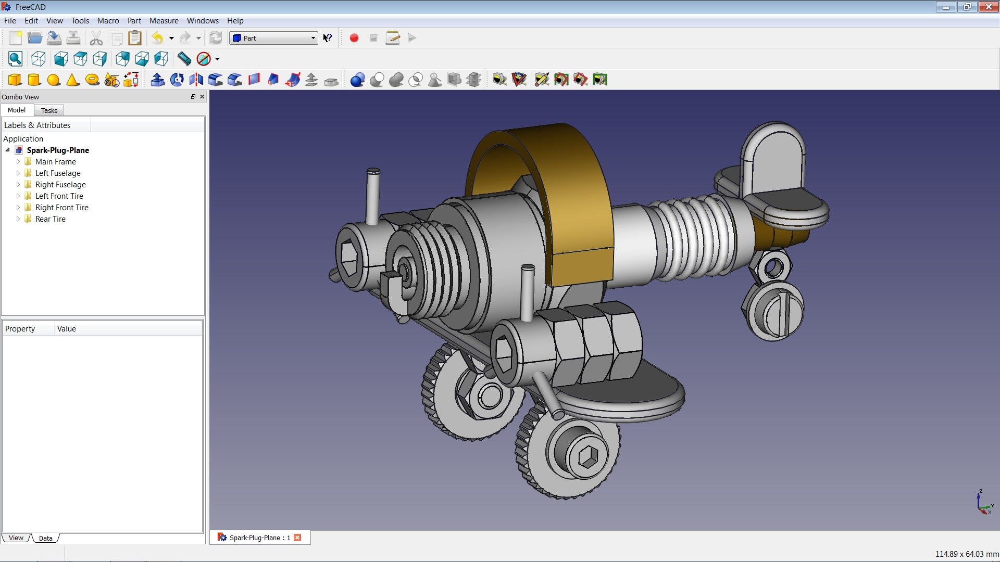
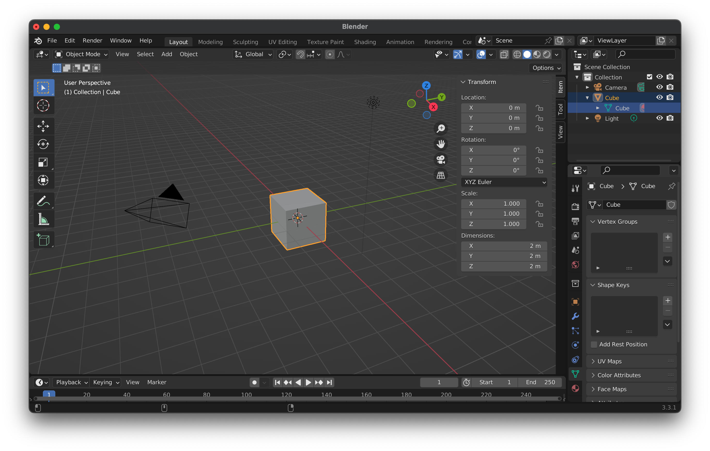
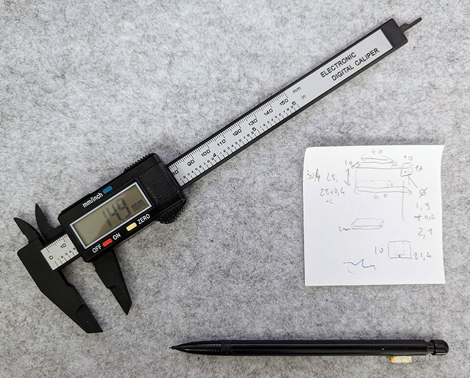
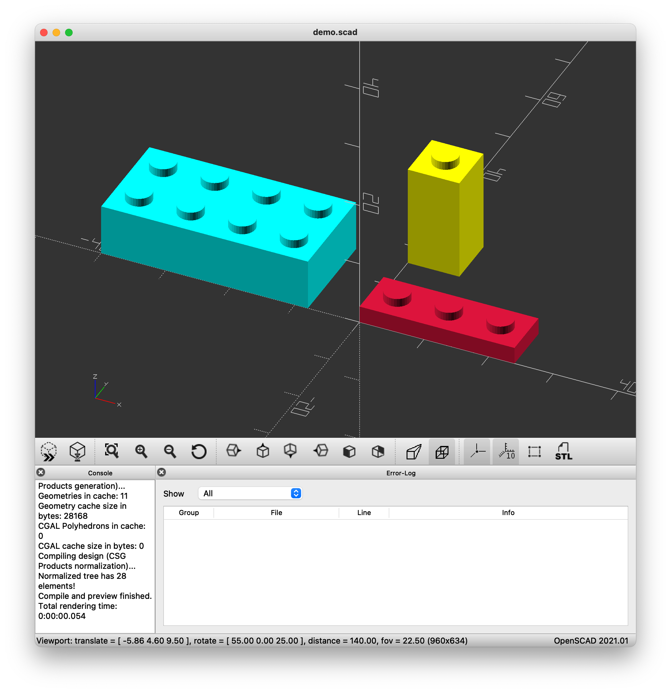

exclude: true
<!--
Créer des objets 3D avec du code, grâce à OpenSCAD

French:
La modélisation 3D, c'est tout un art! Si vous avez déjà tenté l'expérience d'un modeleur 3D comme Blender, vous avez probablement constaté la difficulté de l'exercice. Mais comment faire alors pour créer des modèles 3D que l'on a en tête, quand on vient d'investir dans une belle imprimante 3D? Réponse de développeur: avec du code!

Pour cela nous allons découvrir l'outil et le langage de script OpenSCAD, qui permet de créer des objets à base de primitives et fonctions géométriques simples. A travers cette courte session de live coding, vous apprendrez les bases pour créer vos propres modèles imprimables et laisser libre court à votre imagination! 

English:
3D modeling is an art! If you have already tried the experience of a 3D modeler like Blender, you have probably noticed the difficulty of the exercise. But how do you make 3D models that you have in mind, when you have just invested in a beautiful 3D printer? Developer's answer: with code!

For this we will discover the tool and the OpenSCAD script language, which allows you to create objects based on simple geometric primitives and functions. Through this short live coding session, you will learn the basics to create your own printable models and let your imagination run wild!

- https://www.openscad.org/
- https://www.blockscad3d.com/editor/
- OpenSCAD VSCode
-->
---

title: Create 3D objects with code using OpenSCAD
class: animation-fade
layout: true

.twitter-handle[
  @sinedied
]

---

class: hide-handle, middle, full, center, more-shadow
background-image: url(images/cubes.jpg)

.full-layer.with-margins.left.up[
.w-20.responsive.logo-filter[]
]

.title-new[
# .baseline.sketch.bit-larger[Create 3D objects with code<br>using .grad-text[OpenSCAD]]
]

.full-layer.who.text-right.small.middle.light-text.darkened[
  .ms.responsive[]
  |
  Yohan Lasorsa
  |
  @sinedied
]

<style>
.tmatch { font-size: 1.17em; }
.grad-text { color: #FFB900; }
</style>
???


---

class: middle, center, hide-handle
# .large.sketch[About me]

.table.row.middle[
.col-4.center[
  .w-70.responsive.avatar.tada.animated[]
]
.col-8.bit-larger.left.middle[

.responsive[
<object data="images/me.svg"></object>
]
]
]

???

---

class: big-text, all-sketch, clist, center

.center[
.w-50.responsive[]
]

???
Tout a commencé avec ca:
J'ai acheté cette imprimante 3D en 2020 pendant les confinements

- bricolage pour la maison
- boitier pour mes montages electroniques
- reparer tout ce qui traine

---

class: big-text, all-sketch, clist, center, middle

# Create 3D objects?

.center[
.w-50.responsive.rounded[]
]

???

---

class: big-text, all-sketch, clist, center, middle

# Tools

.row.table.middle.up[
.col-6[
- [Autodesk Fusion 360](https://www.autodesk.com/products/fusion-360/)
- [Blender](https://www.blender.org/)
- [FreeCAD](https://www.freecad.org/)
- [OpenSCAD](https://www.opencad.org/)
- [Tinkercad](https://www.tinkercad.com/) (web)
]
.col-6[
.w-60.responsive[]

.w-60.responsive[]
]
]

---

class: big-text, all-sketch, clist, center, middle

# Blender

.w-80.responsive.rounded.up[]

???
- Pas specialement fait pour ca, demande un peu de configuration
- Ca marche pas trop mal, j'ai fait plein de modeles avec

---

class: cover, hide-handle
background-image: url(./images/confused.jpg)

???
- mais 2 gros defaut:
* des que ne l'utilise pas pendant 1 semaine, bah je sais plus m'en servir
* tres pénible de modifier des modeles apres coup

---

class: all-sketch, clist, center, middle

# .large[3D modeling vs CAD]
<br>

.quote.large[
> .small[CAD (Computed Aided Design) is 3D modeling for .dark-text.gradient-text[engineering] that allows .dark-text.gradient-text[parameterized] objects].
]

???

- Le but est le meme: créer un modele 3D
- 3D modeling:
  * but artistique, flexibilité, textures/rendu, animation
- CAD:
  * contraintes fonctionnelles, parameterization

---

class: big-text, all-sketch, clist, center, middle, alt

# .light-text[OpenSCAD] .w-20.responsive[]

.large[https://www.openscad.org]


???
I use git+vscode for almost anything now so...

---

class: big-text, all-sketch, clist, center, middle

# Setup

.row.table.middle[
  .col-8[
- .mini-img[] OpenSCAD + .mini-img[] VS Code
- Pen, post-its & caliper
  ]
  .col-4[
.w-100.responsive.rounded[]
  ]
]

???
- OpenSCAD VS Code Extension
- BOSL2 library

---

class: contain, hide-handle, dark
background-image: url(./images/show-code.jpg)

???

- Real world examples
  * timer case
  * synth stand
  * synth case

---

class: small

.row.table.middle[
.col-6[
```openscad
unit = 8;
fudge = 0.001;
tolerance = 0.15 / unit;

module lego(w, d, h, c = "white") {
  h_hole = (h - 1/6 + tolerance)*2;

  color(c)
  scale(unit) {
    difference() {
      cube([w, d, h]);
      translate([0.25 - tolerance/2, 0.25 - tolerance/2, -h_hole/2])
        cube([w - 0.5 + tolerance, d - 0.5 + tolerance, h_hole]);
    }

    for (i = [0 : w - 1])
      for (j = [0 : d - 1])
        translate([i + 0.5, j + 0.5, h - fudge])
          cylinder(1/6, d = 0.5, $fn = 32);

    if (w > 1 || d > 1) {
      single = w == 1 || d == 1;
      df = single ? 0.55 : 1;

      for (i = [0 : max(w - 2, 0)])
        for (j = [0 : max(d - 2, 0)])
          translate([i + (w == 1 ? 0.5 : 1), j + (d == 1 ? .5 : 1), fudge])
            difference() {
              cylinder(d = 0.915 * df, h_hole/2, $fn = 32);
              cylinder(d = (0.5 + tolerance*2) * df * df, h_hole, $fn = 32, center = true);
            }
    }
  }
}

translate([-5 * unit, 0, 0])
  lego(4, 2, 1, "cyan");

translate([0, 2 * unit, 0])
  lego(1, 1, 2, "yellow");

lego(3, 1, 1/3, "crimson");
```
]
.col-6[
  .responsive[]
]
]

---

class: all-sketch
# References & going further

.full-layer.with-margins.right.stick-bottom.space-right[
.w-25.responsive.circle[]
]


- OpenSCAD tutorial
  * https://en.wikibooks.org/wiki/OpenSCAD_User_Manual
- VS Code extension
  * https://marketplace.visualstudio.com/items?itemName=Antyos.openscad
- Another OpenSCAD intro
  * https://static.fablab-lannion.org/tutos/openscad/#/intro
- Libraries
  * https://github.com/GillesBouissac/agentscad
  * https://github.com/HopefulLlama/JointSCAD
  * https://github.com/revarbat/BOSL2
- JS fork of OpenSCAD
  * https://github.com/jscad/OpenJSCAD.org
  * https://openjscad.xyz

---

class: middle, center, hide-handle, clist

.w-90.responsive[
<object data="images/thanks.svg"></object>
]

???
Feedback please!