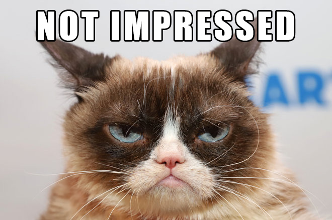

title: **PWA**, Beyond the buzzword
class: animation-fade
layout: true

<!-- 
What's a PWA

Why PWA
  - cross P
  - app store cluttering (but chrom PWA store)

How?

Workshop:
- ng cli
- deploy (netflify?)
- add PWA
  * manifest / icon
  * worker/offline
  * notifs
 -->

---

class: center
background-image: url(images/progressive.jpg)
background-position: center 65%

.title[
# .light-text.large[**Progressive Web Apps**]<br>.alt-text[Beyond the buzzword]
]

.who-box[
  .row.table.middle.text-center[
  .col-3.small.text-left[
  Yohan Lasorsa<br>
  .fab.fa-github[] github.com/sinedied<br>
  .fab.fa-twitter[] @sinedied
  ]
  .col-6.small.half[
  ]
  .col-3.small.text-right[
  .w-90.responsive[]
  ]
  ]
]

---

class: center, middle

# Making apps
<div style="height: 1em"></div>

--
.w-20.responsive.top.margin-right[
  ### Web
  
]
--
.w-20.responsive.top.margin-right[
  ### Native
  
]
--
.w-20.responsive.top[
  ### Hybrid
  <div style="height: 1em"></div>
  .w-30.responsive[]
  .w-30.responsive[]
  .w-30.responsive[]
  <br>
  .w-30.responsive[]
  .w-30.responsive[]
  .w-30.responsive[]
]

--

### .alt-text[Cost vs Performance vs Reach?]

---

class: impact
# .small[What's a .animated.jackInTheBox.ib.alt-text[**PWA**]?]

---

class:  center, middle, big-text

# 🙅‍♂️<br>It's **not**

--
A framework<br>
--
A new technology

---
class: middle

# It's just a web app

--
.full-layer.right.space-right[
<div style="height: 5em"></div>
.w-50.responsive.rounded[]
]

--
### Following a set of best practices

---
class: middle

# Google's definition
<br>

.quote[
> .span[Progressive Web Apps are user experiences] .span[that have the reach of the web, and are fast, reliable and engaging]
]

---
class: middle

# Google's definition
<br>

.quote[
> .span[Progressive Web Apps are] .alt-text[**user experiences**] .span[that have the reach of the web, and are fast, reliable and engaging]
]

---

class: timeline

.head[
# .alt-text.fas.fa-history[]&nbsp; Looking back
]
<div style="height: 3.3em"></div>
- #### 2003
  - Progressive Enhancement
--

- #### 2007
  - iPhone: Web 2.0 + AJAX
--

- #### 2008
  - SproutCore: .small[*"Building Native Look-and-Feel Web Apps"*]
--

  - iOS SDK + App Store
--

- #### 2009
  - Modernizr

- #### 2010
  - Responsive Web Design (RWD) - *Ethan Marcott*
--

- #### 2015
  - Progressive Web Apps (PWA) - *Alex Russell*
--

- #### .boom.responsive[] **2018**
  - Service Workers in Edge & Safari 🍾🎉

???

---

.head.dark[
# .fit[] The principles
]
.head-spacer[]

.w-20.float-left.top[
## Fast
]
.w-70.float-left.top.no-margin[
53% of users quits if app loading > 3s
.em-text.margin-top.no-margin[
  *FCP, TTI, caching, app shell, smooth scrolling, response time...*
]
]
.clear[
]
<br>

--

.w-20.float-left.top[
## **E**ngaging
]
.w-70.float-left.top.no-margin[
Feels like a native experience
.em-text.margin-top.no-margin[
Full screen, Notifications, Home screen shortcut, native features...
]
]
.clear[
]
<br>

--

.w-20.float-left.top[
## Reliable
]
.w-70.float-left.top.no-margin[
Always work, start quickly
.em-text.margin-top.no-margin[
Offline support, service worker, local storage, indexed DB...
]
]

---

background-image: url(images/why.gif)
class: dark, contain

---

class: big-text

# .sketch[Why should I give a f*********?]
- Slow internet speeds
???
- Not everyone have 4G, let even 3G: 60% world on 2G
--

- Discoverability
???
- A average user install 0 apps a month
--

- Engagement
???
- 13% web vs 87% mobile, less context-switching, more time
--

- Cost efficiency
???
- Portable, reuse standard tech
--

- Deployment freedom
???
- Who needs Apple approval?
--

.full-layer.space-right.right[
  <div style="height: 1.85em"></div>
  .w-50.responsive.rounded[]
]

---

class: impact

# How?
## Time for tech


---

class: middle

.big-text.no-bg.baseline[
```js
const end = {
  message: 'Thank you!',
  slides: 'bit.do/pwa',
  code: 'github.com/sinedied/pwa-demo
};
```
<hr class="hr-right">
]
.right.large[
.fab.fa-twitter[] @sinedied<br>
.fab.fa-github[] github.com/sinedied
]

---

exclude: true
.head.dark[
# Links
]
.head-spacer[]


