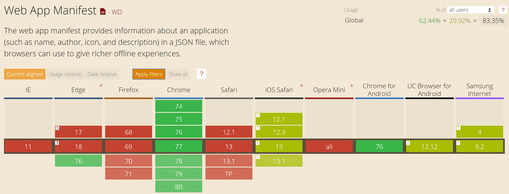

title: **PWA**, Beyond the buzzword
class: animation-fade
layout: true

<!-- 
What's a PWA

Why PWA
  - cross P
  - app store cluttering (but chrom PWA store)

How?

Workshop:
- ng cli
- deploy (netflify?)
- add PWA
  * manifest / icon
  * worker/offline
  * add offline API call
  * notifs
 -->

---

class: center
background-image: url(images/progressive.jpg)
background-position: center 65%

.title[
# .light-text.large[**Progressive Web Apps**]<br>.alt-text[Beyond the buzzword]
]

.who-box[
  .row.table.middle.text-center[
  .col-3.small.text-left[
  Yohan Lasorsa<br>
  .fab.fa-github[] github.com/sinedied<br>
  .fab.fa-twitter[] @sinedied
  ]
  .col-6.small.half[
  ]
  .col-3.small.text-right[
  .w-90.responsive[]
  ]
  ]
]

---

class: center, middle

# Making apps
<div style="height: 1em"></div>

???
What means do we have to make apps today?

--
.w-20.responsive.top.margin-right[
  ### Web
  
]
--
.w-20.responsive.top.margin-right[
  ### Native
  
]
--
.w-20.responsive.top[
  ### Hybrid
  <div style="height: 1em"></div>
  .w-30.responsive[]
  .w-30.responsive[]
  .w-30.responsive[]
  <br>
  .w-30.responsive[]
  .w-30.responsive[]
  .w-30.responsive[]
]

???

Icons trivia!

--

### .alt-text[Cost vs Performance vs Reach?]

---

class: impact
# .small[What's a .animated.jackInTheBox.ib.alt-text[**PWA**]?]

---

class:  center, middle, big-text

# 🙅‍♂️<br>It's **not**

--
A framework<br>
--
A new technology

---
class: middle

# It's just a web app

--
.full-layer.right.space-right[
<div style="height: 5em"></div>
.w-50.responsive.rounded[]
]

--
### Following a set of best practices

---
class: middle

# Google's definition
<br>

.quote[
> .span[Progressive Web Apps are user experiences] .span[that have the reach of the web, and are fast, reliable and engaging]
]

---
class: middle

# Google's definition
<br>

.quote[
> .span[Progressive Web Apps are] .alt-text[user experiences] .span[that have the reach of the web, and are fast, reliable and engaging]
]

---

class: timeline

.head[
# .alt-text.fas.fa-history[]&nbsp; Looking back
]
<div style="height: 3.3em"></div>
- #### 2003
  - Progressive Enhancement
--

- #### 2007
  - iPhone: Web 2.0 + AJAX
--

- #### 2008
  - SproutCore: .small[*"Building Native Look-and-Feel Web Apps"*]
--

  - iOS SDK + App Store
--

- #### 2009
  - Modernizr
--

- #### 2010
  - Responsive Web Design (RWD) - *Ethan Marcott*
--

- #### 2015
  - Progressive Web Apps (PWA) - *Alex Russell*
--

- #### .boom.responsive[] **2018**
  - Service Workers in Edge & Safari 🍾🎉

???

---

.head.dark[
# .fit[] The principles
]
.head-spacer[]

.w-20.float-left.top[
## Fast
]
.w-70.float-left.top.no-margin[
53% of users quits if app loading > 3s
.em-text.margin-top.no-margin[
  *FCP, TTI, caching, app shell, smooth scrolling, response time...*
]
]
.clear[
]
<br>

--

.w-20.float-left.top[
## **E**ngaging
]
.w-70.float-left.top.no-margin[
Feels like a native experience
.em-text.margin-top.no-margin[
Full screen, Notifications, Home screen shortcut, native features...
]
]
.clear[
]
<br>

--

.w-20.float-left.top[
## Reliable
]
.w-70.float-left.top.no-margin[
Always work, start quickly
.em-text.margin-top.no-margin[
Offline support, service worker, Web Storage, Web SQL...
]
]

--
.full-layer.right[
  .throne.responsive[]
]

---

background-image: url(images/why.gif)
class: dark, contain

---

class: big-text

# .sketch[Why should I give a f**?]
- Slow internet speeds
???
- Not everyone have 4G, let even 3G: 60% world on 2G
--

- Discoverability
???
- A average user install 0 apps a month
--

- Engagement
???
- 13% web vs 87% mobile, less context-switching, more time
--

- Cost efficiency
???
- Portable, reuse standard tech
--

- Deployment freedom
???
- Who needs Apple approval?
--

.full-layer.space-right.right[
  <div style="height: 1.85em"></div>
  .w-50.responsive.rounded[]
]

---

class: impact

# How?
## .alt-text[Time for tech] 🤓

---
class: no-bullet, big-text

# .sketch[PWA Checklist]

- ✅ HTTPS
- ✅ Responsive Web Design
- ✅ Offline (ie Service Worker)
- ✅ Web App Manifest
- ✅ TTI < 10s on 3G
- ✅ Cross-{browser, device}

---
class: no-bullet, big-text

# .sketch[PWA .small[.small[(minimal)]] Checklist]

- ✅ HTTPS
- ✅ Responsive Web Design
- ✅ Offline (ie Service Worker)
- ✅ Web App Manifest
- ✅ TTI < 10s on 3G
- ✅ Cross-{browser, device}

---
class: no-bullet, big-text

# .sketch[PWA .small[.small[(minimal)]] Checklist]

- .transparent[✅ HTTPS]
- .transparent[✅ Responsive Web Design]
- ✅ Offline (ie Service Worker)
- ✅ Web App Manifest
- ✅ TTI < 10s on 3G
- .transparent[✅ Cross-{browser, device}]

---

class: big-text, center, dark
.head.dark[
# .fit[] Service Worker
]
<br>
.responsive[]

---

class: big-text, center, dark
.head.dark[
# .fit[] Service Worker
]
<br>
.responsive[]

---

class: big-text
.head.dark[
# .fit[] Service Worker
]
.head-spacer[]

## Libraries

- WorkBox
- @angular/service-worker
- UpUp
- offline-plugin for Webpack

---
class: big-text, middle, center
.head.dark[
# .fit[] Service Worker - .alt-text[The cookbook]
]
<br><br>

.large[https://serviceworke.rs]

.w-50.responsive.rounded[]

---

class: big-text, center, middle
.head.dark[
# .fit[] Service Worker - .alt-text[Can I use it?]
]
.head-spacer[]

.responsive[]

.small[https://jakearchibald.github.io/isserviceworkerready/]

---

.head.dark[
# .fit[] Web App Manifest
]
<br><br><br>
.no-margin[
```html
<link rel="manifest" href="manifest.json"/>
```
]
--
.no-margin[
```json
{
  "name": "My Awesome PWA",
  "short_name": "My PWA",
  "theme_color": "#488aff",
  "background_color": "#488aff",
  "start_url": "/",
  "display": "standalone",
  "icons": [
    {
      "src": "assets/icon@512.png",
      "sizes": "512x512",
      "type": "image/png"
    },
    ...
  ]
}
```
]

---

class: center
.head.dark[
# .fit[] Web App Manifest - .alt-text[Can I use it?]
]
<br><br>

.responsive[]

.large[Most mobile browsers + Chrome / Firefox / Edge ✊]

---

class: center
.head.dark[
# .fit[] TTI < 10s on 3G
]
<div style="height: 4em"></div>

???
One goal
--
# .alt-text[GO FAST!]

.w-50.responsive.rounded[]

---

class: center
.head.dark[
# .fit[] TTI < 10s on 3G
]
.head-spacer[]

# Lighthouse

.w-50.responsive[]

---

class: center
.head.dark[
# .fit[] TTI < 10s on 3G
]
<br><br><br>
.responsive[]

???
- Chrome audit tab
- Also NPM package for CI

---

class: big-text
.head.dark[
# .fit[] TTI < 10s on 3G
]
.head-spacer[]

## Patterns
- Bundling / Lazy loading
- SSR (Server Side Rendering)
- PRPL Pattern
- App Shell

???
Angular Universal, Next.js, Nuxt.js...

---

class: middle, center
.head.dark[
# .fit[] SSR
]
<br><br>

.col-6.rounded.responsive.space-right[]
---
class: middle, center, middle
.head.dark[
# .fit[] SSR
]
<br><br>
.col-6.rounded.responsive[]

---

class: big-text
.head.dark[
# .fit[] SSR
]
.head-spacer[
]

## SSR + SPA = **Universal Apps**

--

1. Initial render on the server
2. Send static HTML
3. Load SPA app bundle
4. Rehydrate

--

.full-layer.right.space-right[
  <div style="height: 4em"></div>
  .col-4.rounded.responsive[]
]

--
### 👉 Angular Universal, Next.js, Nuxt.js...

---

class: big-text, middle
.head.dark[
# .fit[] PRPL Pattern
]
<br><br>

- .alt-text[**P**ush] .a[critical resources for the initial URL route]
- .alt-text[**R**ender] .a[initial route]
- .alt-text[**P**re-cache] .a[remaining routes]
- .alt-text[**L**azy-load] .a[and create remaining routes on demand]

???
Coined by Polymer team at G I/O

- Push: HTTP/2
- Render: not necessarily SSR
- Pre-cache: SW
- Lazy load

---

class: center
.head.dark[
# .fit[] App Shell
]
<br><br>
.w-70.responsive[]

---

class: center
.head.dark[
# .fit[] App Shell
]
<br><br>

.w-80.responsive[]

---

class: big-text, middle

# .a[Now] .animated.ib.rubberBand.alt-text[what].a[?]
.full-layer.right.space-right[
  .w-30.responsive.rounded[]
]

---

.head.dark[
# .fit[] Distribution
]

<div style="height: 4em"></div>

## Browsers
- Desktop: Chrome, Firefox, Edge
- Mobile: Android Chrome (WebAPK), iOS Safari

--

## Stores
- Android: TWA (Trusted Web Activities) for Play Store
- Windows: AppX for Windows Store
- iOS: IPA package for App Store possible

.center[
.large.middle[[pwabuilder.com](http://pwabuilder.com)] &nbsp;&nbsp;&nbsp;&nbsp; .col-2.responsive.middle[]
]

---

class: cover
background-image: url(images/wkwebview.jpg)

???
Not the only rant about iOS...
Context preservation, storage persisted through uninstall...

---

background-image: url(images/pwa-vs-hybrid.jpg)
class: contain, dark

---

.head.dark[
# .fit[] PWA vs hybrid
]
.head-spacer[]


.table.row.no-margin.center.compare[
.col-w20.no-margin[
  ### Web
  .w-50.responsive[]
]
.col-w20.no-margin[
  ### PWA
  .w-50.responsive[]
]
.col-w20.no-margin[
  ### Web/Hybrid
  <br>
  .w-20.responsive[]
  .w-20.responsive[]
  .w-20.responsive[]
]
.col-w20.no-margin[
  ### Native/Hybrid
  .w-20.responsive[]
  .w-20.responsive[]
  <br>
  .w-20.responsive[]
  .w-20.responsive[]
]
.col-w20.no-margin[
  ### Native
  .w-70.responsive[]
]
]
.no-margin[
.w-80.bar[Cross-platform].w-20.bar.no[&nbsp;]
.w-60.bar[Single codebase].w-20.bar.dashed[&nbsp;].w-20.bar.no[&nbsp;]
.w-60.bar.dashed[Native UI].w-40.bar[&nbsp;]
.w-20.bar.no[App store].w-20.bar.dashed[&nbsp;].w-60.bar[&nbsp;]
.w-100.bar.gradient[Cost effectiveness .float-right[Performance]]
]

---

class: center, middle, big-text
.head.dark[
# .fit[] PWA vs hybrid
]
.head-spacer[]

.big[PWA .alt-text[+] Hybrid .alt-text[=] ❤️]

<br><br>
.col-4.float-left.center[
  ### .alt-text.large[Cordova]
  .w-50.responsive[]
]
.col-4.float-left.center[
  ### .alt-text.large[Capacitor]
  .w-50.responsive[]
]
.col-4.float-left.center[
  ### .alt-text.large[Electron]
  .w-50.responsive[]
]

---

class: big-text
.head.dark[
# .fit[] Capacitor
]
.head-spacer[
]

## Cross-platform native bridge
- One codebase, multi-target:<br>
  .em-text[*PWA, iOS/Android hybrid, Electron*]
- Native plugins with web fallbacks

[capacitor.ionicframework.com](https://capacitor.ionicframework.com)

.full-layer.right.space-right[
  <div style="height: 4em"></div>
  .col-3.responsive.rounded[]
]

???
1.0 Stable version since 2 weeks!

---

class: big-text
.head.dark[
# .fit[] Going further with PWA
]

<br>

- App Lifecycle
- Push Notifications
- Web Authentication
- Web Share
- Web USB
- Web Bluetooth
- ...

--

.full-layer.right.space-right[
<div style="height: 3em"></div>
.col-5.responsive.rounded[]
]

---

class: middle

.big-text.no-bg.baseline[
```js
const end = {
  message: 'Thank you!',
  slides: 'bit.do/pwa'
};

alert('Questions?');
```
<hr class="hr-right">
]
.right.large[
.fab.fa-twitter[] @sinedied<br>
.fab.fa-github[] github.com/sinedied
]

---

# References
- [HackerNews PWA comparison](https://hnpwa.com)
- [PWA @ Google Developers](https://developers.google.com/web/progressive-web-apps/)
- [PWA 101](https://www.freecodecamp.org/news/progressive-web-apps-101-the-what-why-and-how-4aa5e9065ac2/)
- [PWA, welcome to the mobile revolution](https://www.creativebloq.com/features/pwas-welcome-to-the-mobile-revolution)
- [PWA support & compatibility](https://medium.com/@guillaumeandre/progressive-web-app-pwa-support-et-compatibilite-manifest-39bcfc703737)
- [The modern PWA cheat sheet (slides)](https://www.slideshare.net/firt/the-modern-pwa-cheat-sheet)
- [PRPL pattern](https://developers.google.com/web/fundamentals/performance/prpl-pattern/)
- [TWA for Google Play Store](https://medium.com/@firt/google-play-store-now-open-for-progressive-web-apps-ec6f3c6ff3cc)
- https://serviceworke.rs
- https://www.pwabuilder.com

???

TODO WORKSHOP

- Fix manifest.json: add 192x192 icon, test add to homescreen
- SW: add manifest.json

0. Netlify account
1. Gen without PWA
  - brief project presentation
  - -> Lighthouse
2. Gen with PWA -> Lighthouse
3. Test offline, API down :(
4. Add API request, test again \o/
5. Update homepage, deploy, refresh once
  - talk about update, catching event, pulling...
6. Test on mobile
