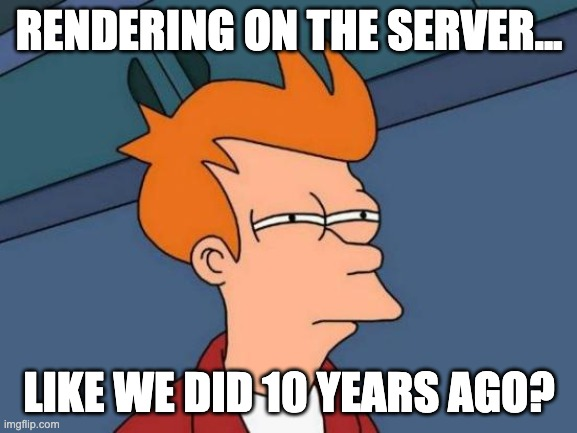
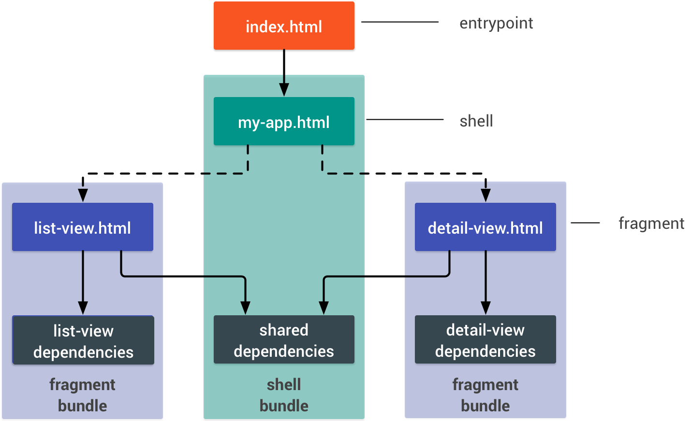

title: A fairer web for everyone with PWA
class: animation-fade
layout: true

<!--
Les PWA c’est cool, tout le monde en parle, mais en fait c’est quoi vraiment?
Pourquoi ca devrait m’intéresser? Comment ca marche? 
A travers ce talk et beaucoup de questions, découvrons les grands principes d’une PWA
d’un point de vue technique et philosophique, et son utilité dans la construction d’un
Web plus juste et équitable.  
 -->

.twitter-handle[
  @sinedied
]

---

class: left, middle, hide-handle
background-image: url(images/love.jpg)

.title-new[
## .large.alt-text[A fairer web for everyone with]
# .light-text.larger[Progressive Web Apps]
]

.full-layer.who.text-right.small.middle.light-text[
  .ms.responsive[]
  |
  Yohan Lasorsa
  |
  @sinedied
]

???

Hi everyone!
In this session I'll talk about a subject that's dear to me: Progressive Web Apps, why they're important in the app landscape, and how they work to make the web one of the most inclusive platform to date.

---

class: middle, center, hide-handle
# .large[Who am I?]

.table.row.middle[
.col-4.center[
  .w-70.responsive.avatar.tada.animated[]
]
.col-8.bit-larger.left[
  .e[Yohan Lasorsa]<br>
  .bit-larger[\[ Cloud Developer Advocate .mini-img[] \]]<br>
  .small.em-text[Web tech geek, OSS maintainer, DIY lover]<br>
]
]
.center.bit-larger[
.large.em-text[{]
.fab.fa-twitter[] .fab.fa-github[] .fab.fa-dev[]
.large.em-text[}] .e[@sinedied]<br>
]

???

ca fait plus de 10 ans que je baigne dans le monde du web...
je ne vais pas vous refaire tout l'historique, car simplement...

---

class: center, middle

# Making apps
<div style="height: 1em"></div>

???
What means do we have to make apps today?

--
.w-20.responsive.top.margin-right[
  ### Web
  
]
--
.w-20.responsive.top.margin-right[
  ### Native
  
]
--
.w-20.responsive.top[
  ### Hybrid
  <div style="height: 1em"></div>
  .w-30.responsive[]
  .w-30.responsive[]
  .w-30.responsive[]
  <br>
  .w-30.responsive[]
  .w-30.responsive[]
  .w-30.responsive[]
]

???

Usually the tech is chosen depending on multiple factors.

--

### .alt-text.large[Cost vs Performance vs Reach]
--
.alt-text.large[ ?]
---

class: alt, middle, impact

## .large[Who **can** use your app?]
???

Qui peut utiliser votre app?

- platform restrictions
- device performance
- network performance

- You have performance tests
- You have identified persona
- You have analytics

---

# Survivor bias
## You may be missing something

.responsive[]

???
Your data may not tell the whole story, and your interpretation of it may biased.

In particular, it's easy to not account for the survivor bias.
Let me illustrate this:

- On this plane, the red dots shows where the US planes where gunned during WW2.
- As a result, the military wanted to add armor in these locations.
- Statistic research group looked at the same data and said that parts where plane were not gunned according to the data should be reinforced.
- Because the data was only from returning planes: they could have sustained the damagae and get back home.

It can be the same with your users!

That may seem a bit of a strech, but the way today to be sure your app can be used by everyone is to make a PWA, and we'll see why!

---

class: impact
# .small[What's a .animated.jackInTheBox.ib.alt-text[**PWA**]?]

???

First let's start with some definition.

---

class:  center, middle, big-text

# 🙅‍♂️<br>It's **not**

--
A framework<br>
--
A new technology

---
class: middle

# It's "just" a web app

--
.full-layer.right.space-right[
<div style="height: 5em"></div>
.w-50.responsive.rounded.space-left[]
]

???

Don't leave yet!

--
### With a better user experience

???

It's a web app that aims to provide a top notch user experience, by following some best practices, using the best of what the web can do today.

---
class: middle

# Google's definition
<br>

.quote[
> .span[Progressive Web Apps are user experiences] .span[that have the reach of the web, and are fast, reliable and engaging]
]

---
class: middle

# Google's definition
<br>

.quote[
> .span[Progressive Web Apps are] .alt-text[user experiences] .span[that have the reach of the web, and are fast, reliable and engaging]
]

---

class: timeline

.head[
# .alt-text.fas.fa-history[]&nbsp; Looking back
]
<div style="height: 3.3em"></div>
- #### 2003
  - Progressive Enhancement
???
- vs Graceful degradation. Content first & accessibility, new tech adoption (PDA)
--

- #### 2007
  - iPhone: Web 2.0 + AJAX
???
- 1er tel qui affiche du vrai web! (epoque N95)
--

- #### 2008
  - SproutCore
???
- SproutCore: "Building Native Look-and-Feel Web Apps"
--
, iOS SDK + App Store 🔒
--

- #### 2009
  - Modernizr
???
- Detection de features
--

- #### 2010
  - Responsive Web Design (RWD) - *Ethan Marcott*
???
- Media queries, fluid grid, images adaptation
--

- #### 2015
  - Progressive Web Apps (PWA) - *Alex Russell*
???
- coined by Google engineer: new web apis especially service workers, manifest
--

- #### .boom.responsive[] **2018**
  - Service Workers in Edge & Safari 🍾🎉

???
- Chrome et firefox ok depuis un moment...
---

class: dark, middle, center, big-text

# .middle[The 3 principles of]

.w-20.responsive[]

---

class: middle, split-slide
## .large[Fast]

.split.w-70.primary.middle.full[
  .bg.overlay[
    
  ]

.large[53% of users lost if app loading > 3s<br><br>]
<!-- .margin-top.no-margin[
  *FCP, TTI, caching, smooth scrolling, response time...*
] -->
]

???

FCP, TTI, caching, smooth scrolling, response time...

---

class: middle, split-slide
## .large[Reliable]

.split.w-70.primary.middle.full[
  .bg.overlay[
    
  ]

.large[Always work, start quickly<br><br>]
<!-- .margin-top.no-margin[
  *Offline support, service worker, Web Storage, IndexedDB...*
] -->
]

???

Offline support, service worker, Web Storage, IndexedDB...

---

class: middle, split-slide
## .large[Engaging]

.split.w-70.primary.middle.full[
  .bg.overlay[
    
  ]

.large[Feels like a native experience<br><br>]
<!-- .margin-top.no-margin[
  *Full screen, Notifications, Home screen shortcut, native features...*
] -->
]

???

Full screen, Notifications, Home screen shortcut, native features...

---

exclude: true
background-image: url(images/why.gif)
class: dark, contain

---

class: center
# .sketch.large[Benefits for users]

.col-6.float-left[
.col-5.responsive[]

.large[Twitter Native App]

.big[**131 MB**]
]
.col-6.col-6.float-left[
.col-5.responsive[]

.large[Twitter Lite PWA]

.big[**2.2MB**]
]

???

- Small size
- Load faster
- No gating (App Store)
- Better usage of bandwidth
- Lighter on battery
- Fast updates

---

class: center
### Average internet speed by country

.no-margin.up[
.col-10.responsive[]
]

???

- Not everyone have 4G, let even 3G
- Map in Mbps

---

class: center, full, cover, overlay-dark, no-bullet
background-image: url(images/money.jpg)


# .sketch.large[Benefits for developers]

.big-text[
- Cost efficiency
- Freedom to deploy and update
- Shorter time to market
- Seamless onboarding
- Higher conversion rates

.w-40.responsive[[](https://www.pwastats.com/)]
]

???
- Portable, reuse standard tech
- Who needs Apple approval?

---

class: middle, split-slide, impact, left, alt
# How?

.split.w-50.primary.middle.full[
  .bg.width[
    
  ]
]

---
class: no-bullet, big-text, center, clist

# .sketch[PWA Checklist]

- ✅ HTTPS
- ✅ Responsive Web Design
- ✅ Offline (ie Service Worker)
- ✅ Web App Manifest
- ✅ TTI < 10s on 3G
- ✅ Cross-{browser, device}

---
class: no-bullet, big-text, center, clist

# .sketch[PWA .small[.small[(minimal)]] Checklist]

- ✅ HTTPS
- ✅ Responsive Web Design
- ✅ Offline (ie Service Worker)
- ✅ Web App Manifest
- ✅ TTI < 10s on 3G
- ✅ Cross-{browser, device}

---
class: no-bullet, big-text, center, clist

# .sketch.base[PWA .small[.small[(minimal)]] Checklist]

- .transparent[✅ HTTPS]
- .transparent[✅ Responsive Web Design]
- ✅ Offline (ie Service Worker)
- ✅ Web App Manifest
- ✅ TTI < 10s on 3G
- .transparent[✅ Cross-{browser, device}]

---

class: big-text, center, dark, hide-handle
.head.dark[
# .fit[] Service Worker
]
<br><br>
.responsive[]
.fade.small.light-text[[developers.google.com/web/updates/2018/05/beyond-spa](https://developers.google.com/web/updates/2018/05/beyond-spa)]
---

class: big-text, center, dark, hide-handle
.head.dark[
# .fit[] Service Worker
]
<br><br>
.responsive[]
.fade.small.light-text[[developers.google.com/web/updates/2018/05/beyond-spa](https://developers.google.com/web/updates/2018/05/beyond-spa)]

---

class: big-text, hide-handle
.head.dark[
# .fit[] Service Worker
]
.head-spacer[
]

## Libraries

- WorkBox
- @angular/service-worker
- UpUp
- offline-plugin for Webpack

.full-layer.right.space-right.through[
  <div style="height: 3em"></div>
  .w-40.responsive.rounded[]
]

---
class: big-text, middle, center, hide-handle
.head.dark.baseline[
# .fit[] .light-text[[serviceworke.rs](https://serviceworke.rs)] - .alt-text[The cookbook]
]
<br><br>

.responsive[]

---

class: big-text, center, middle
.head.dark.baseline[
# .fit[] Service Worker - .alt-text[Can I use it?]
]
.head-spacer[]

.responsive[]

.small[[jakearchibald.github.io/isserviceworkerready/](https://jakearchibald.github.io/isserviceworkerready/)]

---

.head.dark[
# .fit[] Web App Manifest
]
<br><br><br>
.no-margin[
```html
<link rel="manifest" href="manifest.webmanifest"/>
```
]
--
.no-margin[
```json
{
  "name": "My Awesome PWA",
  "short_name": "My PWA",
  "theme_color": "#488aff",
  "background_color": "#488aff",
  "start_url": "/",
  "display": "standalone",
  "icons": [
    {
      "src": "assets/icon@512.png",
      "sizes": "512x512",
      "type": "image/png"
    },
    ...
  ]
}
```
]

---

class: center, hide-handle
.head.dark[
# .fit[] Web App Manifest - .alt-text[Can I use it?]
]
<br><br><br>

.responsive[]
.no-margin[
  [caniuse.com/web-app-manifest](https://caniuse.com/web-app-manifest)
]

---

class: center
.head.dark[
# .fit[] TTI < 10s on 3G
]
<div style="height: 4em"></div>

???
One goal
--
# .alt-text[🏎️ **GO FAST!** 🏎️]

.w-50.responsive.rounded[]

---

class: center
.head.dark[
# .fit[] TTI < 10s on 3G
]
.head-spacer[]

# Lighthouse

.w-50.responsive[]

---

class: center, hide-handle
.head.dark[
# .fit[] TTI < 10s on 3G
]
<div style="height: 3em"></div>
.responsive[]

???
- Chrome audit tab
- Also NPM package for CI

---

class: big-text
.head.dark[
# .fit[] TTI < 10s on 3G
]
.head-spacer[
]

## Patterns
- Lazy loading
- SSR (Server Side Rendering)
- PRPL Pattern
- App Shell

.full-layer.right.space-right.through[
  <div style="height: 3.5em"></div>
  .w-30.responsive.circle[]
]

???
Angular Universal, Next.js, Nuxt.js...

---

class: middle, center
.head.dark[
# .fit[] SSR
]
<br><br>

.col-8.rounded.responsive.space-right[]
---
class: middle, center, middle
.head.dark[
# .fit[] SSR
]
<br><br>
.col-6.rounded.responsive[]

---

class: big-text, hide-handle
.head.dark[
# .fit[] SSR
]
.head-spacer[
]

## SSR + SPA = **Universal Apps**

--

1. **Initial** render on the server
2. Send static HTML
3. Load SPA app bundle
4. Rehydrate

--

.full-layer.right.space-right[
  <div style="height: 4em"></div>
  .col-4.rounded.responsive[]
]

--
### Angular Universal, Next.js, Nuxt.js...

???
Most popular are Node.js base, but there are also solutions for .net core

---

class: big-text, middle, hide-handle
.head.dark[
# .fit[] PRPL Pattern
]
<br><br>

- .alt-text[**P**ush] .a[critical resources for the initial URL route]
- .alt-text[**R**ender] .a[initial route]
- .alt-text[**P**re-cache] .a[remaining routes]
- .alt-text[**L**azy-load] .a[and create remaining routes on demand]

???
Coined by Polymer team at G I/O

- Push: HTTP/2
- Render: not necessarily SSR
- Pre-cache: SW
- Lazy load

---

class: center, hide-handle
.head.dark[
# .fit[] App Shell
]
<div style="height: 3.5em"></div>
.w-60.responsive[]
.small.em-text[[developers.google.com/web/fundamentals/architecture/app-shell](https://developers.google.com/web/fundamentals/architecture/app-shell)]

---

class: center, hide-handle
.head.dark[
# .fit[] App Shell
]
<br><br>

.w-70.responsive[]
<div style="margin-top: -.7em"></div>
.small.em-text[[developers.google.com/web/fundamentals/performance/prpl-pattern](https://developers.google.com/web/fundamentals/performance/prpl-pattern)]

---

class: big-text, middle, hide-handle

# .a[Now] .animated.ib.rubberBand.alt-text[what].a[?]
.full-layer.right.space-right[
  .w-30.responsive.rounded[]
]

---

class: cover, right, middle, full
background-image: url(images/open.jpg)

# .large[Deploy. ✅]

???
It's web app

---

class: center, clist

# .large.sketch[Store distribution]

.table.center[
.row[
.col-4[
  .w-30.responsive[]
]
.col-4[
  .w-30.responsive[]
]
.col-4[
  .w-30.responsive[]
]
]
.row[
  .col-4[
  ### Android
  TWA ✅
]
.col-4[
  ### iOS
  Need wrapper app ⚠️
]
.col-4[
  ### Windows
  AppX ✅
]
]
]
<br>

.center[
.col-2.responsive.middle[] &nbsp;&nbsp;&nbsp;&nbsp;  .large.middle[[pwabuilder.com](http://pwabuilder.com)] 
]

???

- Not the same browser!

---

class: cover, middle, center


# .flex-align[.w-10.responsive.up.ib[] .space-left.space-right.large[💔] .w-20.responsive[]]

.w-70.responsive.space-left.space-right.rounded[]

???
Not the only rant about iOS...

- Context preservation (undocumented 14 days)
- Storage persisted through uninstall...
- App lifecycle
- Lack of documentation

---

background-image: url(images/pwa-vs-hybrid.jpg)
class: contain, dark, hide-handle

---

.head.dark[
# .fit[] PWA vs hybrid
]
.head-spacer[]


.table.row.no-margin.center.compare[
.col-w20.no-margin[
  ### Web
  .w-50.responsive[]
]
.col-w20.no-margin[
  ### PWA
  .w-50.responsive[]
]
.col-w20.no-margin[
  ### .small[Web/Hybrid]
  <br>
  .w-20.responsive[]
  .w-20.responsive[]
  .w-20.responsive[]
]
.col-w20.no-margin[
  ### .small[Native/Hybrid]
  .w-20.responsive[]
  .w-20.responsive[]
  <br>
  .w-20.responsive[]
  .w-20.responsive[]
]
.col-w20.no-margin[
  ### Native
  .w-70.responsive[]
]
]
.no-margin[
.w-80.bar[Cross-platform].w-20.bar.no[&nbsp;]
.w-60.bar[Single codebase].w-20.bar.dashed[&nbsp;].w-20.bar.no[&nbsp;]
.w-60.bar.dashed[Integrated look'n feel].w-40.bar[&nbsp;]
.w-20.bar.no[App store].w-20.bar.dashed[&nbsp;].w-60.bar[&nbsp;]
.w-100.bar.gradient[Cost effectiveness .float-right[Performance]]
]

---

class: center, big-text, middle, hide-handle, impact


.fab.fa-twitter[] @ShouldBePWA

---

class: impact, middle, cover, overlay-dark
background-image: url(images/wormhole.jpg)


## .baseline.large[The Web gives .alt-text[freedom]]
## .baseline.large[Speed is a form of .alt-text[accessibility]]
## .baseline.large[User experience drives .alt-text[success]]

---

class: middle, hide-handle

.big-text.no-bg.baseline[
```js
const end = {
  message: 'Thank you!',
  slides : 'bit.ly/everypwa',
  link   : 'aka.ms/gopwa' // Get started with PWA
};

alert('Questions?');
```
]

<hr class="hr-right more-space">
.right.large[
.large.em-text[{]
.fab.fa-twitter[] .fab.fa-github[] .fab.fa-dev[]
.large.em-text[}] .e[@sinedied]<br>
]

---

exclude: true
class: hide-handle, dark, light-text

.side-layer.right[
  <div style="height: 5.5em"></div>
  .w-30.responsive[]
]

# References
- [HackerNews PWA comparison](https://hnpwa.com)
- [PWA @ Google Developers](https://developers.google.com/web/progressive-web-apps/)
- [PWA 101](https://www.freecodecamp.org/news/progressive-web-apps-101-the-what-why-and-how-4aa5e9065ac2/)
- [PWA, welcome to the mobile revolution](https://www.creativebloq.com/features/pwas-welcome-to-the-mobile-revolution)
- [PWA support & compatibility](https://medium.com/@guillaumeandre/progressive-web-app-pwa-support-et-compatibilite-manifest-39bcfc703737)
- [The modern PWA cheat sheet (slides)](https://www.slideshare.net/firt/the-modern-pwa-cheat-sheet)
- [PRPL pattern](https://developers.google.com/web/fundamentals/performance/prpl-pattern/)
- [TWA for Google Play Store](https://medium.com/@firt/google-play-store-now-open-for-progressive-web-apps-ec6f3c6ff3cc)
- https://serviceworke.rs
- https://www.pwabuilder.com
- https://github.com/TalAter/awesome-service-workers
