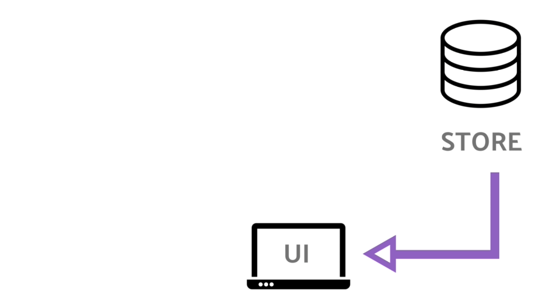
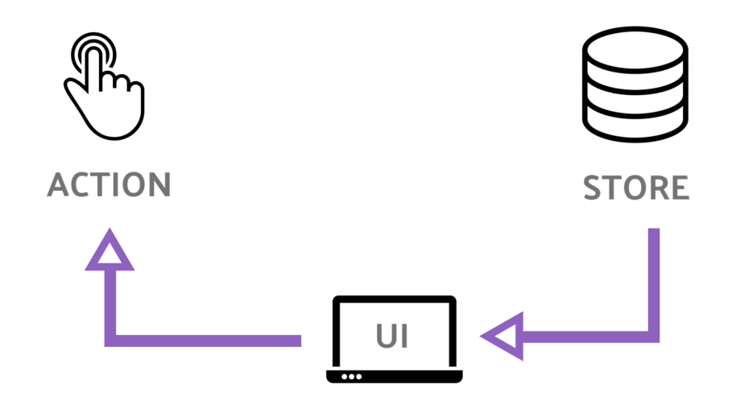
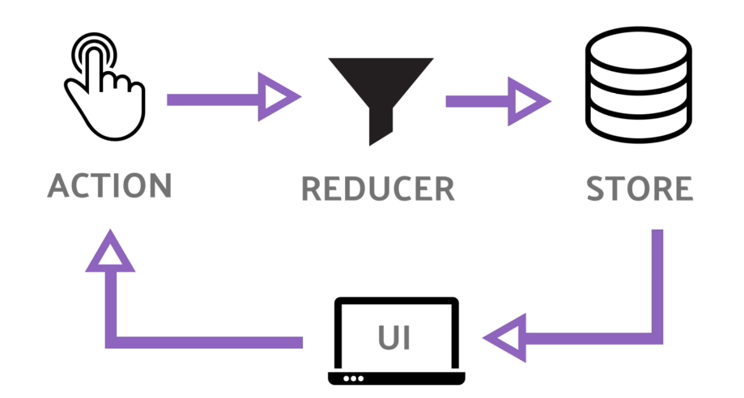
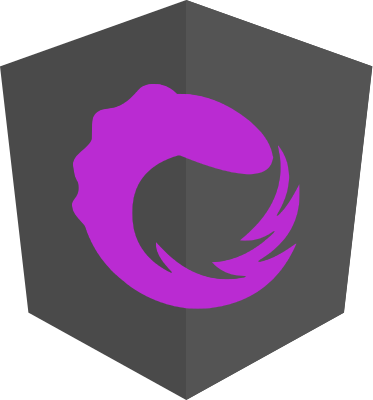

title: The revolution in your apps is called **State Management**
class: animation-fade
layout: true

---

class: center, middle
background-image: url(images/bw.jpg)

# .alt-text[The revolution in your apps is called<br>.big.light-text[**State Management**]]
<br>

.who-box[
  .row.table.middle.text-center[
  .col-3.small.text-left[
  Yohan Lasorsa<br>
  .fab.fa-github[] github.com/sinedied<br>
  .fab.fa-twitter[] @sinedied
  ]
  .col-6.small.half[
  .w-90[
  .w-70.responsive[]
  ]
  ]
  .col-3.small.text-right[
  .w-90.responsive[]
  ]
  ]
]

---

class: middle, center
# .sketch.large[Who am I?]

.table.row.middle[
.col-4.center[
  .w-70.responsive.avatar.tada.animated[]
]
.col-8.large.left[
  Yohan Lasorsa<br>
  .alt-text[{ **Fullstack Engineer @ Criteo ** }]<br>
  .small.em-text[Web tech geek & DIY lover]
]
]
.right.bit-larger[
  .fab.fa-github[] github.com/sinedied<br>
  .fab.fa-twitter[] @sinedied<br>
]

???

ca fait plus de 10 ans que je baigne dans le monde du web...

---

class: center, middle

# Making web apps today

.center[
  .w-20.responsive[]
  .w-20.responsive[]
  .w-20.responsive[]
]

???

Un peu de contexte:
- 3 gros frameworks pour faire des appli web
- je rentrerai pas dans les debats de religion ici, par qu'on s'en fout finalement aujourd'hui!

--

# .big[= **components**]

???

- nos app sont toutes orientées composants
  * simple, de presentation, stateless
  * complexe, containers, eventuellement stateful

---

.full-layer[
.center[
.w-60.responsive[]
<br>
Component Tree
]
]

???

Nos apps ne sont pas simple ou complexe par nature
(du moins j'en ai encore jamais vu)

Elle demarrent toutes comme ca

---

.full-layer[
.center[
.w-60.responsive[]
<br>
Component Tree
]
]

???

Et finissent rapidement comme ca!

---

class: big-text, middle

# Challenges

- Complexity
- Debugging
- Performance
- Long-term maintenance
- Documentation

.full-layer.right.space-right[
  .w-40[
  .rounded.responsive[]
  ]
]

---

class: impact
# .small[.animated.jackInTheBox.ib[{ State }] Management?]

???

Mettons nos problèmes de cotés quelques instants...

---

class: timeline

.head[
# .alt-text.fas.fa-history[]&nbsp; Where does it come from?
]
<div style="height: 3.3em"></div>

- #### 1988
  - Command-Query Separation (CQS)
- #### 1997
  - Functional Reactive Programming (FRP)
- #### 2012
  - Elm
- #### 2014
  - Flux architecture (React)
- #### .boom.responsive[] **2015**
  - **Redux, MobX, NGRX, VueX**
- #### 2018
  - NGXS, Akita, Unstated, "React Context/Hooks"

???
- RP (UI): User actions as a stream of events
- Redux created by Dan Abramov when preparing a talk on hot reloading
- Mobile: ReSwift, Reductor, Jedux

---

class: middle, center

.responsive.bounceInDown.animated.ib[]

???
- Why?
  * Born from development needs: predicatability, time travel, debugging...
  * Simple

---

.head.dark[
# .fit[] The 3 principles
]
.head-spacer[]

## Single source of truth
The **state** of your whole application is stored in an object tree within a single **store**.
--

## State is read-only
The only way to change the **state** is to emit an action, an object describing what happened.
--

## Changes are made with pure functions
To specify how the state tree is transformed by actions, you write pure **reducers**.

---

class: center
.head.dark[
# .fit[] Redux data flux
]
<br><br>
.col-11.responsive[]

---

class: center
.head.dark[
# .fit[] Redux data flux
]
<br><br>
.col-11.responsive[]

---

class: center
.head.dark[
# .fit[] Redux data flux
]
<br><br>
.col-11.responsive[]

---

class: center
.head.dark[
# .fit[] Redux data flux
]
<br><br>
.col-11.responsive[]

---

class: impact
# .small[Let's make our<br>.animated.jello.ib[**own**] Redux]!

---

class: big-text, medium-code

.head[
# .alt-text.fas.fa-code[]&nbsp; Actions
]
.head-spacer.min[]

```js
function loadContent() {
  return { type: 'Load content' };
}

function updateContent(content) {
  return {
    type: 'Update content',
    content
  };
}
```
???
- Are object (in-place literals or action creators)
- Define and intention
- Have unique type
- Can carry data (payload)

---

class: big-text, medium-code

.head[
# .alt-text.fas.fa-code[]&nbsp; Actions
]
.head-spacer.min[]

```js
function loadContent() {
* return { type: 'Load content' };
}

function updateContent(content) {
* return {
*   type: 'Update content',
*   content
* };
}
```
???
- Are object (in-place literals or action creators)
- Define and intention
- Have unique type
- Can carry data (payload)

---

class: big-text, medium-code

.head[
# .alt-text.fas.fa-code[]&nbsp; Reducer
]
.head-spacer.min[]


```js


function editorApp(previousState, action) {
  switch(action.type) {


    default:
      return previousState;
  }
}
```

---

class: big-text, medium-code

.head[
# .alt-text.fas.fa-code[]&nbsp; Reducer
]
.head-spacer.min[]


```js
*const initialState = { content: 'Hello?' };

*function editorApp(previousState = initialState, action) {
  switch(action.type) {


    default:
      return previousState;
  }
}
```

---

class: big-text, medium-code

.head[
# .alt-text.fas.fa-code[]&nbsp; Reducer
]
.head-spacer.min[]


```js
const initialState = { content: 'Hello?' };

function editorApp(previousState = initialState, action) {
  switch(action.type) {
*   case 'Update content':
*     return {
*       ...previousState,
*       content: action.content
*     }
    default:
      return previousState;
  }
}
```

---

class: big-text, medium-code

.head[
# .alt-text.fas.fa-code[]&nbsp; Store
]
.head-spacer.none[]


```js
function createStore(reducer) {
  let _state = reducer(undefined, '@@INIT');
  let store = {};
  return store;
}
```

---

class: big-text, medium-code

.head[
# .alt-text.fas.fa-code[]&nbsp; Store
]
.head-spacer.none[]


```js
function createStore(reducer) {
  let _state = reducer(undefined, '@@INIT');
  let store = {
*   getState: () => _state,
  };
  return store;
}
```

---

class: big-text, medium-code

.head[
# .alt-text.fas.fa-code[]&nbsp; Store
]
.head-spacer.none[]


```js
function createStore(reducer) {
  let _state = reducer(undefined, '@@INIT');
* let _observer = null;
  let store = {
    getState: () => _state,
*   subscribe: observer => {
*     _observer = observer;
*     if (_observer) _observer(_state);
*   }
  };
  return store;
}
```

---

class: big-text, medium-code

.head[
# .alt-text.fas.fa-code[]&nbsp; Store
]
.head-spacer.none[]

```js
function createStore(reducer) {
  let _state = reducer(undefined, '@@INIT');
  let _observer = null;
  let store = {
    getState: () => _state,
    subscribe: observer => {
      _observer = observer;
      if (_observer) _observer(_state);
    },
*   dispatch: action => {
*     _state = reducer(_state, action);
*     if (_observer) _observer(_state);
*   }
  };
  return store;
}
```

---

class: big-text, medium-code

.head[
#  .alt-text.fas.fa-code[]&nbsp; Using it
]
.head-spacer.min[]


```js
const store = createStore(editorApp);

store.subscribe(state => {
  console.log(state.content);
});

store.dispatch(updateContent('Hello SnowCamp!'));
```
> Result?

--

```sh
> Hello?
> Hello SnowCamp!
```

---

class: big-text, medium-code

.head[
#  .alt-text.fas.fa-code[]&nbsp; Side effects?
]
.head-spacer.min[]

```js
const store = createStore(editorApp);

store.subscribe(state => {
  console.log(state.content);
});

*store.dispatch(loadContent()); // Async call here?
store.dispatch(updateContent('Hello SnowCamp!'));
```

> How to manage?

---

class: big-text, medium-code

.head[
# .alt-text.fas.fa-code[]&nbsp; Actions with thunks
]
.head-spacer.min[]

```js
function loadContent() {
* return (dispatch) => {
*   setTimeout(
*     () => dispatch(updateContent('Hello async!')), 1000
*   );
* };
}

function updateContent(content) {
  return {
    type: 'Update content',
    content
  };
}
```
???
Thunk: fct dont on retarde l'evaluation

---

class: big-text, medium-code

.head[
# .alt-text.fas.fa-code[]&nbsp; Store
]
.head-spacer.none[]

```js
function createStore(reducer) {
  let _state = reducer(undefined, '@@INIT');
  let _observer = null;
  let store = {
    getState: () => _state,
    subscribe: observer => { ... },
    dispatch: action => {
*     if (typeof action === 'function')
*       return action(store.dispatch);
      _state = reducer(_state, action);
      if (_observer) _observer(_state);
    }
  };
  return store;
}
```

---

class: big-text, medium-code

.head[
#  .alt-text.fas.fa-code[]&nbsp; Side effects in action
]
.head-spacer.min[]

```js
const store = createStore(editorApp);

store.subscribe(state => {
  console.log(state.content);
});

store.dispatch(loadContent());
store.dispatch(updateContent('Hello SnowCamp!'));
```

> Result?

--

```sh
> Hello?
> Hello SnowCamp!
> Hello async!
```

---

class: center
# Redux design pattern in the wild

.row.table.center[
.col-4[
  .w-40.responsive[]
  <br><br>
  .large.fas.fa-arrow-down[]
  <br>
  ### @ngrx
  .w-40.no-margin[
  .w-90.responsive[]
  ]
]
.col-4[
  .w-40.responsive[]
  <br><br>
  .large.fas.fa-arrow-down[]
  <br>
  ### Redux
  .w-40.responsive[]
]
.col-4[
  .w-40.responsive[]
  <br><br>
  .large.fas.fa-arrow-down[]
  <br>
  ### VueX
  .w-40.responsive[]
]
]

---

class: center
# Redux design pattern in the wild

.row.table.center[
.col-4[
  .w-40.responsive[]
  <br><br>
  .large.fas.fa-arrow-down[]
  <br>
  ### NGXS
  <br>
  .w-60.responsive.animated.heartBeat[]
]
.col-4[
  .w-40.responsive[]
  <br><br>
  .large.fas.fa-arrow-down[]
  <br>
  ### Redux
  .w-40.responsive[]
]
.col-4[
  .w-40.responsive[]
  <br><br>
  .large.fas.fa-arrow-down[]
  <br>
  ### VueX
  .w-40.responsive[]
]
]

---

class: impact

# .small[Do we .ib.animated.swing[**need**] it?]

???

On a deja bcp de libs!

- Non tant que le besoin ne s'est fait pas ressortir...
... mais souvent c'est alors trop tard :(

---

class: middle, no-bullet

.col-6.right.space-right.large.v-sep.alt-sep.float-left[
# .big.sketch[Gain]
- Debugging
- Undo history
- No prop drilling
- Performance (Angular)
]
???
Also RT collaboration

Gain évidents / fonctionnels:
- time travel debug / bug reports / tracabilité
- undo = 101 du state management
- prop drilling > plutot React, transmission de state dans toute la hierarchie
- perf ng > reactive mode w/o change detection
--
.col-6.space-left.large.float-left[
# .big.sketch[Pain]
- Boilerplate
- More indirection levels
- Learning curve
]

--

.full-layer.left.space-left.stick-top.no-margin[
  .w-20.responsive.rounded.slideInDown.animated[]
]

???

Gain évidents / fonctionnels:
- time travel debug / bug reports / tracabilité
- undo = 101 du state management
- prop drilling > plutot React, transmission de state dans toute la hierarchie
- perf ng > reactive mode w/o change detection

---

class: middle, no-bullet

.full-layer.left.space-left.stick-top.no-margin[
  # .dark-text.bit-larger.sketch[\#realworld]
]

.col-6.right.space-right.large.v-sep.alt-sep.float-left[
# .alt-text[More] .big.sketch[Gain]
- Workflow
- Testability & Evolutivity
- Structure
- Self-documentation
]
???
=> @CRITEO
- change how you design/think your features
- TDD / backend within frontend
- Structure: container/pres. components, where should I...
- Clear intentions, discoverability
--
.col-6.space-left.large.float-left[
# .alt-text[Less] .big.sketch[Pain]<sup>*</sup>
- Boilerplate
- .strike[More indirection levels]
- Learning curve
]

.full-layer.stick-bottom.right.space-right[
\* than expected
]

???
- more code, but simple
- once setup/example is done, easy to catch

---

class: impact
.w-60.responsive.animated.shake[]
## .alt-text.large[New solution, new problems]

---

video: v1
# Should I put it in the store?
### (see also: state zealots)
.center.rounded[
<video id="v1" width="70%" src="images/shouldi.webm"></video>
]

???

- Store === git repository

=> ne garder que ce qui est nécessaire pour reconstruire un état donné

=> pas d'état intermédiaire "instable"

- action === commit

---

video: v2
# Side effects
### (aka: I'll put it there, nobody will know)
.center.rounded[
<video id="v2" width="70%" src="images/sideeffects.webm"></video>
]

???

- charger 1 donnée depuis localstorage, call async dans un reducer, Date.now() dans un reducer...

=> effet souvent pas immédiat, mais casse toute la chaine de promesse et tres dur a debug

---

video: v3
# Chained actions
### (aka: yay, a new event bus!)
.center.rounded[
<!-- .w-60.responsive.rounded[] -->
<video id="v3" width="70%" src="images/eventbus.webm"></video>
]

???

- Actions ont un effet sur l'etat
=> dangereux de passer en mode event, car pas fait pour ca initialement

- antipattern: action qui déclenche plusieurs actions (qui elle memes...)

- store et actions ne servent pas faire du découpage fonctionnel!

---

# Overstorage in state
### (aka: it's not free caching?)
.center[
.w-70.responsive.rounded[]
]

???

- On stocke tout, pour tous les écrans! meme les états dérivés!

=> selecteurs avec memoization

=> clean unused data

---

video: v4
# Overengineering
### (aka: let's make a wrapper for...)
.center.rounded[
<!-- .w-70.responsive.rounded[] -->
<video id="v4" width="70%" src="images/overengineering.webm"></video>
]

???

SM, le nouveau joujou des devs!

Tout ne doit pas s'articuler autout hein...
ex: analytics
ex: helpers qui mergent/trigg de multiples actions (rxjs?)

---

class: impact
# .small[Conclusion]
## .alt-text[(As always) not a silver bullet]
.w-20.responsive.middle[]

???
Still... use it whenever you can! Or at least think like it

---

class: big-text, middle
# .w-10.responsive.middle[] Challenges

.baseline[
- .w-50.ib[Complexity] .dminus[--]
- .w-50.ib[Debugging] .dplus[++]
- .w-50.ib[Performance] .dneutral[=] &nbsp;(Angular: .dplus[+])
- .w-50.ib[Long-term maintenance] .dplus[++++]
- .w-50.ib[Documentation] .dplus[+]
]

---

class: middle

.big-text.no-bg.baseline[
```js
store.dispatch(
  new EndTalk({
    message: 'Thank you!',
    slides: 'bit.do/state-management',
    examples: 'github.com/sinedied/md-editor
  })
);
```
<hr class="hr-right">
]
.right.large[
.fab.fa-twitter[] @sinedied<br>
.fab.fa-github[] github.com/sinedied
]

---

exclude: true
.head.dark[
# Links
]
.head-spacer[]

- [You might not need Redux](https://medium.com/@dan_abramov/you-might-not-need-redux-be46360cf367)
- [NGXS website](https://ngxs.gitbook.io/ngxs/)
- [Redux website](https://redux.js.org/)
- [NGRX libs](https://github.com/ngrx/platform)
- [What is VueX?](https://vuex.vuejs.org/)
- [Markdown Editor variants](https://codesandbox.io/dashboard/sandboxes/Markdown%20Editor)

<!-- 

TODO:
- update PDF
- fix example code!!
 -->
