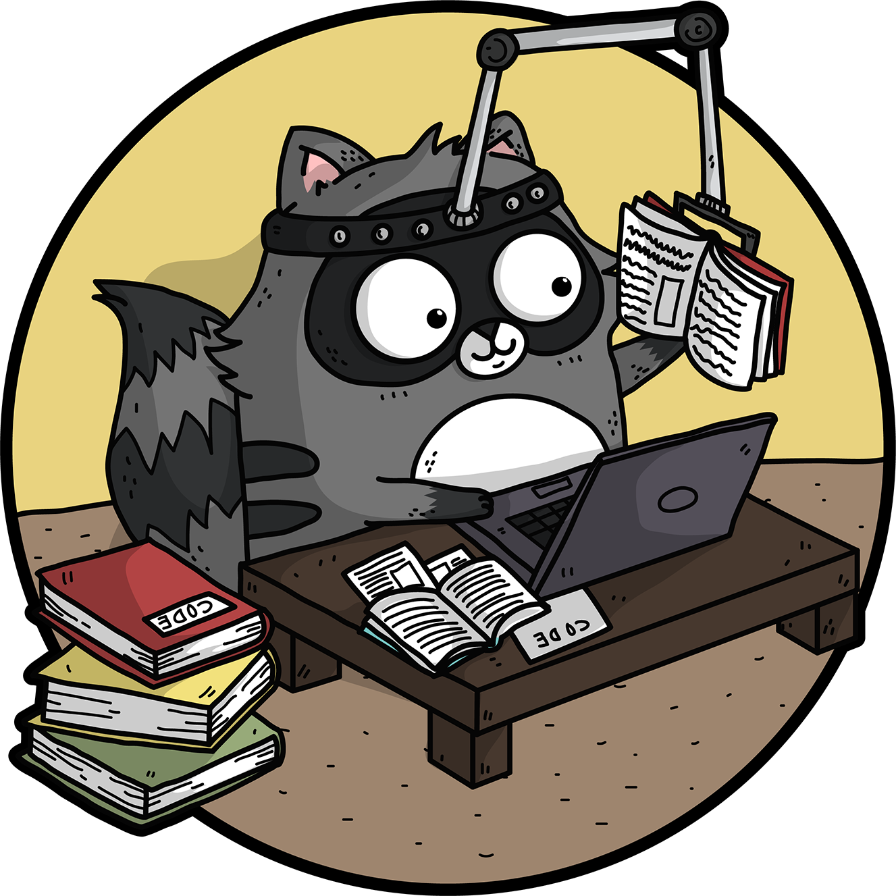
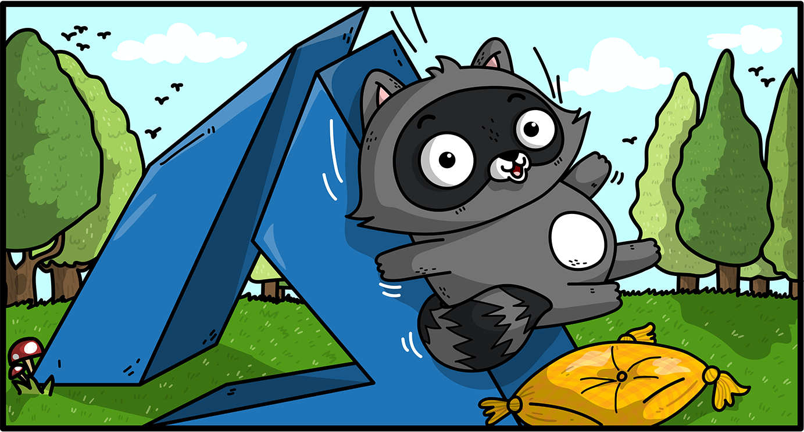
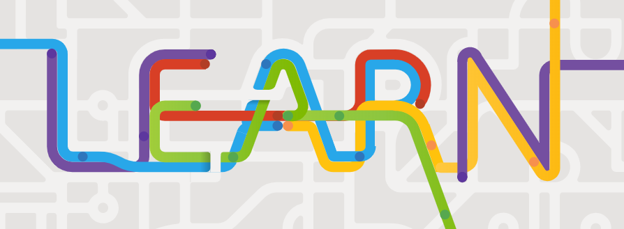
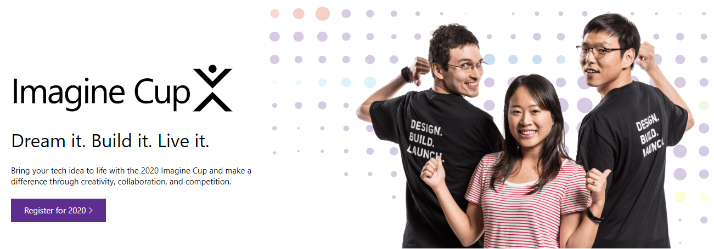
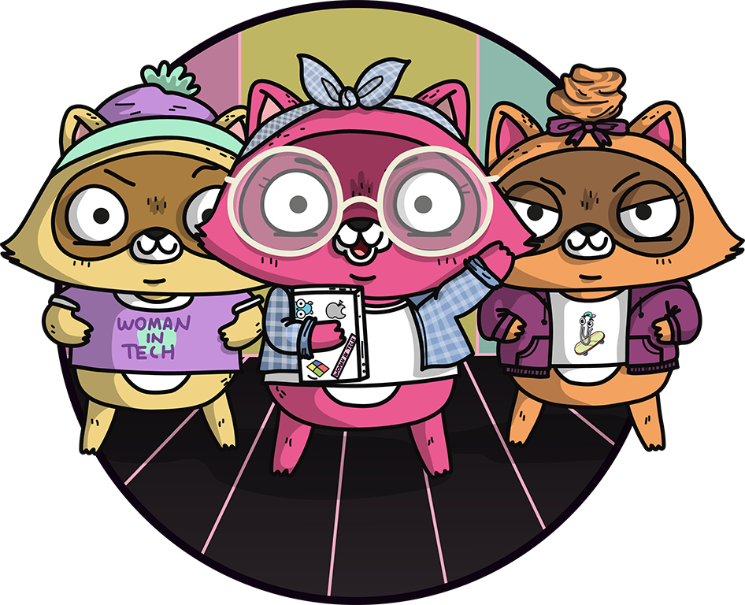
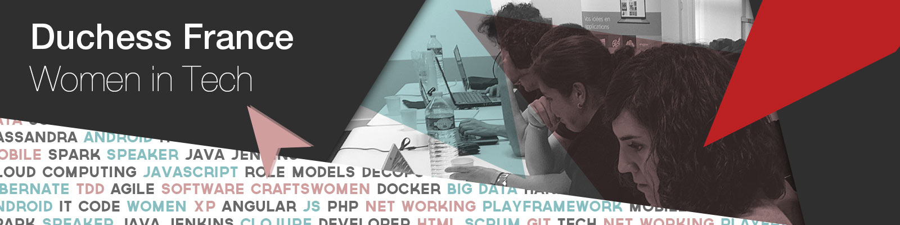

class: middle, black, right, hide-handle
.table.row.middle[
  .col-4[
  .responsive[]
  ]
  .col-8[
  <!-- .w-70.responsive[] -->
  # .large[**Resources**]
  ### .light-text.up[For Students]
  ]
]

.full-layer.who.text-right.small.middle.light-text[
   
  .ms.responsive[]
  |
  Yohan Lasorsa
  |
  @sinedied
]

---

# Microsoft Azure
.bit-larger.up[[aka.ms/student/azure](https://student/azure)]

## Partner school?
Go to https://portal.azure.com and search for "Education" in the search bar

.side-layer.right.space-right[
  .w-45.responsive[]
]

## What for?
- Portfolio website
- Connect the world
- Explore your ideas!

---

# Microsoft Learn
.bit-larger.up[[aka.ms/student/learn](https://student/learn)]

.row[
.col-5[
  ### Ready to learn
  - Everything is **free**
  - Free sandbox creation to use Azure services
  - No install, everything is done in-browser
  - Localized content (incl. french)
]
.col-5.space-left[
  ### Step by step trainings
  - Different path by job, difficulty or product/service
  - Many programming languages supported
  - Videos, tutorials & exercises
]
]

.full-layer.right.through.space-right[
  .w-35.responsive.rounded[]
]

---

class: contain, dark, bottom, full, center
background-image: url(images/learn-module.png)
.primary.full-banner[
# .light-text[[aka.ms/student/learn](https://student/learn)]
]

---
exclude: true
# Microsoft Student Partner

---

# Imagine Cup
.bit-larger.up[[aka.ms/student/imaginecup](https://aka.ms/student/imaginecup)]

.responsive[]

---

# Women In Tech
.bit-larger.up[[womenintechnologyfrance.com](http://www.womenintechnologyfrance.com) | @WiTWomenFrance]

.center[
.w-45.responsive[]
]

???
Reseau mondial

---

# Duchess France
.bit-larger.up[[duchess-france.org](https://www.duchess-france.org) | @duchessfr]

 
.responsive[]

???
Coaching, conseils carriere, soutien

---

# ngGirls
.bit-larger.up[[ng-girls.org](http://ng-girls.org/) | @angulargirls]

 
.center[
.w-70.responsive[]
]

???
workshops + communauté

---

class: middle, center
# Good luck for your adventure!
.large[👉 [aka.ms/simplonGrenoble2019](https://aka.ms/simplonGrenoble2019)]
