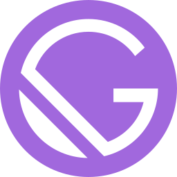
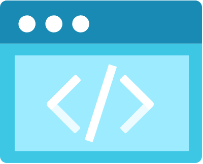

class: show-number, alt-code
layout: true

.bottom-bar[
  .light-text[Create your online portfolio | [aka.ms/swa-portfolio](aka.ms/swa-portfolio)] <!-- .float-right[@sinedied] -->
]

---

class: left, no-bar, primary, no-counter

.title[
# .light-text.large[Create and deploy your online portfolio]
## With Gatsby, GitHub and Azure Static Web Apps

.center.middle[
  .w-20.responsive.space-right[]
  .w-20.responsive.space-right[]
  .w-20.responsive[]
]
]

.full-layer.who.text-right.small.middle.light-text[
  .ms.responsive[]
  Virtual Developer Roadshow
  <!-- |
  Yohan Lasorsa
  |
  @sinedied -->
]

---

# Workshop Objectives
- Bootstrap a Gatsby app from a template
- Create a GitHub repository to push your code
- Deploy your website on Azure Static Web Apps with a CI/CD pipeline
- Understand how Gatsby works with React and Markdown
- Create your own content 😎

**Slides**<br>.big.up.ib[[aka.ms/swa-portfolio](https://aka.ms/swa-portfolio)]

---

# Prerequisites

| | |
|---------------|-----------------|
| Node.js v12+ | https://nodejs.org |
| Git | https://git-scm.com |
| GitHub account | https://github.com/join |
| Azure account | https://aka.ms/student/azure |
| A code editor | https://aka.ms/get-vscode |
| A browser | https://www.microsoft.com/edge |

---

class: middle
# .large[Who are we?]

<!-- .table.row.middle[
.col-4.center[
  .w-70.responsive.avatar.bounceInLeft.animated[]

  **Yohan Lasorsa**<br>
  .fab.fa-twitter[] .e[@sinedied]
]
.col-4.center[
  .w-70.responsive.avatar.bounceInUp.animated[]

  **Olivier Leplus**<br>
  .fab.fa-twitter[] .e[@olivierleplus]
]
.col-4.center[
  .w-70.responsive.avatar.bounceInRight.animated[]

  **Wassim Chegham**<br>
  .fab.fa-twitter[] .e[@manekinekko]
]
] -->

---

class: middle
# .baseline.large[Who are .alt-text[**you**]? 🙂]

---

# Test your setup

Open a terminal and type:

```sh
npm --version
git --version
```

---

class: impact, left
# #1
## Bootstrap Gatsby app

---

# What's Gatsby? .float-right.small[[gatsbyjs.com](http://www.gatsbyjs.com)]

.quote[
> It's an **open-source** static website generator and **framework**, allowing you to create website content from various data sources like JSON, **Markdown**, a database, an API and more, all based on **React** components.
]

## Features
- Themes and starter templates
- Plugins
- Built-in GraphQL support
- Ideal for portfolios, blogs, e-shops, company homepages, web apps...

---

# Create Gatsby app

```sh
# Install Gatsby CLI
npm install -g gatsby-cli

# See available commands
gatsby --help

# Create new app
# (package install might take a while...)
gatsby new my-portfolio https://github.com/sinedied/gatsby-portfolio
cd my-portfolio

# Start development server
gatsby develop
```

???

TODO: fork template, remove cypress/husky + eslint?

---

# Push to GitHub

1. Create a new repo with the name `my-portfolio`: https://github.com/new

  .do[
  > **Tip**: With GitHub CLI (https://cli.github.com) you can do it directly from command line: `gh repo create <name> --public`
  ]

2. Push your code to the repo:
  ```sh
  git remote add origin git@github.com:<USER>/<REPO>.git
  git branch -M main
  git push -u origin main
  ```

  .do[
    > **Tip**: you can copy/paste the commands for your own repo from GitHub directly.
  ]

---

class: impact, left
# #2
## Deploy your app on Azure Static Web Apps

---

# Azure Static Web Apps .float-right.small[[aka.ms/docs/swa](https://aka.ms/docs/swa)]

## What's SWA?

.quote[
> It's an all-inclusive **hosting service** for web apps with **serverless APIs**, based on a continuous integration and deployment pipeline from a GitHub repository.
]

**Provides**:<br>
CI/CD, assets hosting, APIs, SSL certificate, route control, authentication, authorization, CDN, staging environments...

---

# Deploy to Azure Static Web Apps

1. Open Azure portal: [aka.ms/create/swa](https://aka.ms/create/swa)

2. Create new resource group `my-portfolio`

3. Enter a name and choose a region

4. Sign in to GitHub and select your GitHub repo and `main` branch

5. In **Build Details**, choose the `Gatsby` build preset

6. Click **Review + create**, then **Create**

---

# The deployment workflow

In the Azure portal, in the created resource, select **GitHub Actions runs**.

> You can see the **C**ontinous **I**ntegration (CI) and **C**ontinuous **D**eployment (CD) jobs running.

## How the process works?

- Azure made a new commit in your repo with `.github/workflows/<name>.yml`
- The workflow is built with [GitHub Actions](https://github.com/features/actions)
- Every **new commit** triggers a new build and deployment
- You can preview changes separately using a **pull request**

---

class: impact, left
# #3
## Create your own content

---

# Gatsby app structure

```sh
|-- config/             # Website config: title, description, URL, links...
|-- content/            # Pages content: markdown, images
  |-- imprint/
  |-- index/
    |-- about/
    |-- contact/
    |-- ...
|-- src/                # React source code and components
|-- static/             # Static assets, like your resume in PDF
|-- public/             # Built version of your website (with gatsby build)
|-- gatsby-config.js    # Gatsby plugins configuration 
|-- gatsby-browser.js   # Browser events hooks
|-- package.json        # Your Node.js app details

```

---

# The `config/index.js` file

.side-layer.right[
.clist.small.no-bullet.w-40.post-it.no-margin[
  ### .sketch.large[TODO]
  - ☑️&nbsp; Change the website title and info
  - ☑️&nbsp; Personalize the colors
  - ☑️&nbsp; Change or hide RSS feed
  - ☑️&nbsp; Set social media links
]
]

### It contains the website settings:
- Metadata about the site
- Theme colors
- Optional RSS feed to display
- Social media links
- Navigation menu settings

## Task
- Open a terminal and run `gatsby develop`
- Edit `/config/index.js` to make it yours 🙂

---

# What's Markdown? .float-right.small[[commonmark.org/help/](https://commonmark.org/help/)]

.quote[
> Markdown is a lightweight markup language for creating formatted text (HTML) using a plain-text editor.
]

## Example code vs result

.col-6.float-left.no-margin[
```md
# Header

Some text in **bold** or *italic* with a [Link](http://link.com).

- Item 1
- Item 2
- Item 3
```
]
.col-6.float-left.space-left.no-margin[
# Header

Some text in **bold** or *italic* with a [Link](http://link.com).

- Item 1
- Item 2
- Item 3
]

---

# What's MDX? .float-right[[mdxjs.com](https://mdxjs.com/)]

.quote[
> MDX is markdown with JSX<sup>*</sup> support.
]

```mdx
# Hello, *world*

Below is an example of JSX embedded in Markdown.<br>
Try and change the background color!

<div style={{ backgroundColor: 'tomato' }}>
  <h3>This is JSX</h3>
</div>
```

<sup>*</sup>JSX: a syntax extension to JavaScript used in React to produce HTML. [More info](https://reactjs.org/docs/introducing-jsx.html)

---

# `/content` files

- Used by Gatsby to create your website content
- They use MDX with [Front Matter](https://jekyllrb.com/docs/front-matter/) (metadata in text format at the top)
    ---
    title: "I'm a Gatsby Starter"
    icon: "waving-hand.png"
    subtitle: "one-page portfolios"
    ---

- You can put images next to .mdx files
- You can add or create as many as you need

---

# `/content` files

.side-layer.right[
.clist.small.no-bullet.w-40.post-it.no-margin[
  ### .sketch.large[TODO]
  - ☑️&nbsp; Change hero content
  - ☑️&nbsp; Put your story in about section
  - ☑️&nbsp; Change contact details
  - ☑️&nbsp; Feature your skills in interests section
  - ☑️&nbsp; Show your projects
]
]

## Task

- Put your own content there! 🌈

> **Tip**: To redeploy, commit and push<br>your changes

---

class: impact, left
# #4
## Bonus - Go Further!

---

# React components

.side-layer.right[
.clist.small.no-bullet.w-40.post-it.no-margin[
  ### .sketch.large[TODO]
  - ☑️&nbsp; Create a custom component
  - ☑️&nbsp; Use it in a content a file
]<br>
]

.w-60.space-right[
The `src` folder contains the React app behind your website.

You can also create custom components to change the visual look of the content.<br>
- See `src/components/styles/underlining.js` for example.
]

>**Note:** The [Styled Components](https://styled-components.com/) library is used for CSS styling.

---

# For home study

## GraphQL

Gatbsy has built-in support for consuming data from [GraphQL](https://graphql.org/). You can follow this tutorial to learn about GraphQL and how to use it in Gatsby:<br>
**👉 https://aka.ms/learn/gatsby-graphql**

## API

Gatbsy and Azure Static Web Apps are not limited to static data. You can follow this tutorial to learn how to create your own serverless API with JavaScript and deploy it on with Static Web Apps:<br>
**👉 https://aka.ms/learn/swa-api**

---

class: clist, no-bullet, middle, center
.big-text[
# Show off your portfolios!

- 🎨 Post URLs and screenshots in the chat
- 📢 Tweet it and mention us!<br><br>
  `@sinedied @olivierleplus @maudstweets`<br>
  `@msdevs_fr #MSDevRoadShow`
]

---

.center[
  <br>
# .big[Thank you!]
]

.side-layer.right[
  .w-20.responsive[]
]

# Resources
- Gatbsy: https://www.gatsbyjs.com/
- Learn Markdown: https://commonmark.org/help/
- More Static Web Apps tutorials: https://aka.ms/learn/swa
- Intro to React: https://reactjs.org/tutorial/tutorial.html
